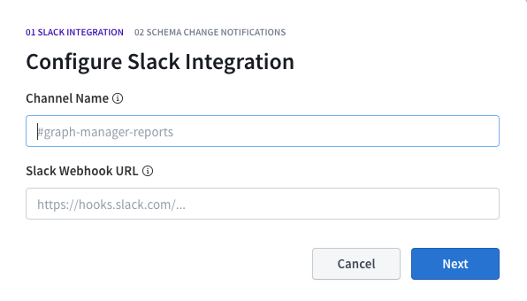
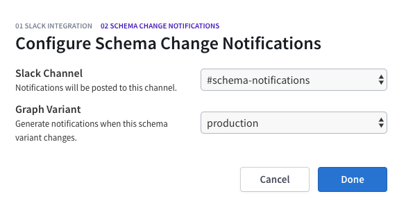

Apollo's Slack integration brings your server's performance metrics and analytics data from Apollo Graph Manager directly to your team's Slack workspace so you can be notified of potential issues proactively. The integration does two main things:

1. Send a [**daily snapshot**](#daily-reports) of the request rate, error rate, and performance latency of your graph.
2. Send [**notifications**](#notifications) that are triggered on thresholds like error percentage and performance latency.
3. Send [**schema notifications**](#schema-notifications) whenever an update lands on your schema.

## Configure the integration

The Apollo Slack integration is set up and configured through the Graph Manager UI. If you do not yet have account, [**follow this guide**](https://www.apollographql.com/docs/apollo-server/features/metrics/#Apollo-Graph-Manager) to get started connecting your server to Graph Manager.

If you already have a Graph Manager account, [**log in**](https://engine.apollographql.com) and ––

1. Select the service you want to turn on Slack notifications for.
1. Visit the "Integrations" tab in the left nav.
1. You'll notice a "Reporting Channels" section at the bottom of this page. Click the "Add channel" button and follow the steps in the Graph Manager UI to get a webhook from Slack.

Once you've configured your Slack channel you'll be able to turn on daily reports snapshotting and configure notifications in the "General" and "Performance Alerts" sections.

## Daily reports

Daily reports from Graph Manager are sent out around 9am in whichever timezone you configure them to be in. You turn them on in the "Integrations" tab as shown above. The reports have a set format that gives a birds-eye view of what your GraphQL API delivered in the previous day:

### Using the report

We've constructed the report provided to give you an actionable summary of what's happened in your API in the last 24 hours. Here’s how you can use it to identify issues:

1.  **Request rate:** This shows you how many queries are hitting your server every minute, along with a list of the most popular operations. If you see a huge dip in this and it's usually a busy time for your app, it might mean that queries aren’t able to reach your server, or some client is down.
2.  **p95 service time:** This shows you how long queries are taking to execute. We selected p95 since it’s the best overall representation of how your users are experiencing your app. You can use this to identify that your API is overloaded and users are seeing long loading delays, or to find out which queries are taking the longest to run. This is usually directly connected to UI performance, so a 500ms query probably means some part of your UI is taking that long to display.
3.  **Error percentage:** This will show you how many of your GraphQL requests end up with an error result. Spikes in errors might be the result of some underlying backend malfunctioning. You can also see which of your operations are most error-prone.

## Notifications

In Graph Manager, you can configure notifications that are triggered on the performance data of your graph, like error percentages and request latencies. This is particularly useful for detecting anomalies, especially around releases. Notifications can be configured to monitor the following metrics for either your entire GraphQL service or individual operations:

- **Request rate:**  requests per minute
- **Request duration:** p50/p95/p99 service time
- **Error rate:** errors per minute
- **Error percentage:** the number of requests with errors, divided by total
  requests

The triggers you set up are evaluated on a rolling five minute window. For example, you can configure a notification to trigger when an operation's error rate exceeds 5%. In production, if 6 out of 100 requests result in an error during the last five minutes, the alert will trigger with an error rate of 6%. Once the error rate falls back below 5% your notification will resolve. Here's an example of what the notification looks like:

## Schema Notifications

From the Graph Manager, you can configure schema notifications that are triggered when any update, such as type additions, field removals or deprecations, land on your schema. GraphQL makes it extremely easy for developers to collaborate on ever-changing schemas which is why we built this feature to help maintainers and readers of your graph stay in the loop on the latest changes. 

To get started, navigate to "Schema Change Notifications" and click on the configure button. You will then be prompted to choose where you want your slack notifications to send to and which variant you want to be notified on. 

If the channel you want to funnel notifications to isn't set up yet you can simply create a new channel by clicking on the "Slack Channel" drop down and click "New Channel."

You will then need to paste in the Slack hook URL for the channel you want schema change notifications to send to and also give it a name that you can reference to in the Graph Manager.

</img>

After that you just need to pick which variant you want to configure notifications for and once you click "Done" you're all set and ready to receive schema change notifiations!

</img>