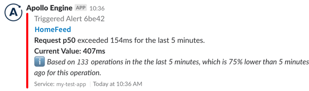

Apollo Graph Manager can send notifications about your data graph to your team's Slack workspace. This enables you to act on any potential issues as soon as they arise.

These notifications include:

* [Daily reports](#daily-reports) of your graph's request rate, error rate, and latency
* [Schema change notifications](#schema-change-notifications) whenever your graph's schema is updated
* [Performance alerts](#performance-alerts) whenever a metric such as error percentage or request latency exceeds a particular threshold (this feature requires a [paid plan](https://www.apollographql.com/pricing/))

## Setup

> If you don't have a Graph Manager account yet, [get started](getting-started/).

### Connecting a Slack channel

You configure the Slack integration from the [Graph Manager UI](https://engine.apollographql.com):

1. Select the graph you want to configure Slack notifications for.
2. Open the graph's Integrations page in the left nav.
3. In the Reporting Channels section at the bottom of the Integrations page, click **Configure Slack Channel**. The following dialog appears:

    </img>

4. Specify the name of the Slack channel you want to push notifications to. 

    _You can complete this process multiple times if you want to push different notifications to different channels._
5. Follow the instructions in the form's tooltips to obtain a webhook from Slack. Provide the webhook in the **Slack Webhook URL** field.

6. Click **Done**.

### Configuring individual notification types

After you [connect at least one Slack channel](#connecting-a-slack-channel), you can set up each of the individual notification types from the other sections of your graph's Integrations page:

</img>

## Daily reports

Graph Manager sends your graph's daily report around 9am in your specified time zone. The report provides a high-level summary of what your GraphQL API delivered in the previous day:

</img>

### Acting on report data

The daily report provides an actionable summary of what's happened in your API over the last 24 hours. Here’s how you can use it to identify issues:

*  **Request rate:** This shows you how many queries are hitting your server every minute, along with a list of the most popular operations. If you see a significant dip in this value, it might mean that queries aren’t able to reach your server, or that a particular client is down.
*  **p95 service time:** An operation's p95 response time indicates that 95% of that operation's executions complete _faster_ than the reported value. You can use this to identify that your API is overloaded and users are seeing long loading delays, or to find out which queries are taking the longest to run. This is often connected to UI performance, so a 500ms query probably means some part of your UI is taking that long to display.
*  **Error percentage:** This shows you how many of your GraphQL requests produce an error result. Spikes in errors might be the result of an underlying back-end malfunction. You can also see which of your operations are most error-prone.

## Schema change notifications

Graph Manager can notify your Slack channel whenever any changes (additions, deprecations, removals, etc.) are made to your graph's registered schema:

</img>

You can configure separate change notifications for each [variant](schema-registry/#managing-environments-with-variants) of your graph.

## Performance alerts

> Performance alerts require a [paid plan](https://www.apollographql.com/pricing/).

You can configure notifications that are triggered on the performance data of your graph, like error percentages and request latencies. This is particularly useful for detecting anomalies, especially around releases. Notifications can be configured to monitor the following metrics for either your entire GraphQL service or individual operations:

- **Request rate:**  requests per minute
- **Request duration:** p50/p95/p99 service time
- **Error rate:** errors per minute
- **Error percentage:** the number of requests with errors, divided by total
  requests

The triggers you set up are evaluated on a rolling five-minute window. For example, you can configure a notification to trigger when an operation's error rate exceeds 5%. In production, if 6 out of 100 requests result in an error during the last five minutes, the alert will trigger with an error rate of 6%. When the error rate falls back below 5%, your notification will resolve. Here's an example of what the notification looks like:

