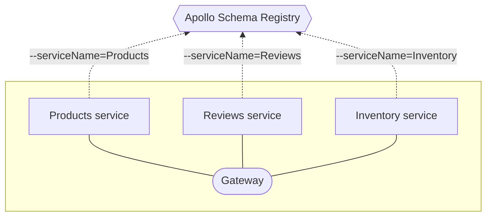

In a federated architecture, each of your graph's [implementing services](https://www.apollographql.com/docs/federation/implementing-services/) uses the Apollo CLI to register its schema as a separate service **of the same graph**:



First, <a href="https://www.apollographql.com/docs/devtools/cli/" target="_blank">install the Apollo CLI</a> if you haven't yet.

Then, **do the following for each of your implementing services**:

1. Obtain the following values, which are required for the `apollo service:push` command:

    * The URL that your federated gateway will use to communicate with the service (e.g., `http://products-graphql.svc.cluster.local:4001/`).
    * The name that uniquely identifies the service within your graph (e.g., `products`).
    * The service's schema. The Apollo CLI can either:
        * Use a `.gql` or `.graphql` file saved on your local machine, or
        * Perform an introspection query on the running service to fetch the schema

2. Run the `apollo service:push` command, providing the following options (documented below):

    ```bash
    apollo service:push \
      --localSchemaFile=./schema.gql \ # (or --endpoint)
      --key=service:docs-example-graph:NYKgCqwfCyYPIm84WVXCdw
      --graph=docs-example-graph \
      --variant=local-development \
      --serviceName=products \
      --serviceURL=http://products-graphql.svc.cluster.local:4001/
    ```

| Name | Description  |
|---|---|
| `--endpoint` | <p>The URL of the running service to perform an introspection query on.</p><p>**Provide this only if the CLI should obtain your schema via introspection.**</p> |
| `--localSchemaFile` | <p>The path of the schema file to register.</p><p>**Provide this only if the CLI should obtain your schema via a local file.**</p> |
| `--key` | <p>The graph API key that the CLI should use to authenticate with the schema registry.</p><p>By default, the CLI uses the value of the `APOLLO_KEY` environment variable.</p> |
| `--graph` | The name of your graph in Apollo Studio (e.g., `docs-example-graph`) |
| `--variant` | <p>The [variant of your graph](https://www.apollographql.com/docs/studio/org/graphs/#managing-variants) to register the schema with.</p><p>The default value is `current`.</p> |
| `--serviceName` | The service's unique name in your federated graph (e.g., `products`). |
| `--serviceURL` | The URL that your federated gateway will use to communicate with the service. |

As you register your service schemas, the schema registry attempts to **compose** their latest versions into a single **federated schema**. Whenever composition succeeds, your gateway can fetch the latest federated schema from the registry.
