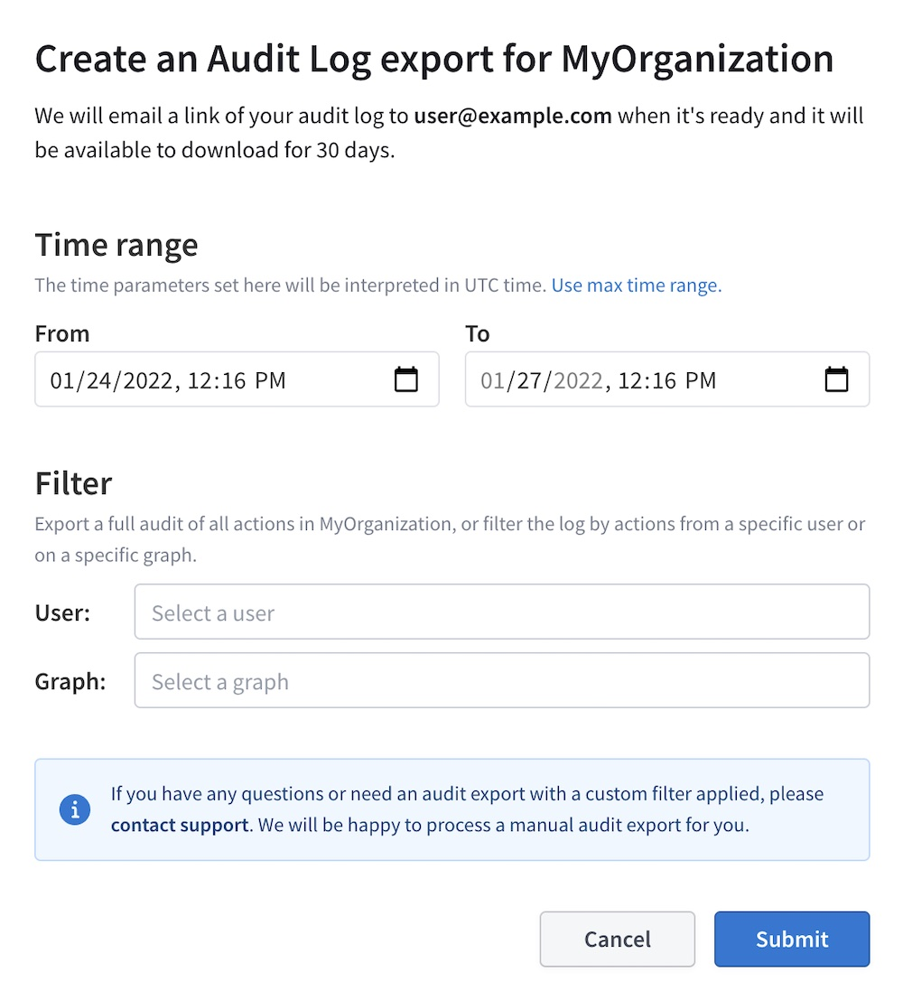

Organizations with a [Studio Enterprise plan](http://apollographql.com/pricing) can export and download an audit log of all material events that have occurred in the organization over a given timeframe. You can find the interface to request an export of auditable events under the **Audit** tab of your organization's homepage:

> Audit log data is available from July 2021 onward.

## Creating an audit log export

> Only [Organization Admins](./org/members/#organization-wide-member-roles) can request audit exports.

When creating an audit log export, you specify a **time range**, along with optional filters to limit actions to a particular **user** or **graph**:

> If you need to export a log with more complex filters, please email **support@apollographql.com**.

Exports sometimes take a few minutes to process. When an export is ready, Studio emails you a link to its CSV file, and you can also find that link in the audit exports table. Audit export files are available to download for 30 days.

Note that it takes about 10 to 15 minutes before a performed action can appear in an exported audit log.

## Reading an audit log

An exported audit log is a CSV file in which each row represents a material change to your Studio organization. Columns contain the following information:

| Column | Description |
|--------|-------------|
| **Timestamp** | The time when the action occurred. |
| **Action** | The type of action that occurred. Possible values are listed in [Audited actions](#audited-actions). |
| **Resource_ID** | The ID of the resource that was acted on. |
| **Resource_Type** | The type of resource that was acted on. Possible values are listed in [Resource types](#resource-types). |
| **Details** | A JSON object containing details of the action that occurred. The fields of this object vary depending on the action. |
| **Actor_ID** | The Studio ID of the actor that performed the action. |
| **Actor_Type** | The type of actor that performed the action. This is most commonly `USER` (an authenticated user) or `GRAPH` (a tool such as the Rover CLI using a graph API key). |
| **Effective_Role** | The [organizational role](/org/members/#organization-wide-member-roles) of the actor that performed the action, indicating its corresponding [permissions](/org/members/#role-permissions). |
| **Actor_Email** | The actor's email address, if the actor is a `USER`. |
| **Actor_Name** | The actor's name, if the actor is a `USER`. |
| **Graph_ID** | The ID of the Studio graph that the action pertains to, if any. |

## Resource types

An audit log's **Resource_Type** column indicates what type of resource each action was performed _on_. Possible values are listed below.

| Resource type | Description |
|---------------|-------------|
| `ACCOUNT` | A Studio [organization](./org/organizations/). |
| `USER` | A Studio user. |
| `GRAPH` | A Studio [graph](./org/graphs/). |
| `GRAPH_VARIANT` | A graph [variant](./org/graphs/#managing-variants). |
| `GRAPH_API_KEY` | A graph [API key](./api-keys/). |
| `USER_API_KEY` | A user [API key](./api-keys/). |
| `ZENDESK_TICKET` | An Apollo support ticket. |
| `AUDIT_JOB` | The generation of an audit log export. |
| `EMAIL_SETTINGS` | A user's marketing email settings. |
| `ACCOUNT_INVITATION` | An invitation for a user to join an organization. |

## Audited actions

The **Action** column of an audit log indicates the type of each action that was performed. Possible values are listed below.

> If your audit log includes an action type that is _not_ listed below and you have questions about it, please contact **support@apollographql.com**.

### Generic actions

These actions are applied to a variety of [resource types](#resource-types), including graphs, variants, and API keys.

| Action type | Description |
|-------------|-------------|
| `CREATE` | Creates a resource of the corresponding resource type. |
| `UPDATE` | Modifies an existing resource of the corresponding resource type. |
| `SOFT_DELETE` | Deletes a resource of the corresponding resource type, but the resource is still recoverable if necessary. |
| `UNDO_SOFT_DELETE` | Recovers a resource from a previous `SOFT_DELETE`. |
| `DELETE` | Permanently deletes a resource of the corresponding resource type. |
| `CONFIG_CHANGE` | Modifies a resource's configuration, such as changing a variant's endpoint URL. Many different configuration changes use this action type. |
| `API_KEY` | Creates, renames, or deletes an API key. This action type is deprecated in favor of `CREATE`, `UPDATE`, and `DELETE`, but it still appears alongside those action types in audit logs. |

### Federated graphs

| Action type | Description |
|-------------|-------------|
| `IMPLEMENTING_SERVICE_UPSERT` | Adds a new subgraph to a federated graph. |
| `IMPLEMENTING_SERVICE_REMOVE` | Removes a subgraph from a federated graph. |

### Organization members

| Action type | Description |
|-------------|-------------|
| `JOIN_ACCOUNT` | Adds a user to an organization. |
| `LEAVE_ACCOUNT` | Removes a user from an organization. |
| `CHANGE_ROLE` | Changes a user's [organizational role](/org/members/#organization-wide-member-roles). |
| `OVERRIDE_GRAPH_ROLE` | [Overrides a user's role](/org/members/#graph-specific-member-roles) for a single graph. |

### Studio features

| Action type | Description |
|-------------|-------------|
| `IGNORE_OPERATION_IN_CHECKS` | Ignores a particular GraphQL operation when running [schema checks](./schema-checks/). |
| `MARK_CHANGES_SAFE_FOR_OPERATION` | Marks a particular set of changes as safe when running [schema checks](./schema-checks/). |
| `REGISTER_OPERATION` | Adds a GraphQL operation to the [operation registry](./operation-registry/). |
| `TOGGLE_DATADOG` | Enables or disables [Datadog metrics forwarding](./metrics/datadog-integration/). |

### Studio plan

| Action type | Description |
|-------------|-------------|
| `CURRENT_BILLING_SUBSCRIPTION_CHANGE` | Changes an organization's active Studio plan. |
| `BILLING_PERIOD_CHANGE` | Changes a Studio plan's billing period. |
| `CANCEL_STUDIO_SUBSCRIPTION` | Cancels a Studio plan (the plan remains active through the current billing period, after which the `TERMINATE_STUDIO_SUBSCRIPTION` action occurs). |
| `TERMINATE_STUDIO_SUBSCRIPTION` | Terminates an organization's canceled plan at the end of the current billing period. |
| `REACTIVATE_STUDIO_SUBSCRIPTION` | Reactivates a previously canceled Studio plan. |
