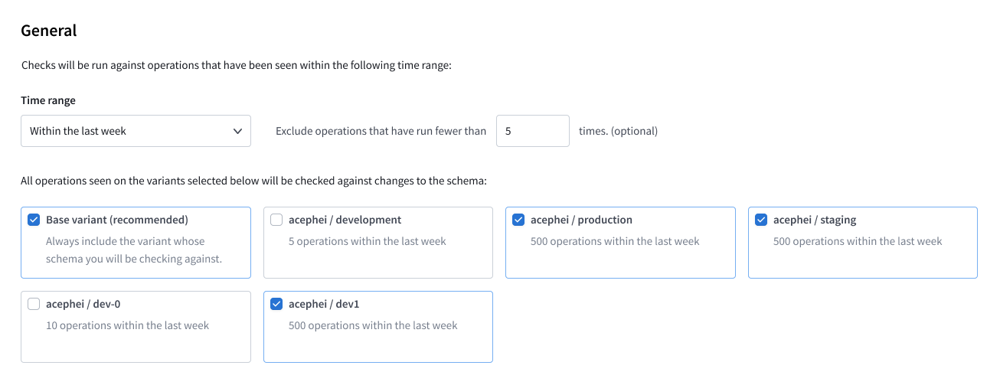
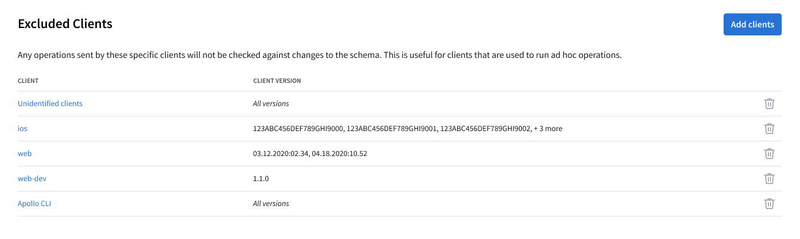

After you [enable schema checks](./schema-checks/) for your graph, you can customize their behavior to suit your use case. For example, you can:

* Exclude past operations that were executed by a particular client, such as a client that you only use for testing
* Exclude past operations that were executed relatively infrequently
* Check schema changes against multiple graph variants

## Using Apollo Studio (recommended)

In [Apollo Studio](https://studio.apollographql.com), you can configure default rules that are applied to every executed schema check. You define these rules from the Configuration tab of your graph's Checks page:



### Configuration options

* **Time range**: _Include_ all distinct operations that were executed within this range. The default value is 7 days ("Within the last week").
* **Operation count threshold**: _Exclude_ all operations that were executed fewer than this number of times within the specified **time range**.
* **Variants**: _Include_ all distinct operations that were executed against each selected variant of your graph. The default value is "Base variant" (i.e., whichever variant schema checks are being run against).
* **Client exclusions**: _Exclude_ all operations that were executed by particular clients, such as clients used exclusively for development and testing.
    

## Using the CLI

You can customize a single run of schema checks by providing options to the CLI command you use. If you've _also_ [configured default rules](#using-apollo-studio-recommended) for schema checks, any command-line options you provide take precedence over those rules.

> **Note:** The examples below use the Rover CLI command `rover graph check`.
>
> If you're using the now-deprecated Apollo CLI command `apollo service:check`, option names differ slightly (e.g., `--queryCountThresholdPercentage` instead of `--query-percentage-threshold`). Run `apollo help service:check` for details.

### Validation period

You can provide the `--validation-period` option to specify how far back in time Studio should look when determining the compatibility of past operations with the changes to your schema (by default, the command uses the last 7 days of operations).

This command checks schema changes against the past two weeks of operations:

```bash
rover graph check docs-example-graph@current --schema ./schema.graphql --validation-period="2 weeks"
```

Valid durations are represented as any combination of `years`, `months`, `weeks`, `days`, `min`, and `sec`:

* `1 month 2 weeks`
* `525600 min`

> If you specify a `--validation-period` that exceeds your organization's operation retention period, the `graph check` command fails with an error.

### Threshold values

You can provide **threshold values** to your CLI command to ignore historical operations that are relatively rare.

For example, you might want to discontinue support for an old version of your client that uses deprecated fields. You can set threshold values to determine when an acceptably small number of users are using the outdated client, thus reducing the impact of discontinuing support.

Provide threshold values with the following flags:

- `--query-count-threshold` - Check your schema only against operations that have been executed _at least_ the specified number of times within the specified duration.
- `--query-percentage-threshold` - Check your schema only against operations that account for _at least_ the specified percentage of _all_ operations against the graph within the specified duration. For example, specify `3` to set this threshold to 3%.

> **Note:** You can provide values for both of these flags. If you do, an operation must meet or exceed _both_ thresholds for schema checks to include it.

Here's an example of running `rover graph check` with threshold values:

```bash
rover graph check docs-example-graph@current \
# Path to schema file
--schema ./schema.graphql
# Check the schema against operations that have run in the last 5 days
--validation-period="5 days" \
# Only check against operations that have run at least 5 times during the 5-day duration
--query-count-threshold=5 \
# Only check against operations that account for at least 3% of total operation volume
--query-percentage-threshold=3
```

To request other filtering or threshold mechanisms, please get in touch with us on the [Rover repository](https://github.com/apollographql/rover).

### Checking against multiple environments

You might want to check schema changes against multiple environments, such as production, staging, and beta. Each of these environments might have a slightly different schema to support features that are experimental or in active development. In Apollo Studio, these schemas are represented as [variants](./org/graphs/#managing-variants) of a single graph.

You specify which variant you want to check against in the [graph ref](https://www.apollographql.com/docs/rover/conventions/#graph-refs) you provide to `rover graph check`:

```bash
rover graph check docs-example-graph@staging --schema ./schema.graphql
```

The graph ref `docs-example-graph@staging` specifies the `staging` variant of the `docs-example-graph` graph.

> In the Apollo CLI, you instead provide a `--variant` option to `apollo service:check`.

To check your schema against multiple variants, call `rover graph check` once for each variant. Doing so results in status checks similar to the following:


