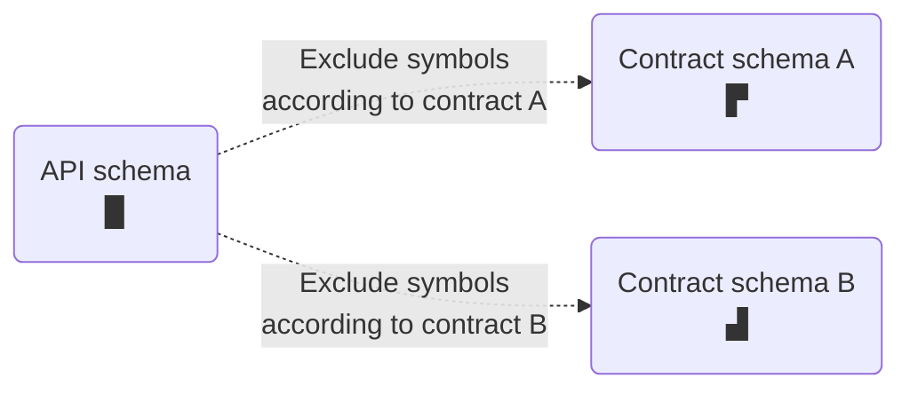

> Contracts are currently available in [public preview](https://www.apollographql.com/docs/resources/release-stages/#public-preview).

Apollo Studio **contracts** enable you to deliver different **schema subsets** to different consumers of your federated graph. Each subset can exclude a different set of symbols from your graph's [API schema](https://www.apollographql.com/docs/federation/#federated-schemas):



> Contracts are currently available _only_ for federated graphs.

## Use cases

Contracts have the follwing primary use cases:

**Scoped gateways.** You can deploy a managed instance of your gateway that uses your contract schema. Developers who use this "scoped" gateway can only execute operations that the contract schema supports. This enables you to hide experimental symbols that are still in development, or to limit a particular audience's access to only the portions of your schema that they need.

Scoped gateways can safely connect to the same subgraph instances as non-scoped gateways, because they can only request data that's represented in the contract schema.

**Documentation.** Your contract variant has its own schema reference, changelog, and Explorer. You can provide these resources to client developers to help them interact with a specific portion of your graph while omitting unnecessary symbols.

## Setup

### 1. Update `@apollo/gateway`

Before you define any contracts, update your gateway's `@apollo/gateway` library to version 0.34 or later.

Older versions of the library don't support the required `@tag` directive.

### 2. Enable variant support for `@tag`

A contract uses one of your graph's existing [variants](https://www.apollographql.com/docs/studio/org/graphs/#managing-variants) (called the **source variant**) to generate its schema subset. You need to enable your source variant's support for the `@tag` directive in Apollo Studio.

Open your graph's Settings page and find the Manage Variants section:


Click **Edit Supported Directives** for the variant you want to use, and enable support for `@tag`.

### 3. Add `@tag`s

With contracts, you include and exclude symbols from your **contract schema** based on **tags** you apply in your subgraph schemas.

For example, let's take a look at this Products subgraph schema:

```graphql{1-6,16-18}:title=products.graphql
# You must include this definition in any schema with tags!
directive @tag(name: String!) repeatable on
  | FIELD_DEFINITION
  | INTERFACE
  | OBJECT
  | UNION

type Query {
  topProducts: [Product!]!
}

type Product @key(fields: "upc") {
  upc: ID!
  name: String!
  description: String!
  # Tagged fields
  internalId: ID! @tag(name: "private")
  percentageMatch: Float! @tag(name: "experimental")
}
```

This schema applies the `@tag` directive to two object fields: `internalId` and `percentageMatch`.

* A tag can have any string name (you specify a contract's behavior for a given tag name).
    * We *strongly* recommend avoiding whitespace and special characters, because we might introduce tag name validations in the future.
* Give symbols the _same_ tag name if those symbols should be included or excluded as a group by a particular contract.
* A single symbol can have multiple tags.

You can tag the following symbols in your schema:

* Fields of object types (as shown above)
* Object types
* Interface types
* Union types

Whenever your graph's [API schema](https://www.apollographql.com/docs/federation/#federated-schemas) is generated, that schema retains all of the `@tag`s from your subgraph schemas.

### 4. Register updated subgraph schemas

After you're done tagging symbols, update your source variant by registering your updated subgraph schemas to Apollo Studio. Now you're ready to define your first contract!

### 5. Define a contract

Here's an example contract definition:

```yaml
name: "staging-public"
sourceVariant: "staging"
include: []
exclude: ["private"]
```

A contract definition includes:

* A contract name
    * The name cannot be changed after it's set. It will correspond to a new **contract [variant](https://www.apollographql.com/docs/studio/org/graphs/#managing-variants)** of your graph.
* An existing **source variant** of your graph
    * The contract uses tags in the source variant's API schema to determine which symbols to include and exclude.
    * The source variant _cannot_ be a contract variant for a _different_ contract.
* Lists of tag names to `include` and `exclude` from the **contract schema**

Each contract generates a **contract schema** that's a subset of its source variant's API schema. Symbols from the API schema are included in the contract schema according to the following rules:

* **If the `include` list is empty**, the contract schema _includes_ each symbol _unless_ it's tagged with a name in the `exclude` list.
* **If the `include` list is non-empty**, the contract schema _excludes_ each symbol _unless_ it's tagged with a name in the `include` list.
* The contract schema _excludes_ a symbol if it's tagged with both a name in the `include` list _and_ a name in the `exclude` list.

Our example contract excludes the `internalId` field from [the subgraph schema above](#tagging-fields). It _includes_ all other symbols in the schema.

> Whenever a contract's source variant successfully updates its API schema, Apollo automatically updates the contract schema to reflect modifications to symbols and tags.
>
> Configuration updates to a source variant do _not_ yet trigger new contract variant builds. This functionality is coming soon.

### 6. Add the contract to Studio

During this public preview, you add contracts to Studio by executing a mutation with the Apollo Studio API. You can execute this mutation from your own code, or via a tool like [Apollo Sandbox](https://studio.apollographql.com/sandbox).

#### API details

The Apollo Studio API is hosted at: `https://graphql.api.apollographql.com/api/graphql`

All requests to the Studio API require an `X-API-KEY` header. The value of this header must be an API key (graph or personal) with sufficient permissions for your graph. [Learn how to obtain an API key.](./api-keys/)

We also recommend setting the following header for all Studio API requests:

```
apollographql-client-name = <your-email-address>
```

This enables us to identify your traffic and understand your usage during this preview period. We can also reach out to you if we make any API changes that might affect your implementation.

> The Studio API does not provide any symbol stability guarantees at this time.

#### Mutation structure

Here's the structure of the mutation for adding a contract to Studio (which creates the associated contract variant):

```graphql
mutation UpsertContractVariant(
  $graphId: ID!,                    # Your Studio graph's ID
  $sourceVariant: String!,          # The contract's source variant
  $contractVariantName: String!,    # The contract variant to add
  $filterConfig: FilterConfigInput! # The tags to include and exclude
) {
  service(id: $graphId) {
    upsertContractVariant(
      sourceVariant: $sourceVariant
      contractVariantName: $contractVariantName
      filterConfig: $filterConfig
    ) {
      ... on ContractVariantUpsertSuccess {
        contractVariant {
          id
          name
        }
      }
      ... on ContractVariantUpsertErrors {
        errorMessages
      }
    }
  }
}
```

Here are example values for the variables required by this mutation:

```json
{
  "graphId": "docs-example-graph",
  "sourceVariant": "staging",
  "contractVariantName": "staging-public",
  "filterConfig": {
    "include": [],
    "exclude": ["private"]
  }
}
```

## Important cases and considerations

* If a contract excludes _every field_ of a particular object type, that object type's definition is excluded from the contract schema entirely.

* If a contract excludes an object, interface, or union type, it **must** also exclude all schema fields that _return_ that type. Otherwise, generation of the contract schema fails.

* If a contract excludes an object that implements an interface or is included in a union:

    * The contract is _not_ required to exclude schema fields that return that interface or union.

    * _However_, if a subgraph resolves one of these fields by returning the excluded object, a runtime error occurs in the gateway and the operation fails.

* You _can_ exclude object fields that are used in a computed field's [`@requires` directive](https://www.apollographql.com/docs/federation/entities/#extending-an-entity-with-computed-fields-advanced) without causing runtime errors.
