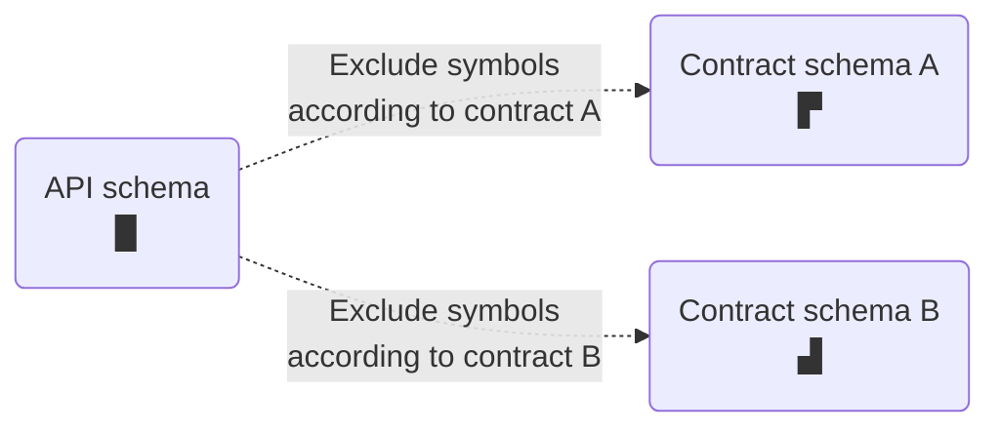

Apollo Studio **contracts** enable you to deliver different **schema subsets** to different consumers of your federated graph. Each subset can exclude a different set of symbols from your graph's [API schema](https://www.apollographql.com/docs/federation/#federated-schemas):



You can use contracts to hide "experimental" symbols that are still in development, or to scope a particular audience's access to only the portions of your schema that they need.

> Contracts are currently available _only_ for federated graphs.

## Setup

### Update `@apollo/gateway`

Before you define any contracts, update your gateway's `@apollo/gateway` library to version 0.34 or later.

Older versions of the library don't support the required `@tag` directive.

### Tag symbols

With contracts, you include and exclude symbols from your API schema based on **tags** you apply in your individual subgraph schemas.

For example, let's take a look at this Products subgraph schema:

```graphql{1-6,16-18}:title=products.graphql
# You must include this definition in any schema with tags!
directive @tag(name: String!) repeatable on
  | FIELD_DEFINITION
  | INTERFACE
  | OBJECT
  | UNION

type Query {
  topProducts: [Product!]!
}

type Product @key(fields: "upc") {
  upc: ID!
  name: String!
  description: String!
  # Tagged fields
  internalId: ID! @tag(name: "private")
  percentageMatch: Float! @tag(name: "experimental")
}
```

This schema applies the `@tag` directive to two object fields: `internalId` and `percentageMatch`.

* A tag can have any string name.
    * We *strongly* recommend avoiding whitespace and special characters, because we might introduce tag name validations in the future.
* You give symbols the _same_ tag name if those symbols should be included or excluded as a group by a particular contract.
* A single symbol can have multiple tags.

Whenever your graph's [supergraph schema](https://www.apollographql.com/docs/federation/#federated-schemas) is composed, that schema retains all of the `@tag`s from your subgraph schemas.


After you apply tags to one or more subgraph symbols, you're ready to define your first contract!

### Define a contract

Each contract you define consists of the following:

* A contract name
    * The name cannot be changed after it's set. It will correspond to a new **contract [variant](https://www.apollographql.com/docs/studio/org/graphs/#managing-variants)** of your graph.
* An existing **source variant** of your graph
    * The contract uses the source variant's API schema to determine which symbols to include and exclude.
    * The source variant _cannot_ also be a contract variant for a _different_ contract.
* A list of tag names to `include`
* A list of tag names to `exclude`

Here's an example contract's details:

```yaml
name: "staging-public"
sourceVariant: "staging"
include: []
exclude: ["private"]
```

Each contract generates a **contract schema** that's a subset of its source variant's API schema. Symbols from the API schema are included in the contract schema according to the following rules:

* **If the `include` list is empty**, the contract schema _includes_ each symbol _unless_ it's tagged with a name in the `exclude` list.
* **If the `include` list is non-empty**, the contract schema _excludes_ each symbol _unless_ it's tagged with a name in the `include` list.
* The contract schema _excludes_ a symbol if it's tagged with both a name in the `include` list _and_ a name in the `exclude` list.

Our example contract excludes the `internalId` field from [the subgraph schema above](#tagging-fields). It _includes_ all other symbols in the schema.

> Whenever a contract's source variant successfully updates its API schema, Apollo automatically updates the contract schema to reflect modifications to symbols and tags.
>
> Configuration updates to a source variant do _not_ yet trigger new contract variant builds. This functionality is coming soon.

### Add the contract to Studio

TODO


## Deployed vs Documentation Variants

Your Contract Variant can be used in two primary ways:
1) Documentation that you provide to your client developers to help them focus on just the parts of the graph which are relevant to them. They’ll be able to use the Apollo Studio schema reference, changelog, and Explorer all in the context of their subset of the graph.
2) Deploy the variant to an instance of Apollo Gateway (note you can run multiple gateway instances in parallel, e.g. through Express) so that it becomes an actual GraphQL API scoped to a subset of your larger schema. This gives you all the benefits of a documentation variant as well as enforcement of the Contract schema. Developers whose requests go to the Contract gateway will only have access to the defined subset of the graph.

## Using the Studio API

The Apollo Studio GraphQL API is located at https://graphql.api.apollographql.com/api/graphql, and is where you’ll need to execute the above operations to get set up. To authenticate, you’ll need to set the X-API-KEY header to your user token ([how to obtain an API key](https://www.apollographql.com/docs/studio/api-keys/))

We highly recommend you set the following header(s):

```
apollographql-client-name = <your-email-address> // Identify your traffic
```

This will help us to identify your traffic and understand your usage, so that we can reach out if we make any changes that will affect you. The Studio API does not come with any stability guarantees at this time, though we do our best to make all changes backwards compatible, when possible.

## Nuances, Known Limitations, & Issues

* Tag can only be applied to fields of an object type directly.
* Tag filtering behavior when every field on an object type is excluded.
    * If every field for an object type is removed, the entire object type is removed. This is the only way to remove an object type today.


* Tag filtering behavior with interfaces and unions.
    * If one of the object types which implements an interface or belongs to a union is removed by a filter, we suggest you ensure that your subgraph resolvers are aware and do not attempt to return the filtered object type.
    * Runtime errors can occur in the gateway when subgraphs return fields / types not included in the Contract Schema, for example a query for an interface which returns multiple object types.

## TODO

### Getting started

1. Choose a source variant to use for your Contract Schema. *While the feature is in preview we strongly recommend using a non-production variant.*
3. Enable @tag support on your chosen source variant.
    1. In order for your @tag directives to survive composition, you must enable the feature in Studio.
    2. You can edit supported directives in your graph settings page in Apollo Studio. Navigate to the graph > Settings > Manage Variants > Edit Supported Directives, and enable @tag.

screenshot

  3. You can also update these through the API (See how to make an API request below:)

  3. Add tags to fields in your subgraph schema document. Note that tags are additive across subgraphs so they only need to be defined in a single subgraph.

      ```
      // products subgraph
      type Query {
        topProducts: [Product!]!
      }

      type Product @key(fields: "upc") {
        upc: ID!
        name: String!
        description: String!
        internalId: ID! @tag(name: "private")
        percentageMatch: Float! @tag(name: "experimental")
      }
      ```

  4. Publish subgraph schemas to your source variant. ([docs](https://www.apollographql.com/docs/rover/subgraphs/#publishing-a-subgraph-schema-to-apollo-studio))

5. Create a Contract configuration via API

When elements are filtered out to create your Contract, they are removed from your [API schema](https://www.apollographql.com/docs/federation/#federated-schemas) and queries and mutations cannot access them. However, they’re still accessible to your Gateway for internal routing. This means that you can filter out fields that are used in @requires clauses without causing any runtime errors.
