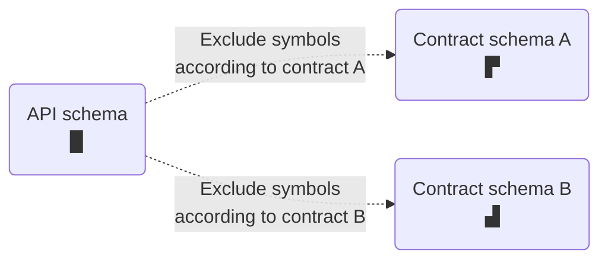

> Contracts are currently available in [public preview](https://www.apollographql.com/docs/resources/release-stages/#public-preview).

Apollo Studio **contracts** enable you to deliver different **schema subsets** to different consumers of your federated graph. Each subset can exclude a different set of symbols from your graph's [API schema](https://www.apollographql.com/docs/federation/#federated-schemas):



You can use contracts to hide "experimental" symbols that are still in development, or to scope a particular audience's access to only the portions of your schema that they need.

> Contracts are currently available _only_ for federated graphs.

## Use cases

Contracts have the follwing primary use cases:

**Scoped gateway.** You can deploy an instance of your gateway that uses your contract variant's schema _instead of_ your source variant's API schema. Developers who use this scoped gateway can only execute operations that the contract schema supports. Scoped gateways can safely connect to the same subgraph instances as non-scoped gateways.

**Documentation.** Your contract variant has its own schema reference, changelog, and Explorer. You can provide these resources to client developers to help them interact with a specific portion of your graph while omitting unnecessary symbols.

## Setup

### Update `@apollo/gateway`

Before you define any contracts, update your gateway's `@apollo/gateway` library to version 0.34 or later.

Older versions of the library don't support the required `@tag` directive.

### Tag symbols

With contracts, you include and exclude symbols from your **contract schema** based on **tags** you apply in your individual subgraph schemas.

For example, let's take a look at this Products subgraph schema:

```graphql{1-6,16-18}:title=products.graphql
# You must include this definition in any schema with tags!
directive @tag(name: String!) repeatable on
  | FIELD_DEFINITION
  | INTERFACE
  | OBJECT
  | UNION

type Query {
  topProducts: [Product!]!
}

type Product @key(fields: "upc") {
  upc: ID!
  name: String!
  description: String!
  # Tagged fields
  internalId: ID! @tag(name: "private")
  percentageMatch: Float! @tag(name: "experimental")
}
```

This schema applies the `@tag` directive to two object fields: `internalId` and `percentageMatch`.

* A tag can have any string name (you specify a contract's behavior for a given tag name).
    * We *strongly* recommend avoiding whitespace and special characters, because we might introduce tag name validations in the future.
* Give symbols the _same_ tag name if those symbols should be included or excluded as a group by a particular contract.
* A single symbol can have multiple tags.

You can tag the following symbols in your schema:

* Fields of object types (as shown above)
* Object types
* Interface types
* Union types

Whenever your graph's [API schema](https://www.apollographql.com/docs/federation/#federated-schemas) is generated, that schema retains all of the `@tag`s from your subgraph schemas.


After you apply tags to one or more subgraph symbols, you're ready to define your first contract!

### Define a contract

Each contract you define consists of the following:

* A contract name
    * The name cannot be changed after it's set. It will correspond to a new **contract [variant](https://www.apollographql.com/docs/studio/org/graphs/#managing-variants)** of your graph.
* An existing **source variant** of your graph
    * The contract uses tags in the source variant's API schema to determine which symbols to include and exclude.
    * The source variant _cannot_ be a contract variant for a _different_ contract.
* Lists of tag names to `include` and `exclude` from the **contract schema**

Here's an example contract's details:

```yaml
name: "staging-public"
sourceVariant: "staging"
include: []
exclude: ["private"]
```

Each contract generates a **contract schema** that's a subset of its source variant's API schema. Symbols from the API schema are included in the contract schema according to the following rules:

* **If the `include` list is empty**, the contract schema _includes_ each symbol _unless_ it's tagged with a name in the `exclude` list.
* **If the `include` list is non-empty**, the contract schema _excludes_ each symbol _unless_ it's tagged with a name in the `include` list.
* The contract schema _excludes_ a symbol if it's tagged with both a name in the `include` list _and_ a name in the `exclude` list.

Our example contract excludes the `internalId` field from [the subgraph schema above](#tagging-fields). It _includes_ all other symbols in the schema.

> Whenever a contract's source variant successfully updates its API schema, Apollo automatically updates the contract schema to reflect modifications to symbols and tags.
>
> Configuration updates to a source variant do _not_ yet trigger new contract variant builds. This functionality is coming soon.

### Add the contract to Studio

TODOO


## Using the Studio API

The Apollo Studio GraphQL API is located at https://graphql.api.apollographql.com/api/graphql, and is where you’ll need to execute the above operations to get set up. To authenticate, you’ll need to set the X-API-KEY header to your user token ([how to obtain an API key](https://www.apollographql.com/docs/studio/api-keys/))

We highly recommend you set the following header(s):

```
apollographql-client-name = <your-email-address> // Identify your traffic
```

This will help us to identify your traffic and understand your usage, so that we can reach out if we make any changes that will affect you. The Studio API does not come with any stability guarantees at this time, though we do our best to make all changes backwards compatible, when possible.

## Important cases and considerations

* If a contract excludes _every field_ of a particular object type, that object type's definition is excluded from the contract schema entirely.

* If a contract excludes an object, interface, or union type, it **must** also exclude all schema fields that _return_ that type. Otherwise, generation of the contract schema fails.

* If a contract excludes an object that implements an interface or is included in a union:

    * The contract is _not_ required to exclude schema fields that return that interface or union.

    * _However_, if a subgraph resolves one of these fields by returning the excluded object, a runtime error occurs in the gateway and the operation fails.

## TODO

### Getting started

1. Choose a source variant to use for your Contract Schema. *While the feature is in preview we strongly recommend using a non-production variant.*
3. Enable @tag support on your chosen source variant.
    1. In order for your @tag directives to survive composition, you must enable the feature in Studio.
    2. You can edit supported directives in your graph settings page in Apollo Studio. Navigate to the graph > Settings > Manage Variants > Edit Supported Directives, and enable @tag.

screenshot

  3. You can also update these through the API (See how to make an API request below:)

  3. Add tags to fields in your subgraph schema document. Note that tags are additive across subgraphs so they only need to be defined in a single subgraph.

      ```
      // products subgraph
      type Query {
        topProducts: [Product!]!
      }

      type Product @key(fields: "upc") {
        upc: ID!
        name: String!
        description: String!
        internalId: ID! @tag(name: "private")
        percentageMatch: Float! @tag(name: "experimental")
      }
      ```

  4. Publish subgraph schemas to your source variant. ([docs](https://www.apollographql.com/docs/rover/subgraphs/#publishing-a-subgraph-schema-to-apollo-studio))

5. Create a Contract configuration via API

When elements are filtered out to create your Contract, they are removed from your [API schema](https://www.apollographql.com/docs/federation/#federated-schemas) and queries and mutations cannot access them. However, they’re still accessible to your Gateway for internal routing. This means that you can filter out fields that are used in @requires clauses without causing any runtime errors.
