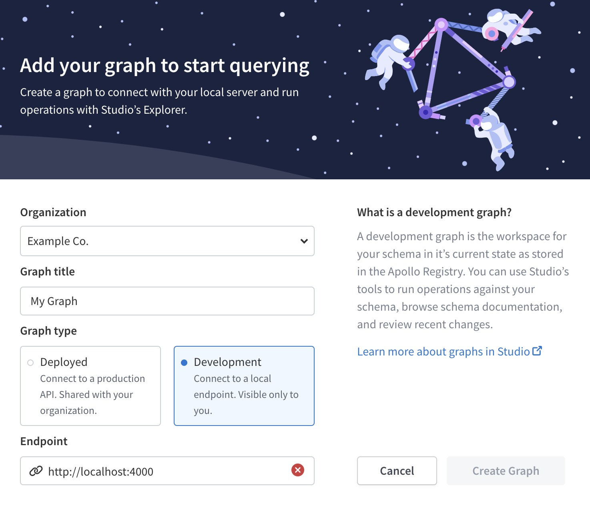
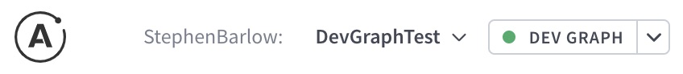

Development graphs (or **dev graphs**) are a special type of graph in Apollo Studio. Unlike a _deployed_ graph (which represents a graph in a deployed environment like staging or production), a dev graph represents a graph in your own development environment.

Your dev graphs are only visible to you, so you can prototype and iterate on schema changes quickly and safely, without creating noise for your teammates.

Currently, dev graphs support the following Apollo Studio features:

* [The Apollo Studio Explorer](./explorer/explorer/)
* [Schema changelog](./org/graphs/#tracking-schema-changes)

Other Apollo Studio features (such as metrics reporting and graph API keys) are not yet supported.

## Creating a dev graph

1. Make sure your GraphQL server is running in your development environment, and that introspection is enabled.
    > Unlike deployed graphs, dev graphs use introspection to obtain your server's schema. Deployed graphs use the schema you register with Studio so you can disable introspection in your production environments.

2. Open [Apollo Studio](https://studio.apollographql.com/) and click **New Graph** in the upper right. The following form appears:

    

3. In the form, specify:

    * The dev graph's associated Studio organization
    * A name for the graph
    * The **Development** graph type
    * Your development GraphQL server's endpoint (by default this is `localhost:4000` when running Apollo Server locally)

4. Click **Create Graph**.
    * _If the **Create Graph** button is disabled, Studio can't reach your server's endpoint. Double check that your server is running._

After your graph is created, Studio automatically opens the Explorer so you can begin querying your server.

## Using the Explorer with dev graphs

You can use the [Apollo Studio Explorer](./explorer/explorer/) to explore and query dev graphs just like you use it with deployed graphs.

When you're exploring a dev graph, Studio's top nav displays a special **Dev Graph** dropdown menu:

The dropdown displays a green dot if the Explorer is successfully connected to your running GraphQL server.

Click the dropdown to configure the following options that are specific to dev graphs:

* **Endpoint URL**: If your development server's endpoint changes (for example, if you run the server on a different port), update it here.
* **Auto update**: By default, the Explorer regularly polls your development server for updates to your schema. If you change your schema and restart your server, the Explorer detects and reflects these changes automatically. You can disable that automatic behavior here.
