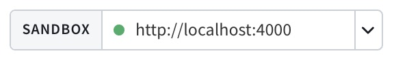

import { VideoFrame } from 'gatsby-theme-apollo-docs'
import { Button } from '@apollo/space-kit/Button';
import { Link } from 'gatsby';
import { colors } from 'gatsby-theme-apollo-core';

The Apollo Studio Explorer is a powerful web IDE for creating, running, and managing GraphQL operations:

<VideoFrame src="https://www.youtube.com/embed/j8b0Bda_TIw"/>

The Explorer is free for all Apollo Studio organizations. It supports all GraphQL operation types (`Query`, `Mutation`, and `Subscription`).

## Account-free sandbox

**Apollo Sandbox** is a special instance of the Explorer that doesn't require an Apollo account. Sandbox doesn't support advanced Explorer features like schema history, but it's great for local development.

<p>
  <Button
    size="large"
    color={colors.primary}
    as={<Link to="https://studio.apollographql.com/sandbox/" target="_blank" />}
  >
    Launch Sandbox
  </Button>
</p>

Sandbox automatically attempts to connect to a GraphQL server running at `http://localhost:4000`. You can use the box at the top of the page to change this URL to any local or remote GraphQL endpoint that's accessible by your browser:



>To try out Sandbox with an example GraphQL API, you can set its URL to `https://swapi-graphql.netlify.app/.netlify/functions/index`.


## Setup

To get started with the Explorer, [create a graph](./getting-started/#2-create-your-first-graph) in Apollo Studio and then navigate to the graph's Explorer tab.

The Getting Started tab _within_ the Explorer helps you get up and running with core features.

When you execute your first query, the Explorer prompts you for the URL of your running GraphQL server. You can then change this URL at any time from the Explorer's Settings tab.

## Building a query

### The operation editor

The Explorer’s operation editor is built on [Monaco](https://microsoft.github.io/monaco-editor/). It provides common features of query-building tools, including:

* Panels for specifying headers and variables
* Persistence across sessions
* Keyboard shortcuts (click the keyboard icon in the bottom-right corner of the operation editor to view all available shortcuts)

The editor also provides full IntelliSense support for GraphQL, including:

* Query linting
* Autocomplete
* Peek definitions on mouse hover
* Jump-to-definition with command-click

The editor can manage multiple operations and reason about those operations individually. As you work, the editor shifts focus to whichever operation you click into. Each operation has its own context menu ("**...**") that enables you to format it, copy a link to share, or generate a `curl` command.

### The Documentation tab

The Explorer's Documentation tab enables you to step into your schema, beginning at one of its entry points. As you step into a field and its subfields, the Explorer keeps track of your current path within the schema.

You can click the **⊕** button next to any field in the Documentation tab to add that field to the operation editor, at your current path. By default, the Explorer automatically generates variables for that field's arguments.

## Searching your schema

The Explorer provides a two-step schema search (shortcut `⌘+K`):

1. Find the schema field you're looking for
2. Find the ideal _path_ to that field from your schema's entry points

### 1. Find a field

First, you search for a field by its name (e.g., `email`). The interface helps you differentiate between fields with the same name (e.g., `User.email` versus `Organization.email`). The search is "fuzzy", so it works even if you don't know a field's exact spelling.

If you know exactly which type and which field you're looking for, you can separate those values with a period (e.g., `User.email`).

### 2. Find a path to the field

After you identify a type-field pair, the Explorer lists all of the _paths_ to that field that start at your schema's entry points (`Query`, `Mutation` and `Subscription`). These paths are ordered by depth.

> Finding the path to a field is particularly important with GraphQL, because you can only query a field if that field's position within your query is valid. 

After you select which path you want, the Explorer opens that path in its Documentation tab. You can then click the **⊕** button to add that path to your query.

## Connecting to your server

The Explorer automatically attempts to connect to your GraphQL server at the URL specified in the Explorer Settings tab. Depending on your server's settings, you might need to configure this connection to handle authentication or CORS requirements.

### Authentication

The Explorer currently enables you to authenticate via [request headers](#request-headers), [cookies](#cookies), and [preflight scripts](#preflight-scripts-beta).

> If your graph has authentication requirements that aren't covered by these options, please contact **support@apollographql.com** with questions or feedback.

#### Request headers

The bottom of the Explorer editor provides a Headers section where you can set headers that are included in your operation's HTTP request.

#### Environment variables

The bottom of the Explorer editor includes an Environment Variables section where you can provide sensitive information that's sent with your operation's HTTP request.

#### Cookies

If your server uses cookies to authenticate, you can configure your endpoint to share those cookies with `https://studio.apollographql.com`.

To set this up, your [cookie's value must contain `SameSite=None; Secure`](https://www.chromium.org/updates/same-site). Additionally, these CORS headers must be present in your server's response to Studio:

```bash
Access-Control-Allow-Origin: https://studio.apollographql.com
Access-Control-Allow-Credentials: true
```

Once configured, requests sent from `https://studio.apollographql.com` will carry the cookies from your domain when you run queries with the Explorer. If you're logged in on your domain, requests from the Explorer will also be logged in. If you log out on your domain and the cookie is removed, requests from the Explorer will be logged out.

#### Preflight Scripts (beta)

> To request access to preflight scripts, contact **support@apollographql.com**.

[Similar to Postman](https://learning.postman.com/docs/writing-scripts/pre-request-scripts/), the Explorer can execute custom JavaScript before your request runs. This feature is especially useful for managing OAuth, for example by refreshing an access token automatically.

You can save preflight scripts to your organization, meaning all users in your organization can use them.

For more information, see the [documentation for preflight scripts](https://github.com/apollographql/apollo-studio-community/blob/main/preview-docs/PreRequestScripts.md).

### CORS policies

Requests from the Explorer go straight from your browser to your GraphQL server, so your endpoint will see requests coming from the `https://studio.apollographql.com` domain.

It's common for public endpoints to have [CORS policies](https://developer.mozilla.org/en-US/docs/Web/HTTP/CORS) that restrict which domains can query them. If your endpoint has CORS protections enabled, you probably need to safelist `https://studio.apollographql.com` in your CORS policy to use the Explorer.

To do so, include the following header(s) in your server's responses:

```bash
Access-Control-Allow-Origin: https://studio.apollographql.com

# Include this one only if your server also authenticates via cookies.
Access-Control-Allow-Credentials: true
```

> If you can't change your CORS policy, you might be able to create a proxy for your endpoint and point the Explorer to the proxy instead. CORS policies are enforced by browsers, and the proxy won't have the same issues communicating to your endpoint.

## Additional features

### Display

#### Dark mode

> Toggle between light and dark mode from the Explorer's Settings tab.

#### Table layout for response data

> Toggle between table and JSON layout from the top of the Explorer's Response panel.

You can view an operation's response as JSON or as a table. Table layout is especially useful when your response includes an array, or when you want to share a query's results with someone who isn't familiar with JSON.

When looking at arrays of data in table mode, you can click the header of any column of data to sort your array by that column's values.

#### Inline/Extract fragments

> Right-click any fragment name to inline that fragment in queries where it is used. Right-click any selection of fields to extract those fields into a fragment.

While editing your operations, you can now inline and extract your fragments with one click. This is useful when trying to select the same fields in multiple places using fragments, or when trying too inline fragments into a single operation to be used somewhere else.

#### Inline/Extract variables

> Click the "**...**" menu next to an operation in the editor to select a notation for variables.

While editing your operations, you can toggle between inline or extracted notation for variables. This is useful when you want to switch notations to copy and paste something, or when you're drafting a query in the editor and want to move it to your code.

##### Inline variable

```graphql:title=query.graphql
query {
  user(id: "Beth Harmon") {
    name
  }
}
```

##### Extracted variable

```graphql:title=query.graphql
query($id: ID!) {
  user(id: $id) {
    name
  }
}
```

```json:title=variables.json
{
  "id": "Beth Harmon"
}
```

### Federation

#### Query plans for federated graphs

If you're working with a federated graph in Studio, the Explorer dynamically calculates query plans for your operations in the right-hand panel (an option under the Responses tab). As you edit your query, the Explorer will recalculate your query plans and show you their updates.

There are two display modes for query plans. You can switch between the "text" and "chart" display modes in the response panel's header menu.

### Local development

You can use the Explorer for local development by creating a [development graph](./dev-graphs/) in Studio.

Unlike _deployed_ graphs, dev graphs use **introspection** to fetch your schema from your development server, and they also poll regularly for changes. Whenever a dev graph detects schema changes, it pulls those changes and updates itself automatically. You can pause introspection polling at any time.

### Saving operations

#### Operation history

> View your operation history from the Explorer's **Run history** tab.

The Explorer saves the history of your recently run operations (and the variable values for those operations) to your browser's local storage. Access your history to retain and recover previous work without cluttering your editor.

#### Downloading responses

You can copy responses from your operations with a button or download any given response to a local JSON file.

If you are looking at your data [in the table layout](#table-layout-for-response-data), you will also be able to download arrays in your response to CSV files.

### Testing operations

#### Tracing

> Enable **Inlined traces** from the Explorer's Settings tab.

If you are using Apollo Server 2.18+, you can see traces from your responses inlined in the Explorer by adding the `ApolloServerPluginInlineTrace` plugin to your server's configuration:

```
import { ApolloServerPluginInlineTrace } from "apollo-server-core";
const server = new ApolloServer({
  typeDefs,
  resolvers,
  plugins: [ApolloServerPluginInlineTrace()],
})
```

Turning on the inlined traces feature in the Explorer's settings tells the Explorer to forward a special header to your server to request that it return tracing information along with its response.

#### Mocked responses

> Enable **Mock responses** from the Explorer's Settings tab.

This feature naively mocks operation responses based on your schema's types, instead of sending your operations over the wire to your endpoint.

Mocked responses are helpful if you want to get a feel for the shape of a query's response when your endpoint isn't available, or if you need a quick response to use in a code sample or a unit test.

#### Response hints

> Enable **Use response hints** from the Explorer's Settings tab.

As you build your query, the Explorer runs partial queries under the hood and shows their results in-line. This is helpful when you want to get a sense of the data you'll get back in your full operation response. It can also help you retrieve a quick answer to a query without needing to click the Run button.

The Explorer does not show response hints for mutations (this requires running partial mutations, which is unsafe).

#### Default headers

> Set **Default Headers** from the Explorer's Settings tab.

> **WARNING:** Do not use **default headers** to provide sensitive information, such as an access token. Instead, use [environment variables](#environment-variables)

You can specify default headers that are applied to _every_ Explorer request executed by _every_ user in your organization. This can be useful if you want to provide a consistent identifier to your server for requests coming from the Explorer.

#### Field latency hints

As an alternative to [response hints](#response-hints), the Explorer can show you hints for the latency of the fields in your query. This option is available only if you've configured your graph to [report field usage and tracing data to Studio](./setup-analytics/).

The Explorer shows you the 95th-percentile (default) response times for the fields in your query to help you get a sense of how "expensive" your query is and what the bottlenecks in response time will be.
You can change which percentile you want to see hints from at any time in the Explorer settings.

#### `graphql-lodash` integration

The Explorer [extends your schema with `graphql-lodash`](https://github.com/APIs-guru/graphql-lodash) on the client side, so you can write queries that include lodash directives and they will resolve correctly. This is helfpul if you want to manipulate your response data into into a specific format for exporting, or if you want to do some quick analysis without needing to export.

Here's an example of a query that uses `graphql-lodash`. You can try pasting this in the Explorer embedded at http://apollographql.com/studio/develop:

```graphql:title=example.graphql
query StarWarsGenderStats {
  genderStats: allPeople @_(get: "edges") {
    edges @_(countBy: "node.gender") {
      node {
        gender
      }
    }
  }
}
```

## FAQ

### Does the Explorer support subscription operations?

Yes. You can run queries, mutations, and subscriptions all from the same Explorer page. You can start and stop listening to subscriptions, and you can see new subscription data as it comes in and old information as it becomes stale. 

You can also set your server's subscription websocket endpoint independently from the HTTP endpoint for queries and mutations.

### Is the Explorer available for on-prem distribution?

Not at this time. The Explorer is available for free, unlimited use in Apollo Studio, but it is not available for download or on-prem distribution. This might change in the future, but for now our goal is to provide the best possible Explorer experience from within Studio.

### Do my Explorer operations pass through Apollo servers?

No. Operations you run in the Explorer are sent directly from your browser to your GraphQL server, _without_ passing through Apollo's systems. Apollo never sees your request headers or response data. For more information, see [Apollo Studio data privacy and compliance](./data-privacy).
