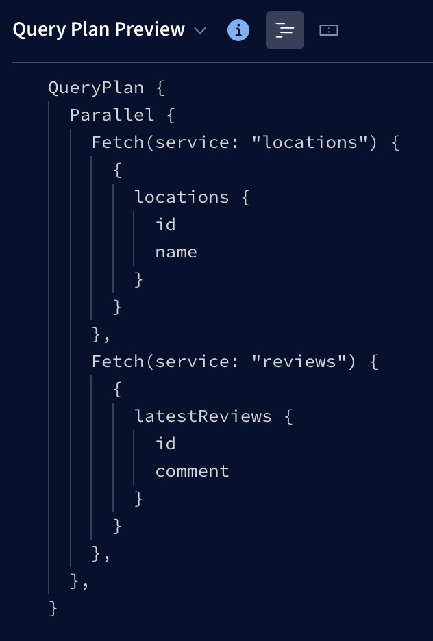
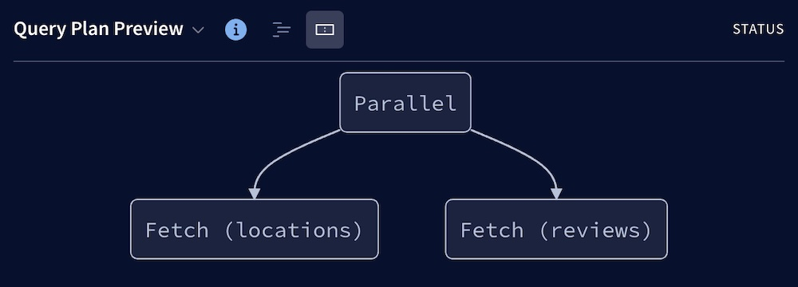
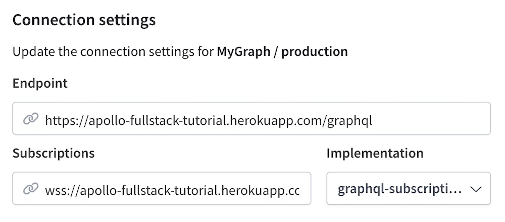
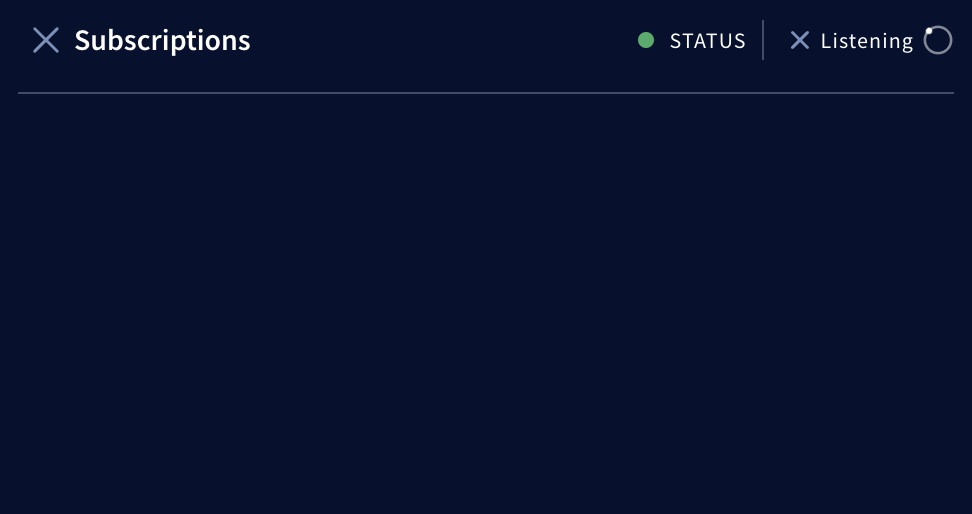

## Display

### Dark mode

> Toggle between light and dark mode from the Explorer's Settings tab.

### Table layout for response data

> Toggle between table and JSON layout from the top of the Explorer's Response panel.

You can view an operation's response as JSON or as a table. Table layout is especially useful when your response includes an array, or when you want to share a query's results with someone who isn't familiar with JSON.

When looking at arrays of data in table mode, you can click the header of any column of data to sort your array by that column's values.

### Inline/Extract fragments

> Right-click any fragment name to inline that fragment in queries where it is used. Right-click any selection of fields to extract those fields into a fragment.

While editing your operations, you can now inline and extract your fragments with one click. This is useful when trying to select the same fields in multiple places using fragments, or when trying too inline fragments into a single operation to be used somewhere else.

### Inline/Extract variables

> Click the "**...**" menu next to an operation in the editor to select a notation for variables.

While editing your operations, you can toggle between inline or extracted notation for variables. This is useful when you want to switch notations to copy and paste something, or when you're drafting a query in the editor and want to move it to your code.

#### Inline variable

```graphql:title=query.graphql
query {
  user(id: "Beth Harmon") {
    name
  }
}
```

#### Extracted variable

```graphql:title=query.graphql
query($id: ID!) {
  user(id: $id) {
    name
  }
}
```

```json:title=variables.json
{
  "id": "Beth Harmon"
}
```

## Local development

You can use the Explorer for local development by opening [Sandbox](./sandbox/), or by creating a [development graph](../dev-graphs/) in Studio.

Unlike _deployed_ graphs, both Sandbox and dev graphs use **introspection** to fetch your schema from your development server, and they also poll regularly for changes. Whenever schema changes are detected, they're pulled in automatically.

You can pause introspection polling at any time. To do so:

* **In Sandbox**, open the Explorer Settings tab on the left and edit your connection settings. In the dialog, disable **Auto Update**.
* **In dev graphs**, open the **DEV GRAPH** menu at the top and disable **Auto Update**.

## Federation

### Query plans for federated graphs

If you're working with a federated graph in Studio, the Explorer dynamically calculates example query plans for your operations in the right-hand panel (click **Response** and select **Query Plan Preview** from the dropdown):



> If you don't see the **Query Plan Preview** option, make sure you're using the full version of the Apollo Explorer, _not_ Apollo Sandbox. Also make sure you're using the Explorer with a federated graph.

As you edit an operation, the Explorer recalculates its example query plan accordingly.

> **⚠️ The Explorer might not use the same query planning logic as your gateway!** You can mouse over the information icon next to **Query Plan Preview** to see which version of the `@apollo/query-planner` library the Explorer is using. This version might differ from your gateway's version.
>
>The Explorer's example query plan helps you reason about your operations, but it is _not_ intended as a source of truth.

There are two display modes for query plans. You can switch between **Show plan as text** and **Show plan as chart** by clicking the icons next to **Query Plan Preview**:



## Subscription support

The Explorer supports the following libraries/protocols for sending subscription operations over WebSocket:

* [`graphql-ws`](https://github.com/enisdenjo/graphql-ws)
    * This library uses the `graphql-transport-ws` protocol.
* [`subscriptions-transport-ws`](https://github.com/apollographql/subscriptions-transport-ws)
    * This library uses the `graphql-ws` protocol (not to be confused with the `graphql-ws` _library_ above).
    * Most Apollo Server instances with subscriptions enabled use this library.

To execute a subscription operation, first specify your subscriptions endpoint and implementation in the Explorer's connection settings:



When you execute a subscription, a Subscriptions panel appears in the bottom-right of the Response panel:



The dot next to `STATUS` indicates whether the Explorer is connected to your WebSocket endpoint (green if connected, red if disconnected). As long as you're connected _and_ listening for updates, any such updates appear in the panel as they're received.

> If you can't connect, double-check that you've specified the correct subscriptions endpoint and implementation.

You can click the `X` next to `Listening` to stop listening for updates (the updates you've already received remain in the panel). You can also click the `X` next to `Subscriptions` to close the panel entirely.

## Embedding

If you've enabled [public access to a variant of your graph](../org/graphs/#public-variants), you can embed the Explorer in a webpage that you can then provide to your graph's consumers. This enables those consumers to test out operations from your own website.

See [Embedding the Explorer](./embed-explorer).

## Saving operations

### Operation history

> View your operation history from the Explorer's **Run history** tab.

The Explorer saves the history of your recently run operations (and the variable values for those operations) to your browser's local storage. Access your history to retain and recover previous work without cluttering your editor.

### Downloading responses

You can copy responses from your operations with a button or download any given response to a local JSON file.

If you are looking at your data [in the table layout](#table-layout-for-response-data), you will also be able to download arrays in your response to CSV files.

## Testing operations

### Tracing

> Enable **Inlined traces** from the Explorer's Settings tab.

If you are using Apollo Server 2.18+, you can see traces from your responses inlined in the Explorer by adding the `ApolloServerPluginInlineTrace` plugin to your server's configuration:

```
import { ApolloServerPluginInlineTrace } from "apollo-server-core";
const server = new ApolloServer({
  typeDefs,
  resolvers,
  plugins: [ApolloServerPluginInlineTrace()],
})
```

Turning on the inlined traces feature in the Explorer's settings tells the Explorer to forward a special header to your server to request that it return tracing information along with its response.

### Mocked responses

> Enable **Mock responses** from the Explorer's Settings tab.

This feature naively mocks operation responses based on your schema's types, instead of sending your operations over the wire to your endpoint.

Mocked responses are helpful if you want to get a feel for the shape of a query's response when your endpoint isn't available, or if you need a quick response to use in a code sample or a unit test.

### Response hints

> Enable **Use response hints** from the Explorer's Settings tab.

As you build your query, the Explorer runs partial queries under the hood and shows their results in-line. This is helpful when you want to get a sense of the data you'll get back in your full operation response. It can also help you retrieve a quick answer to a query without needing to click the Run button.

The Explorer does not show response hints for mutations (this requires running partial mutations, which is unsafe).

### Default headers

> Set **Default Headers** from the Explorer's Settings tab.

> **WARNING:** Do not use **default headers** to provide sensitive information, such as an access token. Instead, use [environment variables](./connecting-authenticating/#environment-variables)

You can specify default headers that are applied to _every_ Explorer request executed by _every_ user in your organization. This can be useful if you want to provide a consistent identifier to your server for requests coming from the Explorer.

### Field latency hints

As an alternative to [response hints](#response-hints), the Explorer can show you hints for the latency of the fields in your query. This option is available only if you've configured your graph to [report field usage and tracing data to Studio](/metrics/usage-reporting/).

The Explorer shows you the 95th-percentile (default) response times for the fields in your query to help you get a sense of how "expensive" your query is and what the bottlenecks in response time will be.
You can change which percentile you want to see hints from at any time in the Explorer settings.

### `graphql-lodash` integration

The Explorer [extends your schema with `graphql-lodash`](https://github.com/APIs-guru/graphql-lodash) on the client side, so you can write queries that include lodash directives and they will resolve correctly. This is helfpul if you want to manipulate your response data into into a specific format for exporting, or if you want to do some quick analysis without needing to export.

Here's an example of a query that uses `graphql-lodash`. You can try pasting this in the Explorer embedded at http://apollographql.com/studio/develop:

```graphql:title=example.graphql
query StarWarsGenderStats {
  genderStats: allPeople @_(get: "edges") {
    edges @_(countBy: "node.gender") {
      node {
        gender
      }
    }
  }
}
```

## FAQ

### Is the Explorer available for on-prem distribution?

Not at this time. The Explorer is available for free, unlimited use in Apollo Studio, but it is not available for download or on-prem distribution. This might change in the future, but for now our goal is to provide the best possible Explorer experience from within Studio.

### Do my Explorer operations pass through Apollo servers?

No. Operations you run in the Explorer are sent directly from your browser to your GraphQL server, _without_ passing through Apollo's systems. Apollo never sees your request headers or response data. For more information, see [Apollo Studio data privacy and compliance](../data-privacy).
