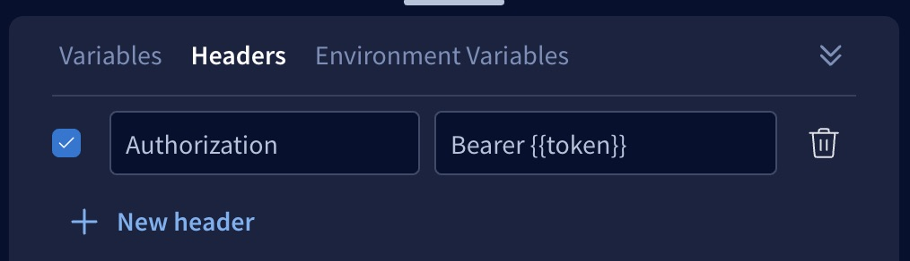
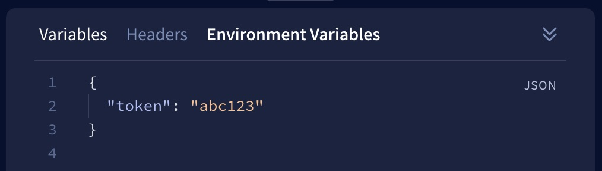
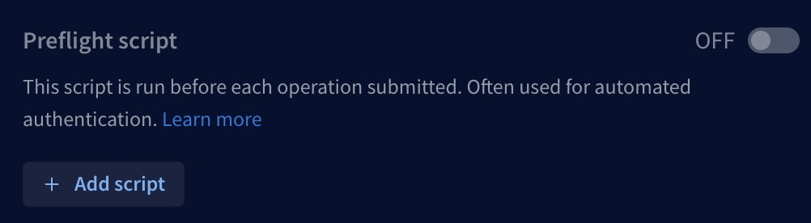
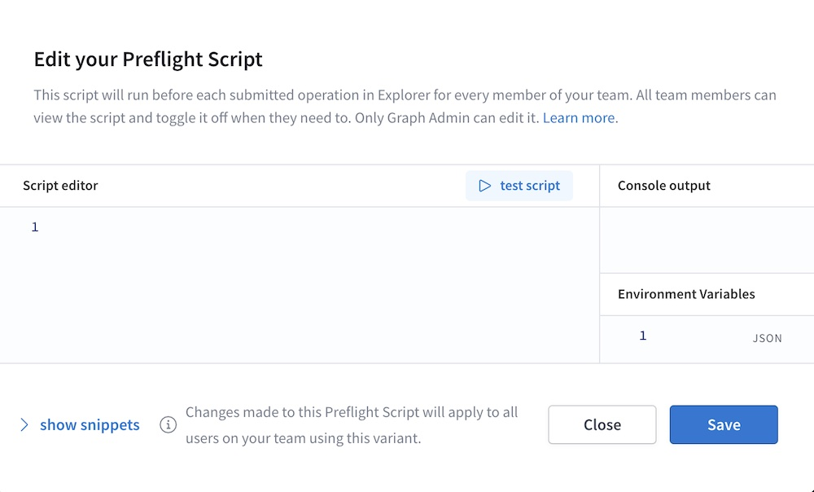
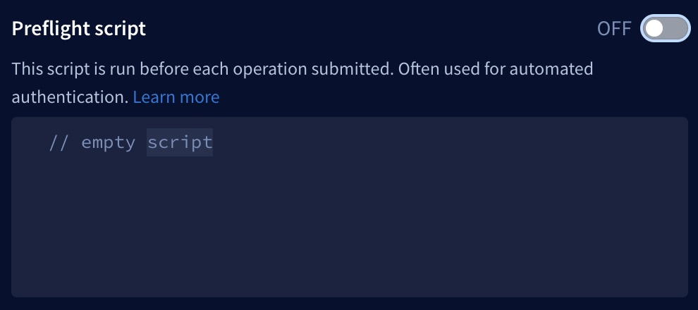

The Explorer automatically attempts to connect to your GraphQL server at the URL specified in the Explorer Settings tab. Depending on your server's settings, you might need to configure this connection to handle CORS requirements or authentication.

## CORS policies

Requests from the Explorer go straight from your browser to your GraphQL server, so your endpoint will see requests coming from the `https://studio.apollographql.com` domain.

It's common for public endpoints to have [CORS policies](https://developer.mozilla.org/en-US/docs/Web/HTTP/CORS) that restrict which domains can query them. If your endpoint has CORS protections enabled, you probably need to safelist `https://studio.apollographql.com` in your CORS policy to use the Explorer.

To do so, include the following header(s) in your server's responses:

```bash
Access-Control-Allow-Origin: https://studio.apollographql.com

# Include this one only if your server also authenticates via cookies.
Access-Control-Allow-Credentials: true
```

> If you can't change your CORS policy, you might be able to create a proxy for your endpoint and point the Explorer to the proxy instead. CORS policies are enforced by browsers, and the proxy won't have the same issues communicating to your endpoint.


## Authentication

The Explorer currently enables you to authenticate via [request headers](#request-headers), [cookies](#cookies), and [preflight scripts](#preflight-scripts).

> If your graph has authentication requirements that aren't covered by these options, please contact **support@apollographql.com** with questions or feedback.

### Request headers

The bottom panel of the Explorer includes a Headers tab where you can set headers that are included in your operation's HTTP request.

Headers can include the values of [environment variables](#environment-variables), as shown:



### Cookies

If your server uses cookies to authenticate, you can configure your endpoint to share those cookies with `https://studio.apollographql.com`.

To set this up, your [cookie's value must contain `SameSite=None; Secure`](https://www.chromium.org/updates/same-site). Additionally, these CORS headers must be present in your server's response to Studio:

```bash
Access-Control-Allow-Origin: https://studio.apollographql.com
Access-Control-Allow-Credentials: true
```

Once configured, requests sent from `https://studio.apollographql.com` will carry the cookies from your domain when you run queries with the Explorer. If you're logged in on your domain, requests from the Explorer will also be logged in. If you log out on your domain and the cookie is removed, requests from the Explorer will be logged out.

### Environment variables

The bottom panel of the Explorer editor includes an Environment Variables tab. Here, you can provide sensitive information that you can then include in header values or [preflight scripts](#preflight-scripts). This enables you to share operations (including headers) with other team members _without_ exposing sensitive data.

For example, you can define a `token` environment variable like so:



You can then include that environment variable in header values with the following syntax:


When you share this operation, the value of `token` is _not_ shared, and other users can provide their own.

### Preflight scripts

Similar to tools like Postman, the Explorer can run a custom **preflight script** before each GraphQL operation that's executed by your team members. This script is identical for every team member that uses the Explorer with a particular variant. Preflight scripts are especially useful for managing authentication flows like OAuth, for example by refreshing an access token.

Each preflight script applies to a _single variant_ of a particular graph, so you can define different scripts for each of your graph's environments.

#### ⚠️ Important considerations for preflight scripts

* All team members with access to a variant can _view_ that variant's preflight script.
* For [protected variants](../org/graphs/#protected-variants-enterprise-only), only organization members with the [`Graph Admin` role](../org/members/#organization-wide-member-roles) can _create or edit_ a variant's preflight script.
    * For _non_-protected variants, members with the `Contributor` role can also modify the preflight script.
* Preflight scripts are stored in the Apollo cloud in plaintext.
    * **Do not include secret credentials in preflight scripts.** Instead, team members can provide their individual credentials in the Explorer via [environment variables](#environment-variables).
* Team members can [disable](#disabling-preflight-scripts) the execution of a preflight script.

#### Creating a preflight script

To create a preflight script:

1. [Open Apollo Studio](https://studio.apollographql.com/) and then open the Explorer for the graph and variant you want to create a script for.

2. Open the Explorer's Settings tab and scroll down to the **Preflight script** section:

    

3. Click **Add script**. The following dialog appears:

    

4. Click **Show snippets** to display a list of common helpful actions you can perform from your preflight script (such as sending HTTP requests and interacting with Explorer environment variables).

5. Develop your script in the **Script editor** panel. As you develop, you can click **Test script** to test its execution. Console messages are printed in the **Console output** panel.

6. When your script is ready, click **Save**. Studio stores your script.

You're done! After you save your script, it's automatically loaded for any team member that uses the Explorer with the associated variant.

#### Preflight script API reference

These symbols are available within the scope of a preflight script. Snippets for each are available via the **Show snippets** link in the preflight script dialog.

<table class="field-table api-ref">
  <thead>
    <tr>
      <th>Name /<br/>Type</th>
      <th>Description</th>
    </tr>
  </thead>

<tbody>

<tr>
<td>

##### `explorer.environment.get`

`(key: string) => Readonly`
</td>
<td>

Function that returns the current value of the environment variable with the specified `key`.
</td>
</tr>

<tr>
<td>

##### `explorer.environment.set`

`(key: string, value: JSONValue) => void`
</td>
<td>

Function that sets a new value for the environment variable with the specified `key`.
</td>
</tr>

<tr>
<td>

##### `explorer.fetch`

`(href: string, options?: { method?: string, body?: string | null, headers?: Record<string, string> }) => Promise<{ code: number, body: string, json: () => any }>`
</td>
<td>

Function for making HTTP requests to external services from within a preflight script.
</td>
</tr>

<tr>
<td>

##### `explorer.prompt`

`(msg: string, defaultResponse?: string) => Promise<string | null>`
</td>
<td>

Function that prompts the user for input and returns the value in a promise. If the user cancels the prompt, the promise resolves to `null`.
</td>
</tr>

<tr>
<td>

##### `explorer.request.body`

`
{ query: string; variables: { [key in string]?: JSONValue } | null; operationName: string | undefined; }
`
</td>
<td>

The body of the `POST` request that's sent to the configured GraphQL endpoint for the current operation.
</td>
</tr>

<tr>
<td>

##### `explorer.CryptoJS`
</td>
<td>

This exposes the `crypto-js` package for use within your preflight script. For available functions, [see the documentation](https://www.npmjs.com/package/crypto-js).
</td>

</tr>
</tbody>
</table>


#### Disabling preflight scripts

By default, a variant's preflight script runs automatically before every GraphQL operation that's executed in the Explorer. Team members can temporarily disable the script from the **Preflight script** section of the Settings tab. To do so, toggle the switch to **OFF**:


