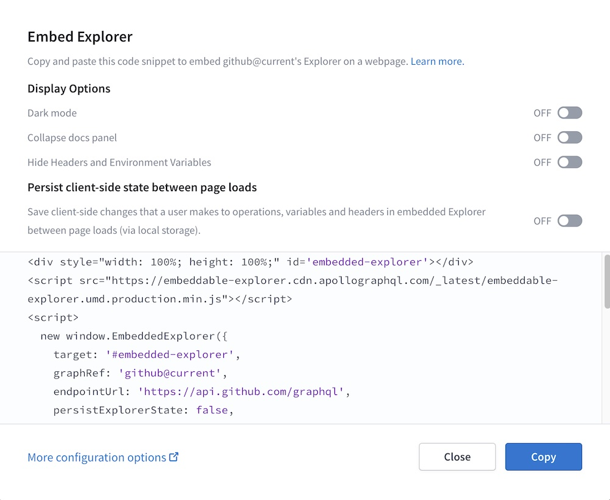
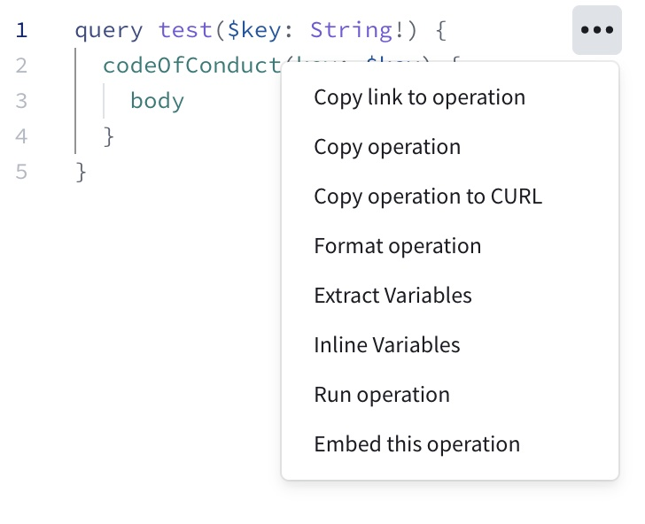

import { EmbeddableExplorer } from "gatsby-theme-apollo-docs";

If you have a [public variant](../org/graphs/#public-variants) of your graph, you can embed the [Apollo Studio Explorer](./explorer/) in a webpage that you can then provide to your graph's consumers. This enables those consumers to test out operations from your own website.

For example, here's an embedded Explorer for an Apollo example graph. Try it out!

<EmbeddableExplorer
  graphRef="Apollo-Fullstack-Demo-o3tsz8@current"
  graphEndpoint="https://apollo-fullstack-tutorial.herokuapp.com/graphql"
  graphSubscriptionEndpoint="wss://apollo-fullstack-tutorial.herokuapp.com/graphql"
  defaultOperation={`query GetLaunches {
  launches {
    launches {
      id
      site
      rocket {
        id
        name
      }
    }
  }
}`}
  styles={{
    width: "100%",
    height: "450px",
    border: "0px",
    borderRadius: "4px",
  }}
/>

> This embedded Explorer collapses its left column by default because the full three-column layout is a little cramped on this page. You can [customize the embedded Explorer's appearance](#options) to suit the page it's on.

## Setup

> Before you proceed, make sure you have a [public variant](../org/graphs/#public-variants) of your graph in Apollo Studio.

1. <a href="https://studio.apollographql.com/" target="_blank">Go to Apollo Studio</a> and open the public variant you want to use with the embedded Explorer.

2. Go to the variant's Explorer page.

3. Under the Explorer's Settings tab, find **Embed Explorer** and click **Copy code snippet**.

    The following dialog appears:

    

4. Use the options in the dialog to customize the embedded Explorer's appearance and behavior to your liking.
5. Click **Copy** to copy the snippet, then paste it into your code.


[See below](#options) for descriptions of options shown in the dialog, along with advanced options that _aren't_ shown.

### Embedding with a default operation

You can also open the Embed Explorer dialog from the Explorer's operation editor. Open the **•••** menu next to an operation and click **Embed this operation**:



This configures your embedded Explorer to include all of the following automatically on load:

* The operation you selected
* Any variable values defined in your current Explorer tab that are used in the selected operation
* All headers defined in your current Explorer tab

## Options

The `EmbeddedExplorer` object takes an options object with the following structure (individual options are described below):

```js
{
  graphRef: 'acephei@current',
  endpointUrl: 'https://acephei-gateway.herokuapp.com',
  persistExplorerState: false,
  initialState: {
    document: `query ExampleQuery {
  me {
    id
  }
}
`,
    variables: { 'Variable1': 'ExampleValue' },
    headers: { 'Header1': 'ExampleValue' },
    displayOptions: {
      showHeadersAndEnvVars: true,
      docsPanelState: 'open',
      theme: 'light',
    },
  },
  handleRequest: (endpointUrl, options) => {
    return fetch(endpointUrl, {
      ...options,
      headers: {
          ...options.headers,
          authorization: `token ${token}`
      },
    })
  },
}
```

### Top-level options

These are the top-level fields you can include in the options object you pass to `new EmbeddedExplorer`:

<table class="field-table api-ref">
  <thead>
    <tr>
      <th>Name /<br/>Type</th>
      <th>Description</th>
    </tr>
  </thead>

<tbody>
<tr class="required">
<td>

##### `graphRef`

`string`

</td>
<td>

**Required.** The graph ref for the [public variant](../org/graphs/#public-variants) you want to use the embedded Explorer with. Has the format `graph-id@variant-name`. This value is automatically populated in the Explorer's embed snippet.

The Explorer fetches this variant's schema from Apollo Studio to populate its Documentation panel and enable code completion.

If you omit this option, the Explorer _does_ still load, but it doesn't know which schema to fetch. This prevents the Explorer from providing critical features like documentation and code completion.

</td>
</tr>

<tr class="required">
<td>

##### `endpointUrl`

`string`

</td>
<td>

The endpoint URL of the [public variant](../org/graphs/#public-variants) you want to use the embedded Explorer with. This value is automatically populated  in the Explorer's embed snippet.

**Required**, _unless_ you specify your own fetcher with the [`handleRequest`](#handlerequest) option.

</td>
</tr>

<tr>
<td>

##### `persistExplorerState`

`true | false`

</td>
<td>

If `true`, the embedded Explorer uses `localStorage` to persist its state (including operations, tabs, variables, and headers) between user sessions. This state is automatically populated in the Explorer on page load.

If `false`, the embedded Explorer loads with an example query based on your schema (unless you provide [`document`](#document)).

The default value is `false`.

</td>
</tr>

<tr>
<td>

##### `handleRequest`

`(url, options) => Promise`

</td>
<td>

By default, the embedded Explorer uses the `fetch` API to send requests to your `endpointUrl`. You can instead pass a _custom_ fetcher that's used to run all operations.

You might want to do this if you need to include specific headers in every request made from your embedded Explorer.

</td>
</tr>

<tr>
<td>

##### `initialState`

`Object`

</td>
<td>

An object containing additional options related to the state of the embedded Explorer on page load.

For supported subfields, see [`initialState` options](#initialstate-options).

</td>
</tr>

</tbody>
</table>

### `initialState` options

These are the fields you can include in the `initialState` option you pass to `new EmbeddedExplorer`:

<table class="field-table api-ref">
  <thead>
    <tr>
      <th>Name /<br/>Type</th>
      <th>Description</th>
    </tr>
  </thead>

<tbody>
<tr>
<td>

##### `document`

`string`

</td>
<td>

A URI-encoded operation to populate in the Explorer's editor on load.

If you omit this, the Explorer initially loads an example query based on your schema.

If [`persistExplorerState`](#persistexplorerstate) is `true` _and_ you provide this option, the Explorer loads any of the user's tabs from `localStorage`, and it _also_ opens a _new_ tab with this operation.

Example:

```jsx
intialState: {
  document: `
  query ExampleQuery {
    books {
      title
    }
  }
`;
}
```

</td>
</tr>

<tr>
<td>

##### `variables`

`string`

</td>
<td>

A URI-encoded, serialized object containing initial variable values to populate in the Explorer on load.

If provided, these variables should apply to the initial query you provide for [`document`](#document).

Example:

```jsx
intialState: {
  variables: {
    userID: "abc123"
  },
}
```

</td>
</tr>

<tr>
<td>

##### `headers`

`string`

</td>
<td>

A URI-encoded, serialized object containing initial HTTP header values to populate in the Explorer on load.

Example:

```jsx
initialState: {
  headers: {
    authorization: "Bearer abc123";
  }
}
```

</td>
</tr>

</tbody>
</table>

### `displayOptions` options

These are the fields you can include in the `initialState.displayOptions` option you pass to `new EmbeddedExplorer`:

<table class="field-table api-ref">
  <thead>
    <tr>
      <th>Name /<br/>Type</th>
      <th>Description</th>
    </tr>
  </thead>

<tbody>
<tr>
<td>

##### `docsPanelState`

`"open" | "closed"`

</td>
<td>

If `open`, the Explorer's Documentation panel (the left column) is initially expanded. If `closed`, the panel is initially collapsed.

The default value is `open`.

</td>
</tr>

<tr>
<td>

##### `showHeadersAndEnvVars`

`true | false`

</td>
<td>

If `true`, the embedded Explorer includes the panels for [setting request headers and environment variables](./connecting-authenticating/). If `false`, those panels are not present.

The default value is `true`.

</td>
</tr>

<tr>
<td>

##### `theme`

`"dark" | "light"`

</td>
<td>

If `dark`, the Explorer's dark theme is used. If `light`, the light theme is used.

The default value is `dark`.

</td>
</tr>
</tbody>
</table>
