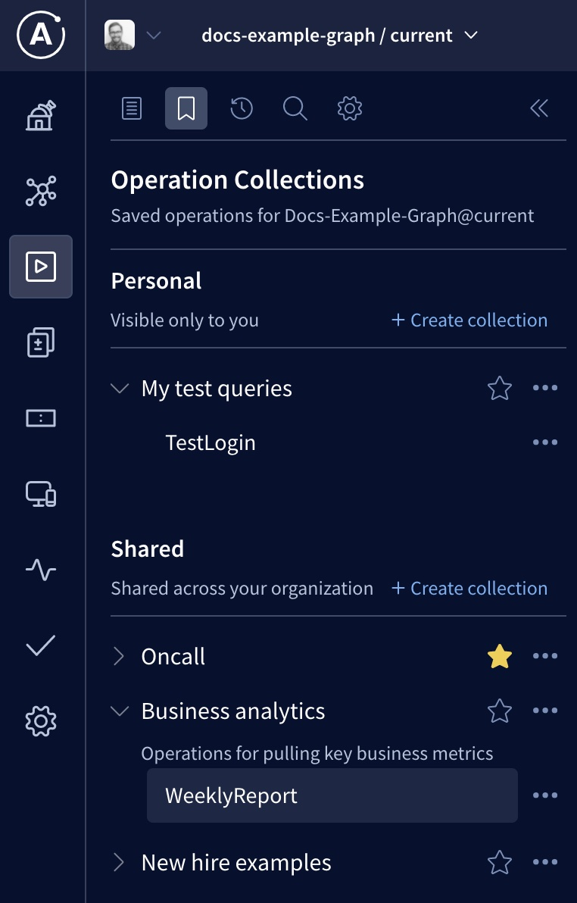
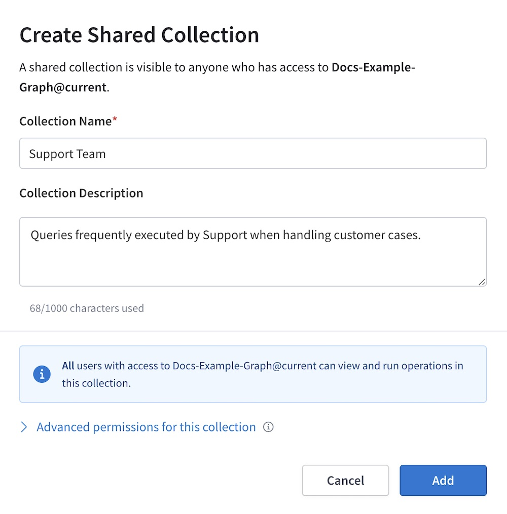
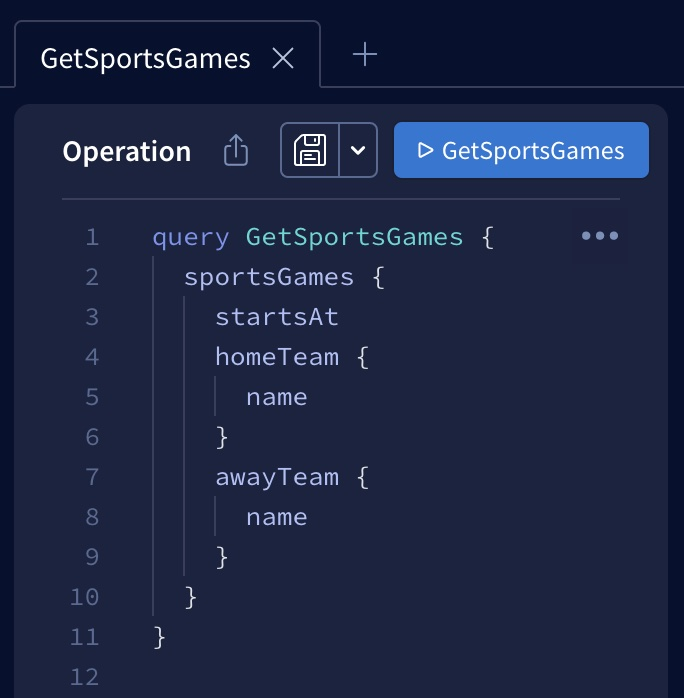
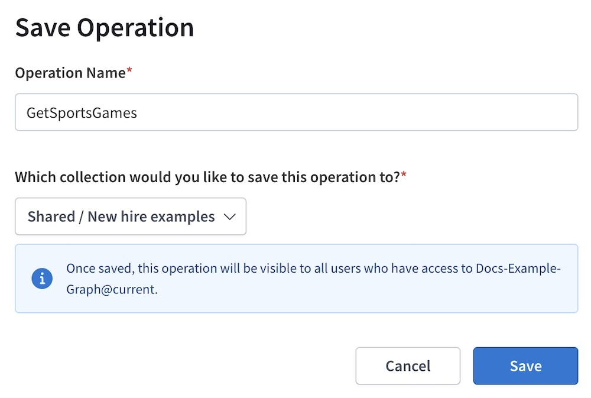
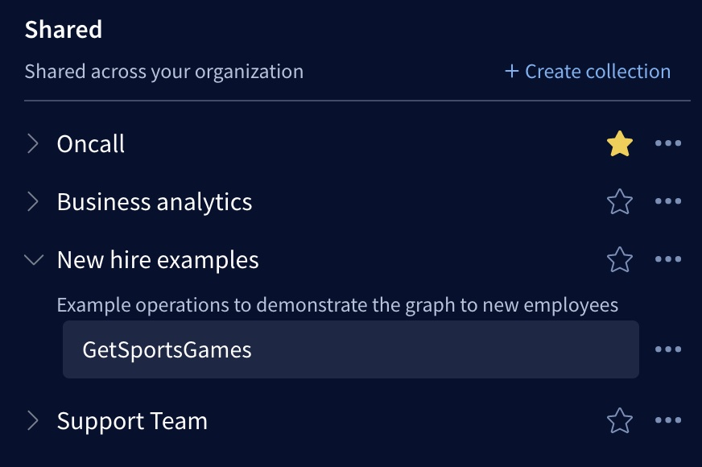
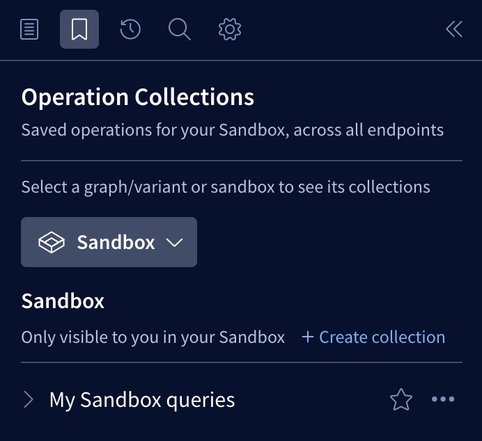

You can save **operation collections** in the Apollo Studio Explorer, enabling you to organize your frequently used GraphQL operations and optionally share them with your team:

Each [variant](../org/graphs/#managing-variants) of a graph has its own set of operation collections. An operation collection can be either **personal** (visible only to you) or **shared** (visible to all organization members).

**Operation collections help you and your team:**

* Stop writing the same operation over and over
* Organize common operations by how they're used and who uses them
* Design, execute, and share operations all in a single interface
* Onboard new team members

## Creating a collection

To create an operation collection in the Explorer:

1. [Open Studio](https://studio.apollographql.com/) and navigate to the Explorer.
2. In the top left, select the graph/variant combination you want to create a collection for (e.g., `docs-example-graph/current` in the screenshot above).
3. Click the "bookmark" tab in the Explorer's left panel to open your collection settings (shown in the screenshot above).
4. Click **+ Create collection** at the top of either the Personal or the Shared section, depending on which type of collection you want to create.

    A dialog like the following appears:

    

5. Provide a name and optional description for your collection.
6. If you're creating a shared collection, you can click **Advanced permissions for this collection** to specify whether non-admin members of the organization can modify your shared collection and its operations.
7. Click **Add**.

That's it! Your newly created collection appears in its corresponding list.

## Adding operations

To add operations to a collection:

1. Define at least one operation in the Explorer's editor panel:

    

    > If you define _multiple_ operations in a single editor, _all_ of those operations are saved together as a single entry in a collection.

2. Click the "floppy disk" button (shown in the screenshot above) to open the save dialog:

    

3. Provide a name for the collection entry, then use the dropdown menu to select a collection to add it to.

    > If you don't see the collection you want, make sure you've selected the correct graph/variant combination in the Explorer.

4. Click **Save**.

That's it! Your newly saved entry appears in its corresponding collection:

If you've saved the entry to a shared collection, it also appears for other members of your organization.

After you add multiple operations to a collection, you can drag and drop to reorder them within the collection.

## Modifying collections and operations

> ⚠️ Non-admin organization members _can't_ edit another team member's shared collection, _unless_ that team member specifically configures the collection to allow this.

**To edit a collection's details,** click the **•••** button next to its entry in the list and select **Configure**.

**To edit an existing operation in a collection,** click that operation to open it and make any necessary changes. Then click the "floppy disk" icon to save those changes.

## Cloning collections and operations

It's often helpful to create a _new_ collection or operation based on an existing one.

* **To clone an entire collection,** click the **•••** button next to its entry in the list and select **Duplicate**.
  * You can save the new collection to any variant of any graph you have access to, and you can make it personal or shared.
  * This creates a new collection with an identical set of operations. Modifying the new collection has no effect on the original.
* **To clone a single operation,** open it in the editor panel and click the dropdown arrow next to the "floppy disk" icon. Then select **Save As**.
  * This enables you to save a copy of the operation to any collection for the current variant.

## Sharing collections

Every **shared** operation collection is automatically visible in the Explorer for all members of your organization.

You can also give team members a link directly to a particular shared collection or operation. To do so, click the **•••** button next to any shared collection or operation in the list and select the **Copy link** option.

> Team members must be signed in to Studio to view a linked collection or operation, unless it's a [public collection](#public-collections).

### Embedding in the README page

Each graph variant in Studio has a [README page](../org/graphs/#the-readme-page) that you can customize to document that variant. You can embed a variant's shared collections and operations in its README using [shortcodes](../org/graphs/#readme-shortcodes) that are shown in the README editor.

### Public collections

If you create a [public variant](../org/graphs/#public-variants) of your graph, any shared collections for that variant are visible to _everyone_, not just members of your organization. Anonymous users can view and execute operations in a public collection, but they can't make any changes to the collection.

## Sandbox collections

[Apollo Sandbox](./sandbox/) is a special mode of Apollo Studio that doesn't require an Apollo account. If you use Sandbox and _do_ sign in with your Apollo account, you can save personal operation collections that are _specific_ to Sandbox:

These Sandbox collections persist regardless of which GraphQL endpoint you connect to.

While signed in to Sandbox, you can also access the collections for any graph and variant your account has access to.

> If you _don't_ sign in to Sandbox, operation collections are not available.
