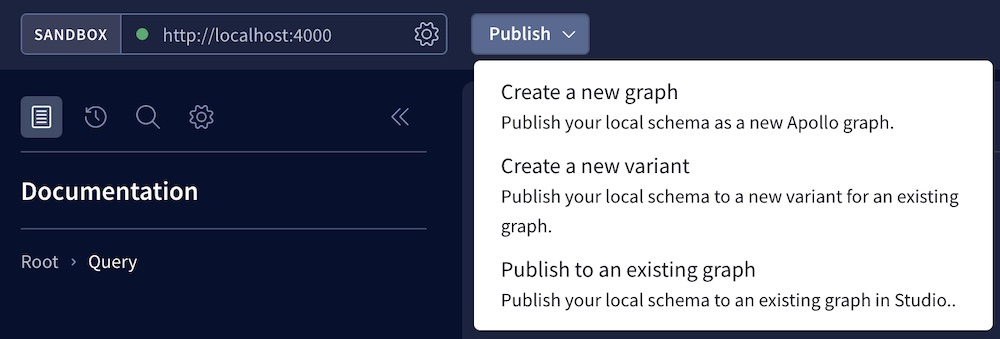
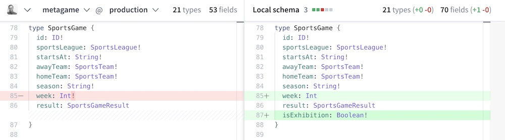
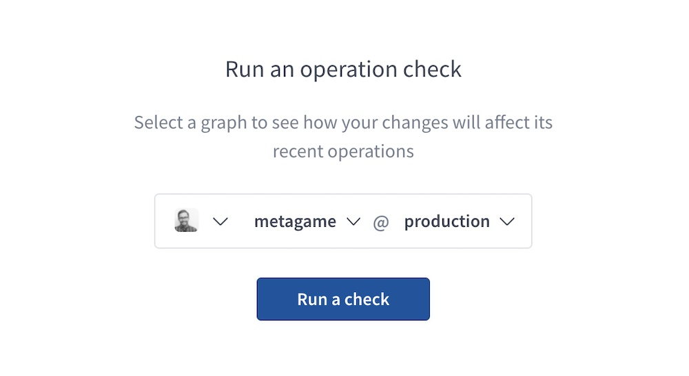
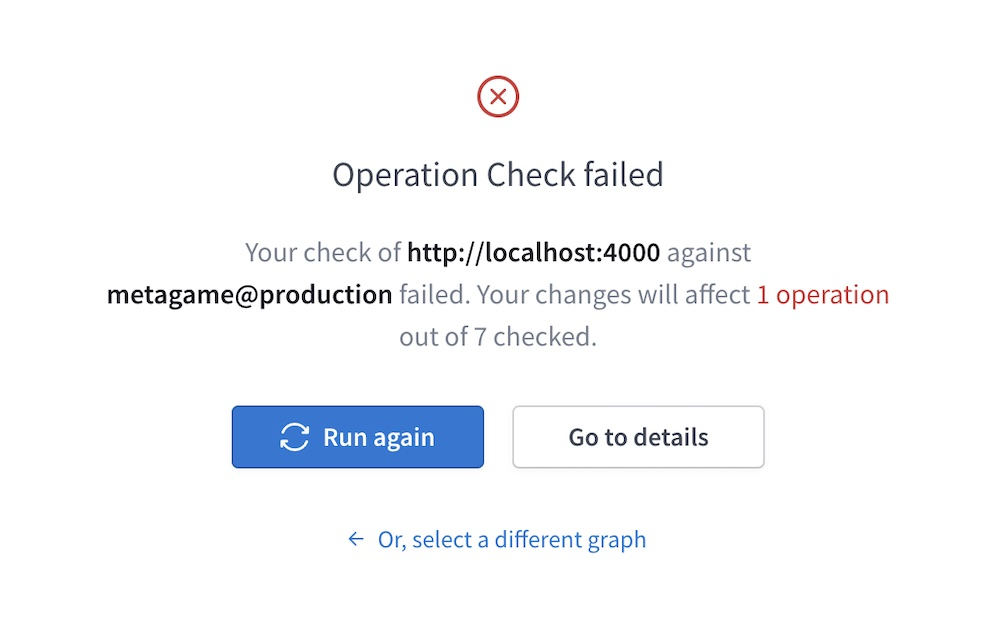
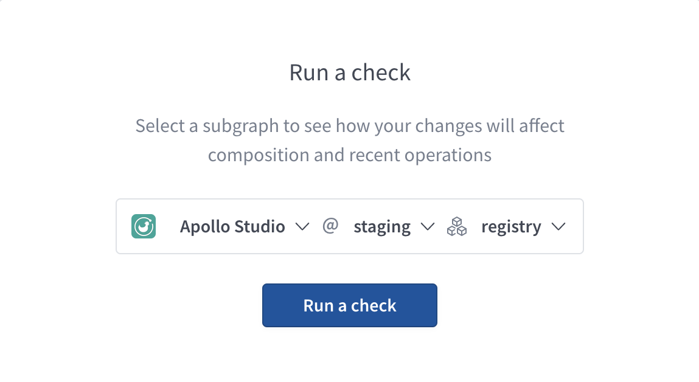
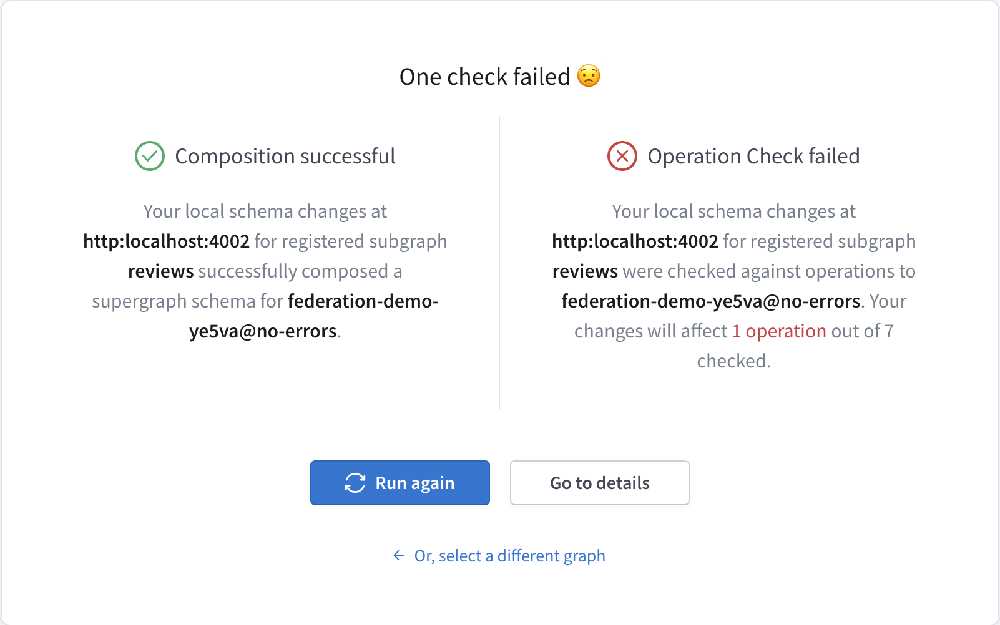

import { Button } from '@apollo/space-kit/Button';
import { Link } from 'gatsby';
import { colors } from 'gatsby-theme-apollo-core';

**Apollo Sandbox** is a special instance of the [Explorer](./explorer/) that doesn't require an Apollo account. Sandbox doesn't support certain Explorer features like schema history, but it's great for local development.

  <Button
    size="large"
    color={colors.primary}
    as={<Link to="https://studio.apollographql.com/sandbox/" target="_blank" />}
  >
    Launch Sandbox
  </Button>

Sandbox automatically attempts to connect to a GraphQL server running at `http://localhost:4000`. You can use the box at the top of Sandbox to change this URL to any local or remote GraphQL endpoint that's accessible by your browser:

> To try out Sandbox with an example GraphQL API, you can set its URL to `https://swapi-graphql.netlify.app/.netlify/functions/index`.

## Overview video

<iframe width="560" height="315" src="https://www.youtube.com/embed/0jzqqHZU00Q" title="YouTube video player" frameborder="0" allow="accelerometer; autoplay; clipboard-write; encrypted-media; gyroscope; picture-in-picture" allowfullscreen></iframe>

## Publishing schemas from Sandbox

> ⚠️ Sandbox does not yet support publishing subgraph schemas to Studio for a [federated graph](https://www.apollographql.com/docs/federation/).

If you're signed in to Sandbox with your Apollo account, you can publish your GraphQL server's schema to any Studio graph and variant you have the necessary permissions for.

To do so, first click **Publish** at the top of Sandbox:

Then use the dropdown to select _where_ in Studio to publish your schema. You can publish to any of the following:

* An entirely new graph
* A new variant of an existing graph
* An existing variant of an existing graph

After you select an option, a dialog appears that enables you to select or create a graph and variant to publish to. After you make your selections, click **Confirm** to publish.

When Sandbox finishes publishing your schema, it redirects you to your selected variant in Studio.

## In-Sandbox schema diffs and checks

Apollo Sandbox provides schema diffs and checks to help you validate changes to your development schema before you publish those changes to Studio.

> These features require you to be signed in to Sandbox with your Apollo account.

### Schema diffs

From [Sandbox](https://studio.apollographql.com/sandbox/), open the **Schema Diff** page from the left navigation panel. Then use the dropdown menus to select any accessible organization, graph, and variant to compare against:

> If you're using Sandbox with a subgraph, this diff shows the schema as originally defined, not the generated subgraph schema that includes federation-specific fields like Query._entities. You can view the generated subgraph schema from the SDL page in Sandbox.

In addition to viewing the diff on this page, you can click **Run a Check** in the upper-right to run [schema checks](#schema-checks) against the currently selected variant.

### Schema checks

> [Schema checks](../schema-checks/) require both a [paid Studio plan](https://www.apollographql.com/pricing/) and [usage reporting data](/metrics/usage-reporting/) from your GraphQL server.
>
> Organization members with the [`Consumer` role](../org/members/#organization-wide-member-roles) cannot run schema checks.

From [Sandbox](https://studio.apollographql.com/sandbox/), open the **Checks** page from the left navigation panel:

Select any accessible organization, graph, and variant to check against and click **Run a check**. When the check completes, Sandbox displays a result summary:

To view the result's _full_ details in Studio, click **Go to details**.

#### Subgraph checks

You can run subgraph checks on federated graphs. If you're using Sandbox with a subgraph, you can use the subgraph dropdown to select which subgraph you want to check your changes against.

When you click **Run a check**, Studio first performs a composition check using your local subgraph schema and the registered schemas of your other subgraphs. If composition succeeds, Sandbox then performs operation checks as usual and displays the results of all checks. If composition fails, Sandbox does not perform operation checks and displays the composition error.

## Offline Sandbox

You can use Sandbox _without_ an internet connection if you're querying a graph running on `localhost`. To do so, [open Sandbox in your browser](https://studio.apollographql.com/sandbox/) at least once while connected to the internet. You can then use that browser to open Sandbox while offline.

### Reconnecting

Sandbox automatically reconnects to Apollo Studio whenever your internet connection is restored. When it does, it might display a notification that your Apollo Studio application version is stale by at least 24 hours. You can click the notification to update _all_ of your browser's open Apollo Studio tabs to the latest version.

> This notification indicates only that the Apollo Studio _UI_ is out of date. Your Studio _data_ is always kept up to date.
