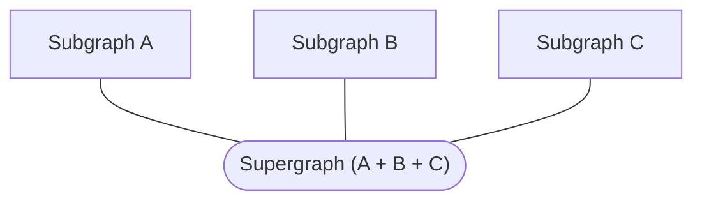
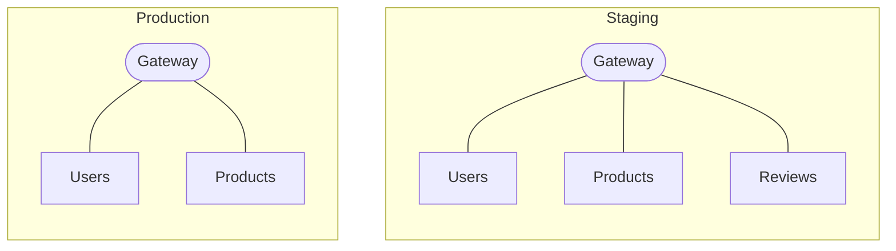
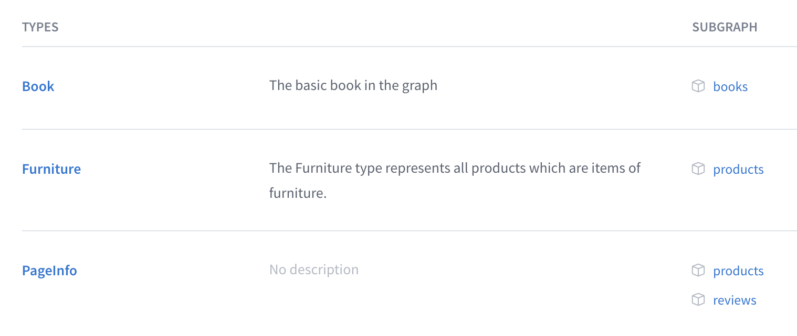
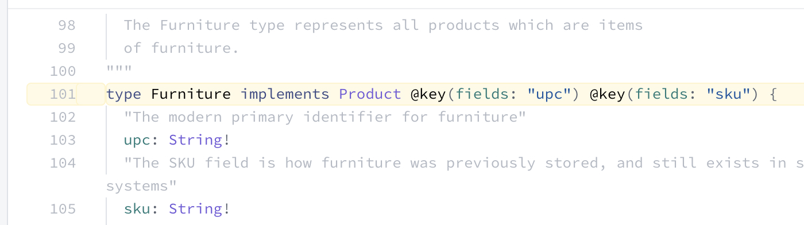
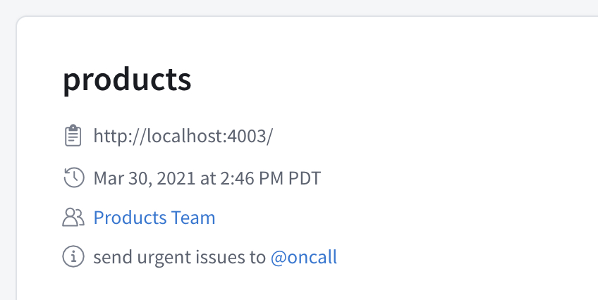
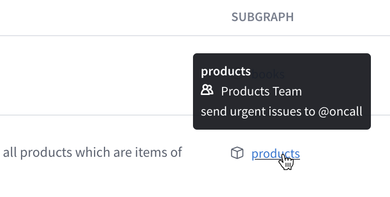
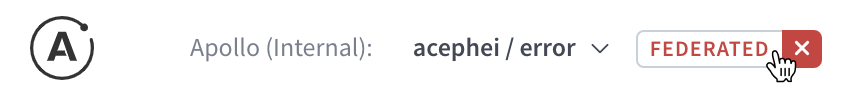
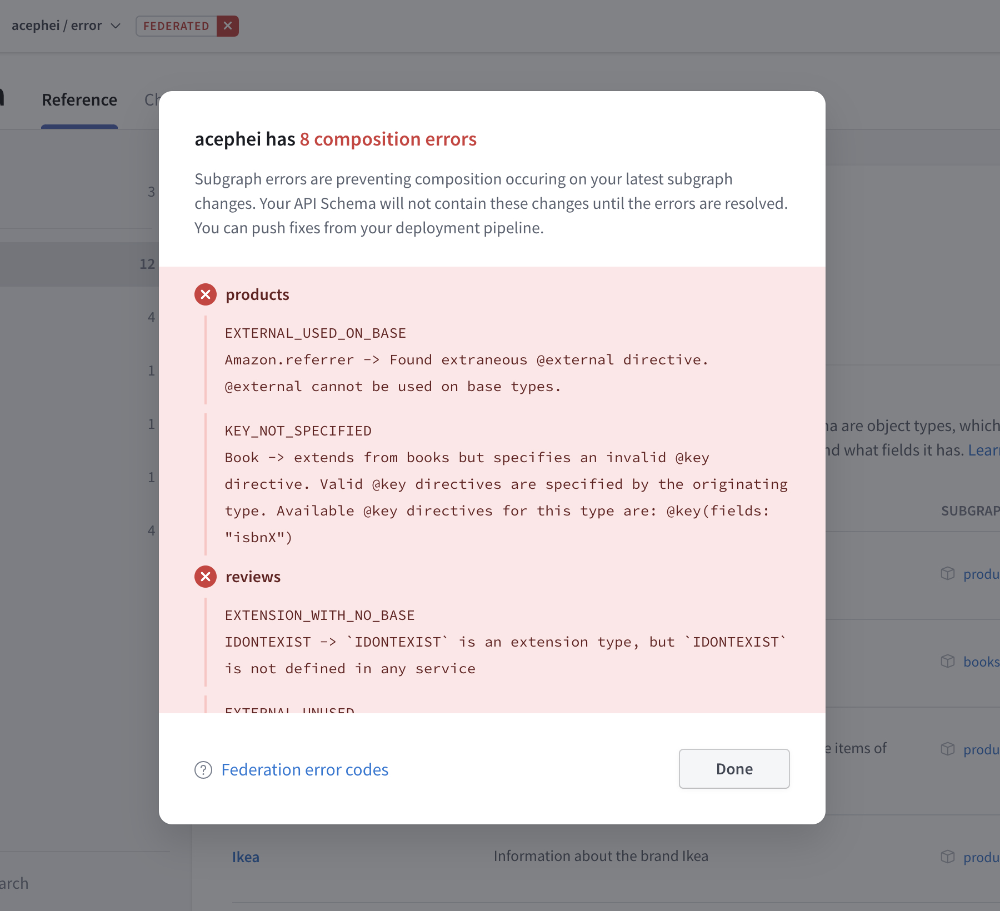

import { VideoFrame } from 'gatsby-theme-apollo-docs'

A [federated graph](https://apollographql.com/docs/federation) (also known as a **supergraph** ) is a graph that’s composed of multiple individual **subgraphs**:



Each subgraph represents an underlying service or set of services that provide their own GraphQL API. Different subgraphs are often owned by different teams in an organization.

Apollo Studio provides tools to help multiple teams collaborate on a federated graph and its subgraphs.

<VideoFrame src="https://www.youtube.com/embed/QaxmqfXl8HI"/>

## Variants and federated graphs

Just like any other deployed graph in Studio, a federated graph can have multiple [variants](./org/graphs/#managing-variants). Each variant has its own subgraph schemas, supergraph schema, change history, and metrics.

In addition, different variants of a federated graph can have completely different sets of subgraphs:



This helps you test out adding new subgraphs (or removing existing ones) in non-production environments.

You specify a subgraph instance's associated variant when you [register its schema](https://www.apollographql.com/docs/federation/managed-federation/setup/#2-register-all-subgraph-schemas).


## Viewing a field's originating subgraph

The **Schema > Reference** tab in Studio displays a table of your federated schema’s types and fields. This table includes a Subgraph column:



Clicking the subgraph link for a type or field takes you to the line in the subgraph schema where it's defined:



If you're using [the `@contact` directive](#subgraph-contact-info) to specify owner contact information for your subgraphs, hovering over a subgraph name displays its contact information, enabling you to follow up with the appropriate team:


## Viewing subgraph SDL

The **Schema > SDL** tab in Studio displays the raw SDL of your federated graph’s schema, along with the schema of each subgraph.

From this tab you can:
- View metadata about the composed graph and each subgraph (such as endpoint URL and the most recent schema registration date)
- Identify the originating subgraph for any type or field in your API and share a link with team members
- Search for types and fields
- Download a copy of your subgraph’s SDL for local development
- Filter out comments and deprecated fields for improved scanning

## Subgraph contact info

You can use the `@contact` directive to add your team's contact info to your subgraph schema. This info is displayed in Studio, helping _other_ teams know who to contact for assistance with the subgraph:



The contact info includes a name (of a team or individual), along with an optional description and custom URL.

### Adding the `@contact` directive to your subgraph

To add the `@contact` directive to your schema, you first need to _define_ the directive. Add the following definition to each of your subgraph schemas:

```graphql:title=schema.graphql
directive @contact(
  "Contact title of the subgraph owner"
  name: String!
  "URL where the subgraph's owner can be reached"
  url: String
  "Other relevant notes can be included here; supports markdown links"
  description: String
) on SCHEMA
```

You can now apply the `@contact` directive to the special `schema` object. Many schemas don’t include this object because it’s not required, but you can add it like so:

```graphql:title=schema.graphql
schema @contact(
  name: "Acephei Server Team",
  url: "https://myteam.slack.com/archives/teams-chat-room-url",
  description: "send urgent issues to [#oncall](https://yourteam.slack.com/archives/oncall)."
) {
  query: Query

  # Also include these if your schema defines
  # the Mutation and/or Subscription type:
  # mutation: Mutation
  # subscription: Subscription
}
```

As shown, the `schema` object must include a field for each root operation type (`Query`, `Mutation`, and/or `Subscription`) that's defined in your schema.

#### Supported `@contact` fields


| Name | Type | Description |
|------|------|-------------|
| `name` | `String!` | The name of the person, people, or team responsible for the subgraph. **Required**.  |
| `url` | `String` | The URL where the subgraph’s owner can be reached. This might be the URL of a chat room or forum, or it could be an email address. |
| `description` | `String` | Provides any additional helpful details about working with this subgraph or contacting its owner. This field also supports markdown links. |

#### Known `@contact` limitations

- To provide the `@contact` directive to Apollo, you must register your schema by providing a local `.graphql` file as the `--schema` option of [`rover graph publish`](./schema/cli-registration/#registering-a-non-federated-schema).
    * If you provide an introspection result to the command instead, directives are **not** included in the result.
- Similarly, you cannot provide your `@contact` directive to Apollo via [schema reporting](./schema/schema-reporting/). This registration method also does not include directives.
- If your subgraph doesn’t already have a `schema` object, you need to add one to use the `@contact` directive. The `schema` object cannot be empty, so you need to include at least one field in it (most commonly `query: Query`). If you do provide the `Query` type like this, it needs to include at least one field in your subgraph’s schema. If your subgraph’s `Query` type is empty, you need to add a dummy field for the SDL to be valid:

    ```graphql:title=schema.graphql
    @contact(...)
    schema {
      query: Query
    }

    extend type Query {
      _dummyField: Boolean
    }
    ```

### Viewing contact info

After you register a subgraph schema with the `@contact` directive, the contact information is included in the metadata shown in Studio’s **Schema > SDL** tab:


In the **Schema > Reference** tab, you’ll also see a contact card when you hover over the subgraph link of a type or field:



## Federation support in the Explorer

The [Apollo Studio Explorer](./explorer/explorer/) provides enhanced support for working with federated graphs:
- You can preview how your graph resolves data for an operation by inspecting the operation’s query plan in the Response pane.
- While you’re building operations in the Explorer, you can see which subgraph each field of your operation originates in by enabling subgraph hints from the Explorer’s Settings tab.

## Viewing composition errors

Studio displays a **Federated** label next to the name of a federated graph. If a federated graph has composition errors, you can click the label to view the errors that must be resolved before composition can succeed.





> [Learn more about composition errors](https://www.apollographql.com/docs/federation/errors/)
