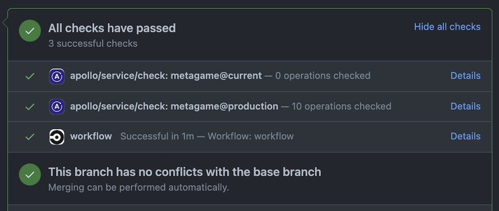

To enhance the convenience and helpfulness of [schema checks](/schema-checks/), the Apollo Studio app for GitHub adds links to schema check results on the pull requests that initiate them:

## Install the GitHub application

Go to [https://github.com/marketplace/apollo-studio#pricing-and-setup](https://github.com/marketplace/apollo-studio#pricing-and-setup) and click **Install it for free** to add the app to the GitHub profile or organization that you want to set up checks for.

## Run a check on each commit

Next, make sure your CI configuration includes a step to execute schema checks. You do this by adding the `rover graph check` command directly as a step in your CI.

> For example CI configurations that do this, [see the Rover docs](https://www.apollographql.com/docs/rover/ci-cd/).

The `rover graph check` command checks for differences in your schema between what's on your current branch and the last version you uploaded to Apollo Studio. If you've removed or changed any types or fields, the command checks whether those changes break any queries that your clients have made recently. If your changes do break any queries, the check fails.

Because you installed the Apollo Studio app on GitHub, the check you've added shows up as a line in your GitHub checks list. If there are changes in your schema, you can review them by clicking the **Details** link. By enabling schema checks in your continuous integration workflow (such as CircleCI), you're alerting developers of any potential problems directly in their pull requests, thereby giving them critical feedback where it's most useful.
