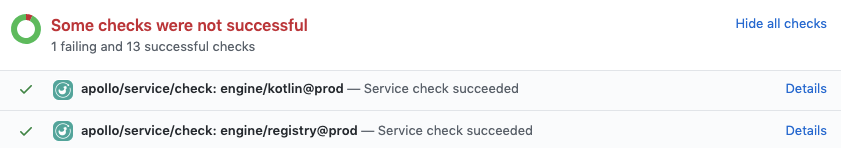

To improve the convenience and helpfulness of [schema checks](/schema-checks/), we've built an Apollo app for GitHub that provides status checks on pull requests when schema changes are proposed.



## Install the GitHub application

Go to [https://github.com/marketplace/apollo-studio](https://github.com/marketplace/apollo-studio) and click the `Install it for free` button at the bottom of the page to install the Apollo Studio integration on the GitHub profile or organization that you want to set up checks for.

## Run a check on each commit

Next, make sure your CI has a step to run the schema check command. This is accomplished by adding the `rover graph check` command directly as a step in your CI. For CircleCI it could look something like this:

### CircleCI

```yaml{13,29,33-36}:title=.circleci/config.yml
version: 2

jobs:
  build:
    docker:
      - image: cimg/node:16.0.0

    steps:
      - checkout

      - run: npm install
      # CircleCI needs global installs to be sudo
      - run: sudo npm install --global @apollo/rover

      # Start the GraphQL server.  If a different command is used to
      # start the server, use it in place of `npm start` here.
      - run:
          name: Starting server
          command: npm start
          background: true

      # make sure the server has enough time to start up before running
      # commands against it
      - run: sleep 5

      # Rover authenticates using the `APOLLO_KEY` environment
      # variable.
      - run: rover graph check my-graph@my-variant --schema ./schema.graphql

      # When running on the 'main' branch, publish the latest version
      # of the schema to Apollo Studio.
      - run: |
          if [ "${CIRCLE_BRANCH}" == "main" ]; then
            rover graph publish my-graph@my-variant --schema ./schema.graphql
          fi
```

### Github Actions

```yaml:title=.github/workflows/schema_check.yaml
name: Check

# Controls when the action will run. Triggers schema validation on every pull request against main
on:
  pull_request:
    branches: [main]

jobs:
  schema-check:
    # The type of runner that the job will run on any runner with node will work
    runs-on: ubuntu-latest

    # Steps represent a sequence of tasks that will be executed as part of the job
    steps:
      - uses: actions/checkout@v2
        with:
          # Needed along with --commitId=… when the merge commit is checked out;
          # alternatively check out the head of the branch with:
          # ref: ${{ github.event.pull_request.head.sha }}
          fetch-depth: 2

      - name: Run schema check
        env:
          # Apollo Key is supplied as an env var from github secrets
          APOLLO_KEY: ${{ secrets.APOLLO_KEY }}
        run: |
          rover graph check my-graph@my-variant --schema ./schema.graphql  \
            --branch=${GITHUB_REF#refs/heads/} \
            --author=$GITHUB_ACTOR \
            --commitId=$(git rev-parse $GITHUB_SHA^2)
```

> **Note:** The `rover graph check` requires your graph's schema. You can provide it to the `--schema` option via a local file, or you can [pass an introspection result via stdin](https://www.apollographql.com/docs/rover/graphs/#checking-schema-changes).

The `rover graph check` command checks for differences in your schema between what's on your current branch and the last version you uploaded to Apollo Studio. If you've removed or changed any types or fields, the command checks whether those changes break any queries that your clients have made recently. If your changes do break any queries, the check fails.

Because you installed the Apollo Studio app on GitHub, the check you've added shows up as a line in your GitHub checks list. If there are changes in your schema, you can review them by clicking the "Details" link. By enabling schema checks in your continuous integration workflow (such as CircleCI), you're alerting developers of any potential problems directly in their pull requests, thereby giving them critical feedback where it's most useful.
