> Launch-related features are currently available only for [federated graphs](https://www.apollographql.com/docs/federation/). We plan to add support for monolithic graphs in a future update.

In Apollo Studio, a **launch** represents the complete process of making a set of updates to your deployed graph.

For a federated graph, these updates might include:

* Adding, removing, or modifying types and fields in a subgraph schema
* Adding or removing entire subgraphs

Your graph's Launches page in Studio enables you to view the status of active and past launches:

Selecting a launch provides a breakdown of its individual steps and any errors or warnings that occurred during it:

From this detail view, you can view the launch's associated supergraph schema (or any build errors if composition failed). You can also view the result of any [schema checks](./schema-checks) that failed due to schema changes.

## What's in a launch?

For a federated graph, a launch encapsulates the following steps:

```mermaid
graph TB;
  subgraph "The steps of a launch"
  subgraphPublished(You publish a subgraph <br/>schema update to Apollo) --> composition(Apollo performs supergraph schema<br/>composition with latest subgraph schemas);
  composition --"If composition succeeds..."-->checks(Apollo runs schema checks if enabled);
  checks-->uplink(Updated supergraph schema<br/>is published to Apollo Uplink<br/>as new target schema);
  uplink --> gateways(Your gateway instances poll Uplink<br/>and fetch new target schema);
  gateways --> reportSchema(Gateway instances begin reporting<br/>new target schema back to Apollo);
  reportSchema --"When all instances are<br/> reporting new schema..."-->publishedSchema(Apollo sets target schema<br/>as new published schema)
  publishedSchema --> studio(Studio updates UI and sends<br/>notifications to reflect new<br/>published schema);
  studio --> complete(Launch complete);
  composition --"If composition fails,<br/>the launch fails"--> complete;
  end
```

