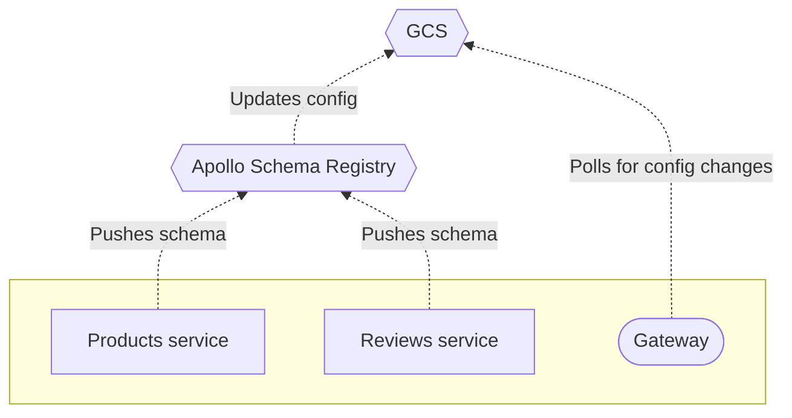

Apollo Studio provides free **managed federation** features for data graphs that use [Apollo Federation](https://www.apollographql.com/docs/apollo-server/federation/introduction/).

With managed federation, your [gateway](https://www.apollographql.com/docs/apollo-server/federation/gateway/) is no longer responsible for fetching schemas from your [implementing services](https://www.apollographql.com/docs/apollo-server/federation/implementing-services/) on startup. Instead, your implementing services push their schemas to the Apollo schema registry, which verifies that they successfully **compose** into a federated schema.

On composition success, Studio updates a dedicated configuration file that's stored in Google Cloud Services, which your gateway regularly polls for updates:

Managed federation helps your organization safely validate, coordinate, deploy, and monitor changes to your graph. It provides:

### Gateway stability

You can modify service schemas (and even add or remove entire services from your graph) _without_ needing to modify or redeploy your gateway. As the point of entry to your entire data graph, your gateway should maximize its uptime.

### Composition stability

Whenever your gateway obtains an updated configuration from Studio, it knows that the updated set of schemas will compose, because Studio has already successfully composed them.

The gateway _also_ knows that your implementing services are prepared to handle operations against the updated set of schemas. This is because your services should register their updated schemas as part of their deployment, meaning they're definitely running by the time the gateway is aware of the configuration change.

And whenever an implementing service accidentally pushes a schema change that _doesn't_ compose, Studio continues to provide the most recent _valid_ configuration to your gateway.

### Schema flexibility

By using a configuration manager that's external to your gateway, you help ensure the safety of certain schema changes. For example, if you want to migrate a type or field from one implementing service's schema to another, you can perform this migration safely _only_ if you externalize your configuration.

Ready to try out out? Continue to [Setup](./setup/).
