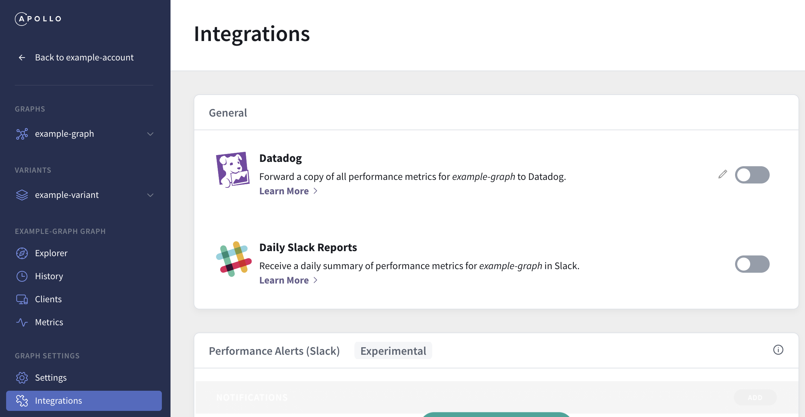
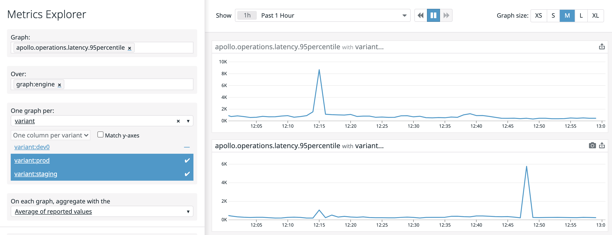

The **Apollo Datadog integration** enables you to forward Studio performance metrics to your Datadog account. Datadog supports an advanced function API, which enables you to create sophisticated graphs and alerts for GraphQL metrics.

> **Important:** Studio only forwards metrics for **named GraphQL operations**. Metrics for _anonymous_ operations are not forwarded. Make sure your graph's clients name all operations:
>
> ```graphql
> ❌
> query {
>   hello
> }
>
> ✅
> query HelloQuery {
>   hello
> }
> ```

## Setup

To integrate with Datadog, you provide your Datadog API key and region to Studio. A Datadog account with administrator privileges is required to obtain an API key.

1. Go to your [Datadog Integrations page](https://app.datadoghq.com/account/settings) and select **Apollo** from the list:

    

    Then go to the Configuration tab and click **Install Integration** at the bottom.

2. Go to your [Datadog APIs page](https://app.datadoghq.com/account/settings#api) and create an API key:

    

3. Determine your Datadog API region by looking at your browser's address bar:

    * If the domain name is `app.datadoghq.com`, then your API region is `US`.
    * If the domain name is `app.datadoghq.eu`, then your API region is `EU`.

4. In Studio, go to your graph's Integrations page:

    

5. In the Datadog Forwarding section, click **Configure**. Provide your API key and region, then click **Enable**.

    

    You can use the same Datadog API key for all of your graphs, because all forwarded metrics are tagged with the corresponding graph's ID (`graph:<graph-id>`).

6. That's it! After about five minutes, your Datadog metrics explorer will begin showing metrics forwarded from Studio.

## Forwarded metrics

Studio forwards the following metrics to Datadog:

| Name | Description |
| ------- | --------- |
| `apollo.operations.count` | The number of GraphQL operations that were executed. This includes queries, mutations, and operations that resulted in an error. |
| `apollo.operations.error_count` | The number of GraphQL operations that resulted in an error. This includes both GraphQL execution errors and HTTP errors if Studio failed to connect to your server. |
| `apollo.operations.cache_hit_count` | The number of GraphQL queries for which the result was served from Apollo Server's full query cache. |
|`apollo.operations.latency.min`<br/>`apollo.operations.latency.median`<br/>`apollo.operations.latency.95percentile`<br/>`apollo.operations.latency.99percentile`<br/>`apollo.operations.latency.max`<br/>`apollo.operations.latency.avg`| A histogram of GraphQL operation response times, measured in milliseconds. Because of Studio's aggregation method (logarithmic binning), these values are accurate to +/- 5%. |


These metrics are aggregated in 60-second intervals and tagged with the GraphQL operation name as `operation:<query-name>`. Unique query signatures with the same operation name are merged, and queries without an operation name are ignored.

These metrics are also tagged with both the associated Apollo graph ID (as `graph:<graph-id>`) and the associated variant name (as `variant:<variant-name>`). If you haven't set a variant name, then `current` is used.

> If you set up your integration before October 2020, the metric names start with `apollo.engine.operations` instead of `apollo.operations`, and use a `service:<graph-id>` tag instead of `graph:<graph-id>`. This is called "legacy mode". You may transition your graph to modern mode by clicking the "Transition to modern mode" button on your graph's Integrations page. This is a one-way change; you should be prepared to update any dashboards and metrics to use the new metric and tag names when you click the button.

## Exploring metrics

In the [Datadog metrics explorer](http://app.datadoghq.com/metric/explorer?exp_metric=apollo.operations.count&exp_group=graph&exp_agg=sum&exp_row_type=metric), all Studio metrics are [tagged](https://www.datadoghq.com/blog/the-power-of-tagged-metrics/) with the graph ID (`graph:<graph-id>`), the variant name (`variant:<variant-name>`), and the operation name (`operation:<query-name>`). These values are normalized according to Datadog naming requirements (all letters are lowercase, and illegal symbols are converted to underscores).

Tagging enables you to see data at any level of granularity, whether you want to aggregate across all operations or zoom in to a particular operation. You can control granularity by choosing a relevant set of operation tags for filtering, along with appropriate functions for [time aggregation](https://docs.datadoghq.com/metrics/introduction/#time-aggregation) and [space aggregation](https://docs.datadoghq.com/metrics/introduction/#space-aggregation). Similarly, if you want to compare metrics across staging and production environments, you can filter with the appropriate variant tags.

### Example

Suppose you want to see the 95th percentile request latency averaged across all operations for a staging and a production graph.

In the [Datadog metrics explorer](https://app.datadoghq.com/metric/explorer):
1. In the **Graph** field, select `apollo.operations.latency.95percentile`.
2. In the **Over** field, select the name of the graph to display.
3. In the **One graph per** field, select `variant`. Choose the variants for your production and staging environments.
4. In the **On each graph, aggregate with the** field, select `Average of reported values`.

At Apollo, we use Studio to monitor Studio itself, so this graph for us looks like the following:



To generate more advanced reports, open up a [Datadog notebook](https://app.datadoghq.com/notebook).

## Alerting with Datadog

You can configure complex alerts with [Datadog monitors](https://docs.datadoghq.com/monitors/).

### Example #1

Studio's Notifications feature supports alerts that trigger when the percentage of requests with an error in the last 5 minutes exceeds some threshold for a specific operation. Suppose that instead of alerting on a specific operation in the last 5 minutes, we want to alert on the error percentage over _all_ operations in some graph in the last 10 minutes, such as when the percentage exceeds 1% for a graph `mygraph` with variant `staging`.

The [Datadog metric alert query](https://docs.datadoghq.com/api/v1/monitors/#query-types) needed here is:
```
sum(last_10m):sum:apollo.operations.error_count{graph:mygraph,variant:staging}.as_count().rollup(sum).fill(null) / sum:apollo.operations.count{graph:mygraph,variant:staging}.as_count().rollup(sum).fill(null) > 0.01
```
The `.rollup(sum).fill(null)` is necessary because `apollo.operations.count` is a [Datadog gauge](https://docs.datadoghq.com/developers/metrics/types/?tab=gauge#metric-types), which means it [defaults to using `avg` for time aggregation](https://docs.datadoghq.com/dashboards/functions/rollup/#rollup-interval-enforced-vs-custom) and [defaults to linear interpolation during space aggregation and query arithmetic](https://docs.datadoghq.com/monitors/guide/monitor-arithmetic-and-sparse-metrics/). The `.as_count()` is necessary to ensure that [operation counts are summed before the division and not after](https://docs.datadoghq.com/monitors/guide/as-count-in-monitor-evaluations/).

### Example #2

Consider the error percentage monitor from the previous example. When the number of operations is small, a few errors might cause the error percentage to exceed the threshold, resulting in a noisy monitor during periods of low traffic. We want to alert _only_ when the number of operations isn't small (e.g., more than 10 in the last 10 minutes).

You can use [Datadog composite monitors](https://docs.datadoghq.com/monitors/monitor_types/composite/) to support this kind of alert. First, create a monitor with the following metric alert query:

```
sum(last_10m):sum:apollo.operations.count{graph:mygraph,variant:staging}.rollup(sum).fill(null) > 10
```
Then create a composite monitor for the two monitors of the form `a && b`, which will have the desired behavior.
