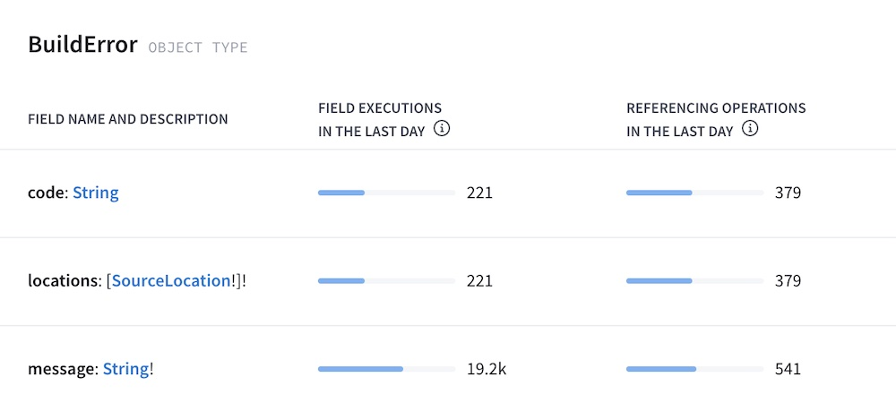

import { CodeColumns } from "gatsby-theme-apollo-docs";

In Apollo Studio, your graph's **Fields** page can display a table of usage metrics for each field in your schema. For example, here are metrics for the fields of a `BuildError` type:



You can click any field in the table to view details about which clients and operations contribute to its usage.

The table displays some combination of the following metrics for each field, depending on what data is available:

| Metric                 | Description                                                                                                                          |
| ---------------------- | ------------------------------------------------------------------------------------------------------------------------------------ |
| Field executions       | How many times your servers have executed the resolver for the field over a given time period.                                       |
| Referencing operations | How many operations sent by clients over a given time period have included the field, according to metrics provided by your servers. |

For each of these columns to appear on the Fields page, your GraphQL servers must [report the associated metrics to Apollo Studio](#reporting-field-usage). If some but not _all_ of your GraphQL servers report this data, the Fields page presents an incomplete picture of your graph's field usage.

## Field executions vs. referencing operations

Let's look at the example metrics for the `BuildError` type again:


As you can see, the daily **field executions** and **referencing operations** for a single field can differ significantly! There are many possible reasons for this, described below.

### Objects in lists

Let's say a client executes the following query one time:

```graphql
query GetBooks {
  books {
    title
  }
}
```

If `Query.books` returns a list of ten `Book` objects, then `Book.title` is resolved _ten times_. This query therefore contributes _ten_ **field executions** and just _one_ **referencing operation** to `Book.title`.

### Multiple references to a field

Let's say a client executes the following query one time:

```
graphql
query GetTwoBooks {
  firstBook: book(id: "123") {
    title
  }
  secondBook: book(id: "345") {
    title
  }
}
```

This operation includes two references to the fields `Query.book` and `Book.title`. Therefore, the resolvers for these fields each execute twice (assuming `Query.book` doesn't return `null`). However, these multiple references are all part of a _single_ operation.

Therefore, this query contributes two **field executions** and just _one_ **referencing operation** to each of `Query.book` and `Book.title`.

### Fields that return interfaces

Let's say our GraphQL server's schema defines the following interface and object types:

```graphql
interface Media {
  title: String!
}

type Book implements Media {
  title: String!
  author: String!
}

type Query {
  favoriteMedia: Media!
}
```

Now, let's say a client executes the following query:

```graphql
query GetFavoriteMedia {
  favoriteMedia {
    title
  }
}
```

If `Query.favoriteMedia` returns a `Book` object here, then `Book.title` is resolved one time. _However_, the original query _does not reference_ `Book.title`. Instead, it references **`Media.title`**, because `Query.favoriteMedia` has a return type of `Media`.

Therefore, this query contributes one **field execution** and zero **referencing operations** to `Book.title`. It also contributes one **referencing operation** to `Media.title`. Note that interface fields always have zero **field executions**.

### Referenced fields that aren't resolved

Let's say a client executes the following query one time:

```graphql
query GetLoggedInUser {
  loggedInUser {
    name
  }
}
```

Now, let's say `Query.loggedInUser` returns `null` because no user is logged in. In this case, the resolver for `User.name` never executes, because its parent retuns `null`. Therefore, this query contributes _zero_ **field executions** and _one_ **referencing operation** to `User.name`.

A referenced field might not be resolved for any of these reasons:

* The field is nested under a field that returns `null`, as shown above.
* The field is nested under a field that returns a list, but the list is empty.
* The field is part of a fragment that doesn't apply to a particular object.
* The resolver is skipped due to a `@skip` or `@include` directive.

### `@key` and `@requires` fields in a federated graph

> This case applies only to graphs that use [Apollo Federation](https://www.apollographql.com/docs/federation).

Let's say our federated graph includes these two subgraph schemas:

<CodeColumns>

```graphql
# Products subgraph

type Product @key(fields: "id") {
  id: ID!
  name: String!
}
```

```graphql
# Reviews subgraph

extend type Product @key(fields: "id") {
  id: ID! @external
}

type Review {
  id: ID!
  score: Int!
  product: Product!
}

type Query {
  reviews: [Review!]!
}
```

</CodeColumns>

Now, let's say a client executes the following query against the gateway:

```graphql
query GetAllReviews {
  reviews {
    score
    product {
      name
    }
  }
}
```

This query's execution starts in the Reviews subgraph, but it needs to obtain each `Product`'s `name` from the Products subgraph. As part of this process, the Products subgraph must [resolve references](https://www.apollographql.com/docs/federation/entities/#resolving) to `Product`s that are provided by the Reviews subgraph.

To help resolve these references, the Reviews subgraph _must_ return each `Product`'s `id` field, even though that field isn't included in the original query. This is because `id` is a `@key` field for `Product`.

Therefore, this query contributes one **field execution** and zero **referencing operations** to `Product.id`. Similar logic applies to fields that use the [`@requires` directive](https://www.apollographql.com/docs/federation/entities/#extending-an-entity-with-computed-fields-advanced).

## Reporting field usage

Your GraphQL server can report metrics for field executions, referencing operations, or both.

### Prerequisites

> ⚠️ Before continuing, make sure you've configured your GraphQL server to [push metrics to Apollo Studio](./usage-reporting/) .

To report each type of field usage metric to Apollo, make sure your graph meets the prerequisites for that metric:

#### Referencing operations

To report metrics for referencing operations, your GraphQL server must run Apollo Server 3.6 or later.

If you have a [federated graph](https://apollographql.com/docs/federation), your _gateway_ must run Apollo Server 3.6 or later, but there are no requirements for your subgraphs.

#### Field executions

To report metrics for field executions, your GraphQL server can run any recent version of Apollo Server 2.x or 3.x.

If you have a [federated graph](https://apollographql.com/docs/federation), your subgraphs must support federated tracing. For compatible libraries, see the **FTV1** column of [this table](https://www.apollographql.com/docs/federation/other-servers/).

> If _some_ of your subgraphs support federated tracing and others _don't_, only field executions in compatible subgraphs are reported to Apollo.

### Performance considerations

Calculating field execution metrics can affect performance for large queries or high-traffic graphs. This is especially true for [federated graphs](https://apollographql.com/docs/federation), because a subgraph includes each operation's full trace data in its response to the gateway.

#### Disabling field execution metrics

In Apollo Server 3.6 and later, you can disable field-level instrumentation for some or all operations by providing the [`fieldLevelInstrumentation` option to `ApolloServerPluginUsageReporting`](https://apollographql.com/docs/apollo-server/api/plugin/usage-reporting/#fieldlevelinstrumentation).

Disabling field-level instrumentation for a particular request has the following effects:

- The request does not contribute to the "field executions" statistic on the Fields page in Studio.
- The request does not contribute to field-level execution timing hints that can be displayed in the Explorer and in VS Code.
- The request does not produce a trace that can be viewed in the Traces section of the Operations page in Studio.

These requests _do_ still contribute to most features of Studio, such as schema checks, the Operations page, and the "referencing operations" statistic on the Fields page.

To disable field-level instrumentation for _all_ requests, pass `() => false` as the `fieldLevelInstrumentation` option:

```ts
new ApolloServer({
  plugins: [
    ApolloServerPluginUsageReporting({
      fieldLevelInstrumentation: () => false,
    }),
  ],
  // ...
});
```

If you do this, field execution statistics do not appear on the Fields page.

#### Fractional sampling

You can enable field-level instrumentation for a fixed fraction of all requests by passing a number between `0` and `1` as the `fieldLevelInstrumentation` option:

```ts
new ApolloServer({
  plugins: [
    ApolloServerPluginUsageReporting({
      fieldLevelInstrumentation: 0.01,
    }),
  ],
  // ...
});
```

If you do so, Apollo Server randomly chooses to enable field-level instrumentation for each request according to the given probability.

> ⚠️ Make sure to pass a _number_ (like `0.01`), _not_ a function that always _returns_ the same number (like `() => 0.01`), which has a [different effect](#custom-sampling).

In this case, whenever field-level instrumentation _is_ enabled for a particular request, Apollo Server reports it to Studio with a weight based on the given probability. The "field executions" statistic on the Fields page (along with execution timing hints) is scaled by this weight.

For example, if you pass `0.01`, your server enables field-level execution for approximately 1% of requests, and every observed field execution is counted as 100 field executions on the Fields page. (The actual observed execution count is available in a tooltip in the table.)

#### Custom sampling

You can decide whether to enable field-level instrumentation (and what the weight should be) on a per-operation basis by passing a function as the value of `fieldLevelInstrumentation`.

For example, you might want to enable field-level instrumentation more often for rare operations and less often for common operations. For details, see the [usage reporting plugin docs](https://apollographql.com/docs/apollo-server/api/plugin/usage-reporting/#fieldlevelinstrumentation).
