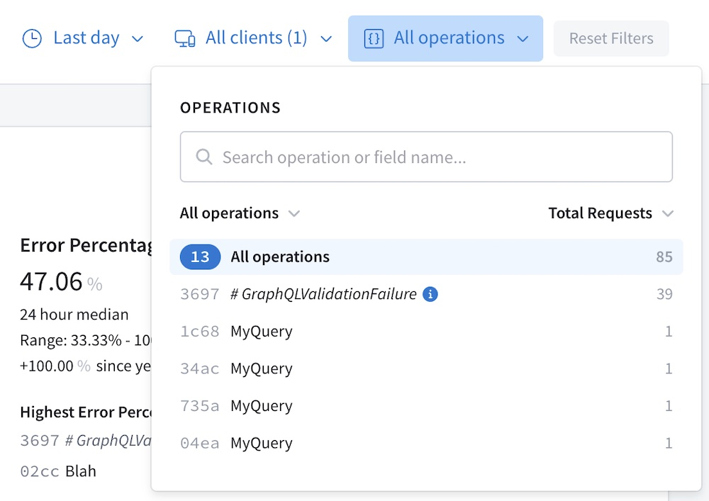

In your metrics reports, Apollo Studio groups together operations based on the exact set of fields they include, _not_ based on operation _names_. This means that operations with the same name but different sets of fields are displayed separately:



To help Studio identify functionally identical operations, Apollo Server generates the **signature** for each operation it reports to Studio. This signature is a normalized representation for an operation with deterministic field order, whitespace, and values for in-line argument values.

## Why do we need an operation signature?

Consider the following operations:

```graphql{10-11,17}
query GetPostDetails($postId: String!) {
  post(id: $postId) {
    author
    content
  }
}

query GetPostDetails($postId: String!) {
  post(id: $postId) {
    content # Different field order
    author
  }
}

query GetPostDetails($postId: String!) {
  post(id: $postId) {
    writer: author # Field alias
    content
  }
}
```

Despite some cosmetic differences (including comments), all of these operations execute identically on a particular GraphQL server. Therefore, Studio should group them when displaying performance information.

Helpfully, Apollo Server's [signature algorithm](#signature-algorithm) generates the _exact same operation signature_ for all of these operations, which means Studio _does_ group them.

## Signature algorithm

> ⚠️ **This algorithm might change in future versions of Apollo Server.** This article describes the signature algorithm as of Apollo Server 3.6.1. It is provided here for informational purposes, not as a canonical specification.

Feel free to [jump to an example](#example-signature) or [view the source](https://github.com/apollographql/apollo-server/blob/main/packages/apollo-server-core/src/plugin/usageReporting/defaultUsageReportingSignature.ts).

Apollo Server's current signature algorithm performs the following modifications on an operation to generate its signature:

### 1. Transform in-line argument values

If an operation includes any in-line argument values, those values are transformed according to their type:

* `Boolean` and `enum` values are _preserved_.
* `Int` and `Float` values are replaced with `0`.
* `String`, list, and object values are replaced with their "empty" counterpart (`""`, `[]`, or `{}`).

> Argument values provided as GraphQL variable names are preserved.

### 2. Remove extraneous characters

Most unnecessary characters in the operation definition (including comments and redundant whitespace) are removed.

If the operation document includes _multiple_ operations, then operations besides the _executed_ operation are removed.

If the operation document includes fragments that _aren't used_ by the executed operation, then those fragments are removed (other fragments are preserved).

### 3. Reorder definitions

Any preserved fragment definitions appear _first_, sorted alphanumerically by fragment name. The definition of the executed operation appears after all fragment definitions.

> Whenever the names of two sorted items are identical, the algorithm preserves the original order of those items relative to each other.

#### Fields

For a given object or fragment's fields, field selections are sorted in the following order:

1. Individually listed fields
2. Named fragment spreads
3. In-line fragments

Within each of these, sorting is alphanumeric by field name or fragment name.

##### Field aliases

All field aliases are _removed_. If an operation includes three instances of the same field with different aliases, then that field is listed in the signature three times with its non-aliased name.

#### Directives and arguments

If multiple directives are applied to the same location in the operation document, those directives are sorted alphanumerically.

If a single field accepts multiple arguments, those arguments are sorted alphanumerically by name.

## Example signature

Consider this operation:

```graphql
# Operation definition needs to appear after all fragment definitions
query GetUser {
  user(id : "hello") { # Replace string argument value with empty string
    ... NameParts # Spread fragment needs to appear after individual fields
    timezone # Needs to appear alphanumerically after `name`
    aliased: name # Need to remove alias
  }
}

# Excessive characters (including this comment!) need to be removed

fragment NameParts on User {
  firstname
  lastname
}
```

The signature algorithm generates the following signature for this operation:

```graphql
fragment NameParts on User{firstname lastname}query GetUser{user(id:""){name timezone...NameParts}}
```

## Signatures and sensitive data

The signature algorithm's primary purpose is to group together operations that differ only cosmetically (in terms of whitespace, field order, aliases, and so on). As an additional effect, the algorithm does [remove most in-line argument values](#1-transform-in-line-argument-values), which in theory helps maintain data privacy.

**However, you should not rely on this!** Ideally, your sensitive data should never reach Apollo Studio in the first place. Whenever possible, [use GraphQL variables](https://www.apollographql.com/docs/react/data/operation-best-practices/#use-graphql-variables-to-provide-arguments) instead of in-line values for arguments. This helps you control exactly which values are reported to Apollo. For details, see [Apollo Studio data privacy and compliance](/data-privacy/).
