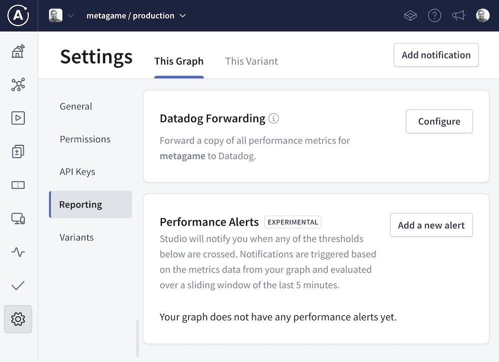
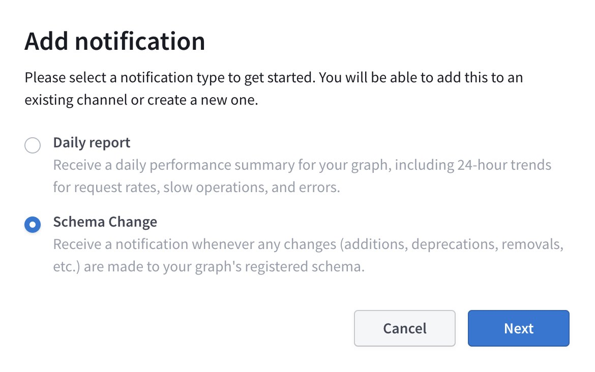
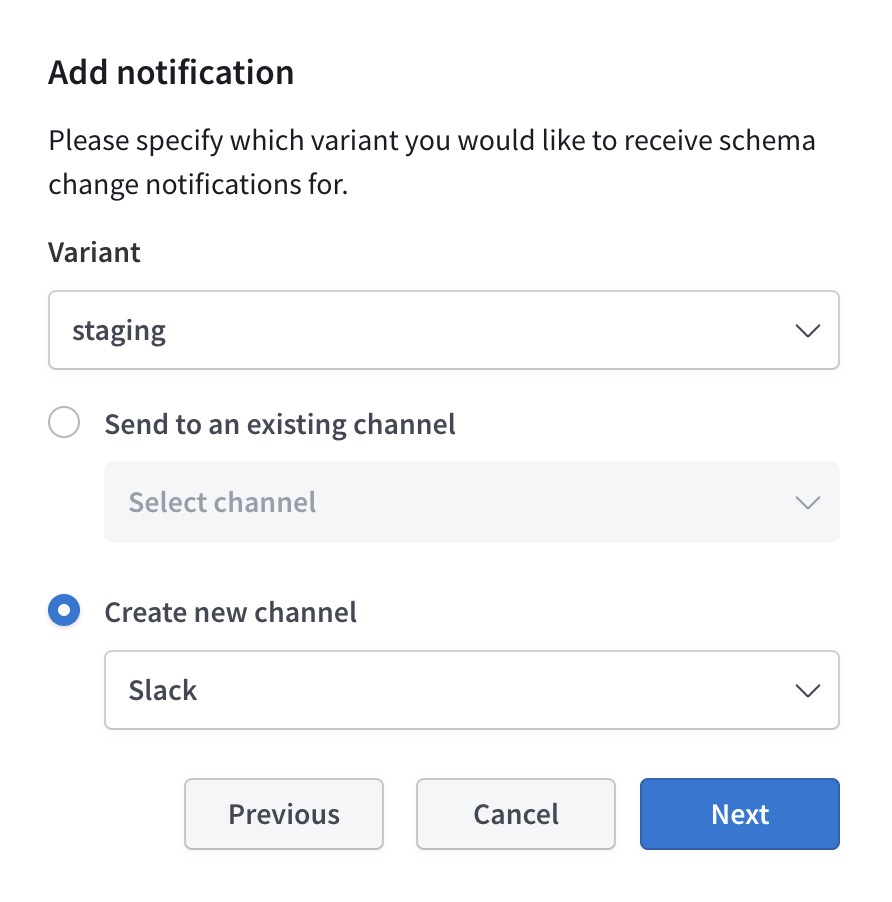
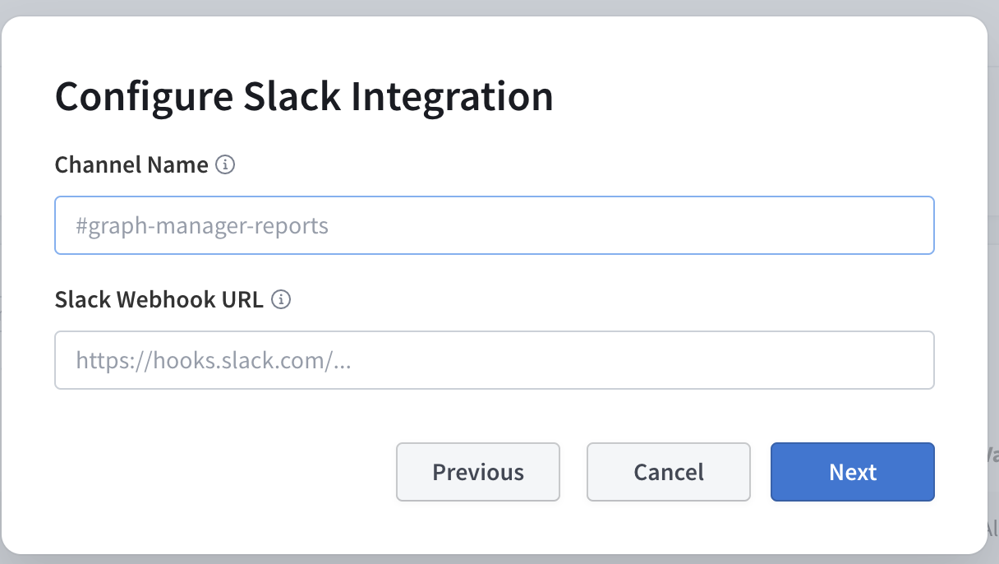
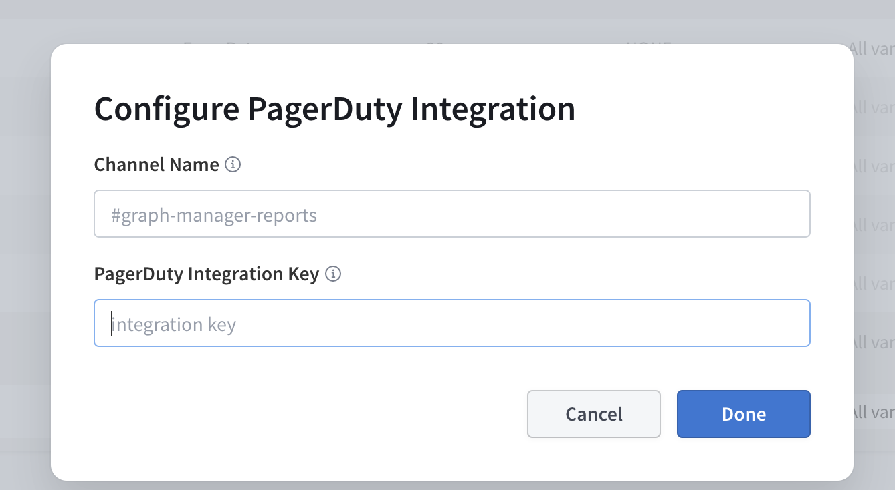
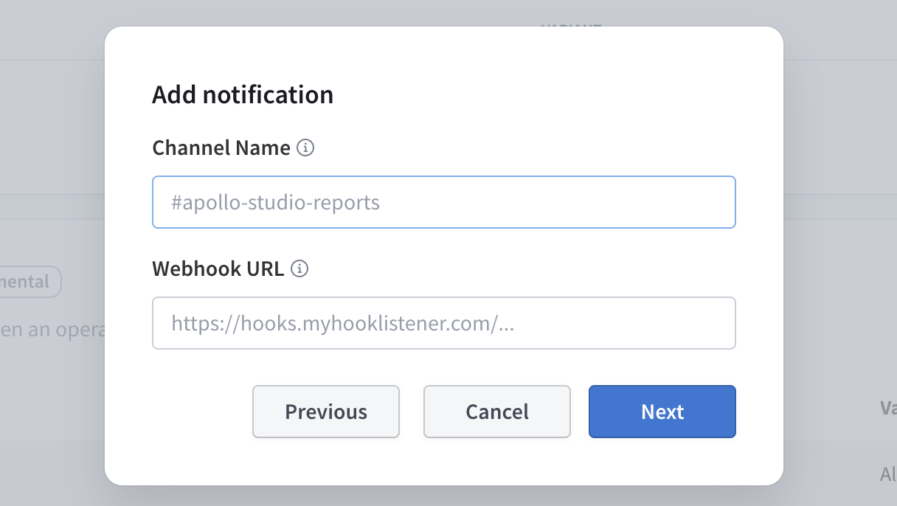

Apollo Studio can notify your team about changes to your graph and its performance. These notifications help you stay up to date and address issues as they arise.

> If you don't have an Apollo Studio organization yet, [get started](getting-started/).

## Supported notifications and channels

Studio can send your team the following notification types:

- [Daily reports](./daily-reports) of your graph's request rate, error rate, and latency
- [Schema change notifications](./schema-change-integration) whenever your graph's schema is updated
- [Performance alerts](./performance-alerts) whenever a metric such as error percentage or request latency exceeds a particular threshold (this experimental feature requires a [paid plan](https://www.apollographql.com/pricing/))
- [Build status notifications](./build-status-notification) whenever Apollo attempts to compose a supergraph schema for your federated graph (this preview feature is [enterprise only](https://www.apollographql.com/pricing/))

Currently, Studio can send each of these notification types to the channel(s) indicated:

| Notification Type                  | Slack | Pagerduty |    Custom Webhook    |
| :-------------------------------- | :---: | :-------: | :------------------: |
| Daily reports                     |   ✓   |           |                      |
| Schema change notifications        |   ✓   |           |           ✓          |
| Performance alerts (paid, experimental) |   ✓   |  ✓  |                      |
| Build status notifications (enterprise only) |   |     |           ✓          |

## Creating a notification

> For performance alerts, see [Performance alerts setup](./performance-alerts/#setup).

1. Go to your graph's Settings page in [Apollo Studio](https://studio.apollographql.com/).
2. Select the **Reporting** tab.
3. Click **Add notification** in the upper right:
    
5. Select a notification type and click **Next**:
    
5. In the dropdown, select which [variant](./org/graphs/#managing-variants) of your graph you want to receive notifications for.
6. Select an existing configured channel to send notifications to, or select which type of new channel you want to configure:
    
7. Click **Next**.
8. If you're configuring a new channel, complete the steps in [Configuring a new channel](#configuring-a-new-channel).
9. If you're creating a daily report, select a time zone. The report is sent daily at 9am in the selected time zone.

## Configuring a new channel

You create new channels as part of the [notification creation process](#creating-a-notification). The information you provide to Studio depends on the type of channel:

* [Slack](#slack)
* [Pagerduty](#pagerduty)
* [Custom webhooks (enterprise only)](#custom-webhooks-enterprise-only)

After you configure a channel for your organization, you can use it to send any notification type that the channel supports. You can add any number of notification channels to your organization.

### Slack

To set up Slack notifications, you first configure an incoming webhook in Slack, then provide that webhook's URL to Apollo Studio.

#### 1. Create an incoming Slack hook

To create an incoming Slack hook:

1. From the [Incoming Hooks](https://slack.com/apps/A0F7XDUAZ-incoming-webhooks) page of the Slack App Directory, sign in and click **Add to Slack**.
2. Select the Slack channel that should receive Studio notifications and click **Add Incoming WebHooks integration**.
3. Copy the **Webhook URL** (has the format `https://hooks.slack.com/services/...`) for use in the [next step](#2-provide-the-slack-hook-to-studio).

You can repeat this process to create webhook URLs for different Slack channels.

#### 2. Provide the Slack hook to Studio

1. Back in Studio, specify a name for this notification channel in the Channel Name field. This name must be unique among your graph's notification channels.

    _This name does not have to match the name of the Slack channel, but it's recommended for simplicity._

2. In the Slack Webhook URL field, paste the webhook URL you obtained in [Create an incoming Slack hook](#1-create-an-incoming-slack-hook).
3. Click **Next**.
4. After you complete configuration, verify that your Slack channel receives a confirmation notification from Studio.

>To configure multiple Slack channels, repeat this process with a different corresponding webhook URL each time.

### Pagerduty

#### 1. Create a Pagerduty integration key

Generate an [integration key](https://support.pagerduty.com/docs/generating-api-keys#events-api-keys) for the service that should recieve alerts in Pagerduty. You can select an [existing service](#existing-services) that corresponds to your GraphQL API or [**Add New Service**](#adding-a-service).

##### Existing services

1. Navigate to the service's Integrations tab and click **new integration**.
2. Enter an Integration Name, (e.g. "Apollo Alerts").
3. Under "Integration type", choose **Use our API directly** and **Events API v2**.
4. Click **Add Integration**.
5. From the Integrations tab, copy the generated integration key from the table for use in the [next step](#2-provide-the-integration-key-to-studio).

##### Adding a service

1. Under "Integration Settings", choose **Use our API directly** and use **Events API v2**.
2. Enter an Integration Name (e.g., `Apollo Alerts`) and complete the add service flow.
3. From the Integrations tab, copy the generated integration key from the table for use in the [next step](#2-provide-the-integration-key-to-studio).

#### 2. Provide the integration key to Studio

1. Back in Studio, specify a name for this notification channel in the Channel Name field. This name must be unique among your graph's notification channels.

   _This name does not have to match the name of the Pagerduty service, but it's recommended for simplicity._

2. In the Pagerduty Integration Key field, paste the integration key you obtained in [Create a pagerduty integration key](#1-create-a-pagerduty-integration-key).

3. Click **Done**.

### Custom webhooks (enterprise only)

> Custom webhooks require an [Enterprise plan](https://www.apollographql.com/pricing/).

Custom webhooks require you to set up an HTTPS endpoint that is accessible via the public internet. Webhook notifications are sent to this endpoint as `POST` requests. Notification details are provided as JSON in the request body, as described in [Webhook format](./schema-change-integration/#webhook-format).

1. Specify a name for this notification channel in the Channel Name field. This name must be unique among of your graph's notification channels.
2. In the Webhook URL field, provide the URL of your HTTP(S) endpoint.
3. Click **Next** and complete any remaining steps in the dialog.
