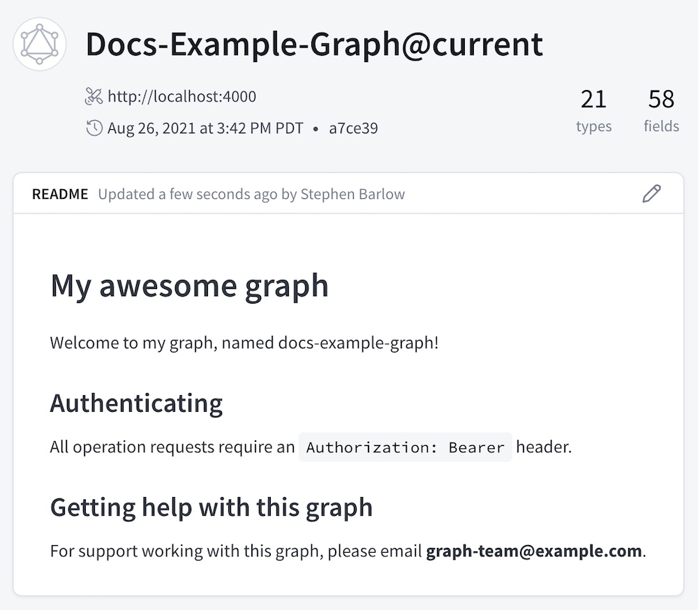
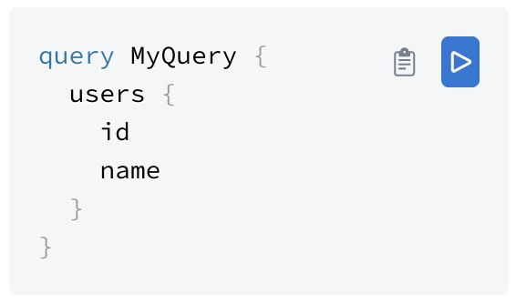
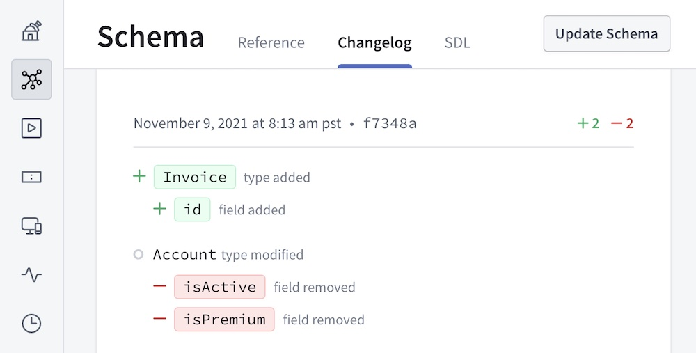
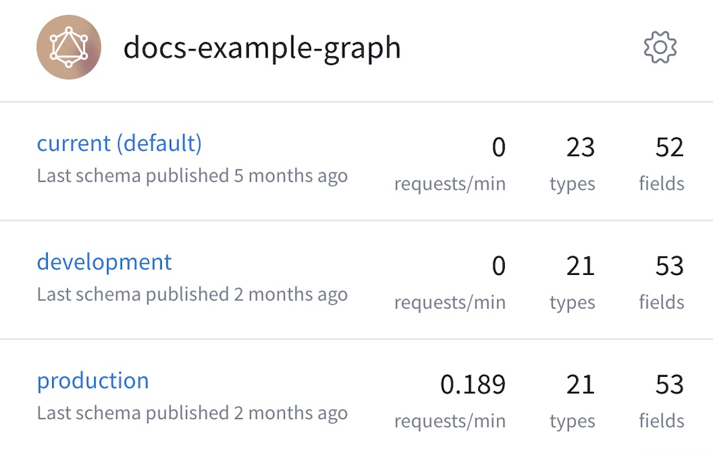
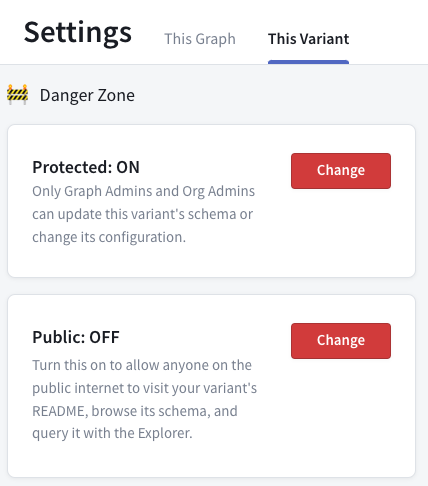

A **graph** in Apollo Studio represents a graph in your organization. Each graph has one or more **variants**, which correspond to the different environments where that graph runs (such as staging and production). Each variant has its own GraphQL schema, which means schemas can differ between environments.

## Creating a graph

To create a graph in [Apollo Studio](https://studio.apollographql.com/), first select the Studio organization that the graph will belong to. Then click **New Graph** in the upper right and proceed through the creation flow:


There are two types of graphs in Studio:

* **Deployed graphs** are shared with other members of your organization. Create a deployed graph for every use case _except_ local development.
* [**Development graphs**](../dev-graphs/) (**dev graphs** for short) are only visible to you. Use them to help you iterate on your graph in your development environment.

## Registering a schema

You can register your schema to a Studio graph with one of the following methods:

* [Using schema reporting](../schema/schema-reporting/) (recommended)
* [Using the Rover CLI](../schema/cli-registration/)

## Viewing graph information

After selecting an organization in Studio, click on a particular graph
to view its editable README, schema, data, and settings. All of a Studio organization's members can access the data and settings for every graph that belongs to that organization.

> Enterprise accounts can set [member roles](./members/#organization-wide-member-roles) to configure access for individual members of their organization.

### The README page

When a user opens one of your graph's variants in Apollo Studio, its **README page** is shown:



Like the typical homepage for a Git repository, this page displays a Markdown-based README that you can edit with any content you like.

> **Note:** Only organization members with the [`Org Admin`, `Graph Admin`, or `Contributor` role](/org/members/) can edit a variant's README. If a variant is [protected](#protected-variants-enterprise-only), `Contributor`s _cannot_ edit its README.

**Each variant has its own README.** If you edit one variant's README, those edits are _not_ applied to other variants. Among other uses, this enables you to provide different information to external consumers in a [public variant](#public-variants).

#### Supported Markdown

The README supports all [basic Markdown syntax](https://www.markdownguide.org/cheat-sheet/#basic-syntax) and _most_ [extended syntax](https://www.markdownguide.org/cheat-sheet/#extended-syntax) (including tables, code blocks, and footnotes).

You can define a GraphQL code block with the following syntax:

    ```graphql
    query MyQuery {
      users {
        id
        name
      }
    }
    ```

This renders the code block with buttons you can use to copy an operation or open it in the Explorer:



#### README shortcodes

The README supports a set of shortcodes you can use to populate it with data that's specific to your variant, such as the graph's name and the variant's graph ref:

```md
# Overview of {{ graph.name }}

Graph ref: {{ graph.ref }}
```

For a list of all supported shortcodes, click **Graph shortcodes** in the bottom-left corner of the README editor.

### Exploring your schema

Apollo Studio provides a powerful **Explorer** IDE that helps you visualize your graph and run queries against it. It's available from your graph's Explorer tab in Studio.

> [Learn about the Apollo Studio Explorer](../explorer/explorer/)

### Tracking schema changes

The Schema > Changelog tab in Apollo Studio displays a timeline of changes made to your graph's schema:



**Only schema changes that you publish to Studio are included in this timeline**, which is one of the most important reasons to [include schema registration in your continuous delivery pipeline](../schema/cli-registration/#registering-with-continuous-delivery).

## Managing variants

To distinguish between instances of the same graph running in different environments (such as staging and production), you can define **variants** for a deployed graph. Each variant has its own schema, along with its own change history, metrics, and operation registry:



> Development graphs do **not** support variants.

### Adding a variant

To add a variant to your graph, you [register a schema](#registering-a-schema) to the graph and include a variant name in the registration. If a variant with the specified name doesn't exist yet, Studio creates it.

### Associating metrics with a variant

You can configure Apollo Server to associate the metrics it sends to Apollo Studio with a particular variant. To do so, set the `APOLLO_GRAPH_VARIANT` environment variable (`ENGINE_SCHEMA_TAG` in `apollo-server` pre-2.13.0) to the appropriate variant before initializing Apollo Server.

> Make sure you associate metrics with the correct variant! Otherwise, metrics from your staging and test environments might be included in reports for your production graph.

### Public variants

You can enable public access for individual variants of your graph. If you do, **anyone with that variant's public link** can view the following pages for that variant in Studio:

* Home
* Schema
* Explorer
    * You can also [embed the Explorer](/explorer/embed-explorer/) on your own webpage.

This enables consumers of your graph to learn about your graph's schema and any special usage information (such as authentication details) that you've documented in [the public variant's README](#the-readme-page). They can also run properly authenticated operations against your graph with the Explorer.

People outside your organization can't view any _other_ pages for a public variant (Fields, Operations, etc.), and they can never view _any_ pages for private variants. New variants always start as private.

#### Making a variant public

> Only organization members with the [`Org Admin` or `Graph Admin` role](/org/members/) can toggle a variant's public visibility.

1. Go to your variant's Settings page and open the **This Variant** tab.
2. Find the Public card and click **Change**:

    

3. Toggle your selection and click **Save**.

You can toggle the switch back to **Off** to make the variant private again.

After you make a variant public, you can click the variant's **PUBLIC** label at the top of Apollo Studio to get its public link:


### Protected variants (Enterprise only)

If you have an Enterprise plan, you can designate particular variants of a graph as **protected variants**. Making a variant protected specifically affects the ability of users with the [`Contributor` role](/org/members/#organization-wide-member-roles) to make certain changes to the variant:
- `Contributor`s _cannot_ push schema updates to a protected variant.
- `Contributor`s _cannot_ manage Explorer-related settings for a protected variant, like setting its URL.
- Graph API Keys with the `Contributor` permission will not be able to report usage metrics to your graph.

These are the only operations (other than creating new protected variants and creating new graphs) that can be performed by `Contributor`s and not by `Observer`s, so one way of thinking of protected variants are that they are variants where `Contributor`s are treated as `Observer`s.

`Graph Admin`s and `Org Admin`s can configure whether a variant is protected from the **This Variant** tab of the variant's Settings page.

## Internal graph visibility (Enterprise only)

> For _external_ graph visibility, see [Public variants](#public-variants).

By default, deployed graphs are visible to all members of your organization. If you have an Enterprise plan, you can set a deployed graph to instead be visible only to members you invite.

You can configure visibility and grant your organization's members explicit access to your graph from the Access tab of your graph's Settings page.

Note that `Organization Admin`s can always see _all_ graphs in your organization.

## Transferring graph ownership

You can transfer a graph to a different Studio organization you belong to
by visiting the graph's Settings page and changing the **graph owner**.

## Deleting a graph

> **Deleting a graph cannot be undone!**

You can delete a graph from Studio by visiting its Settings page and clicking
**Delete Graph**.
