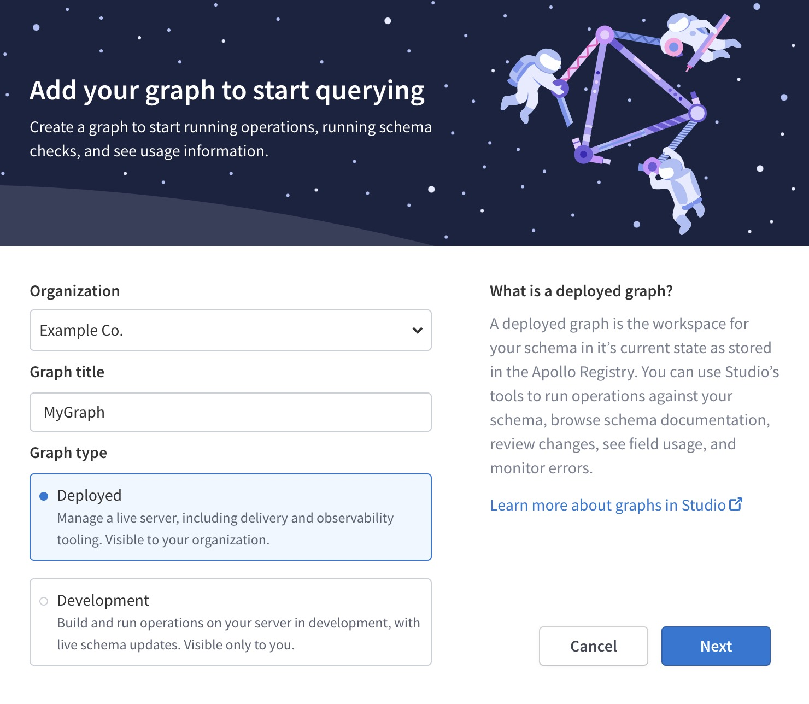
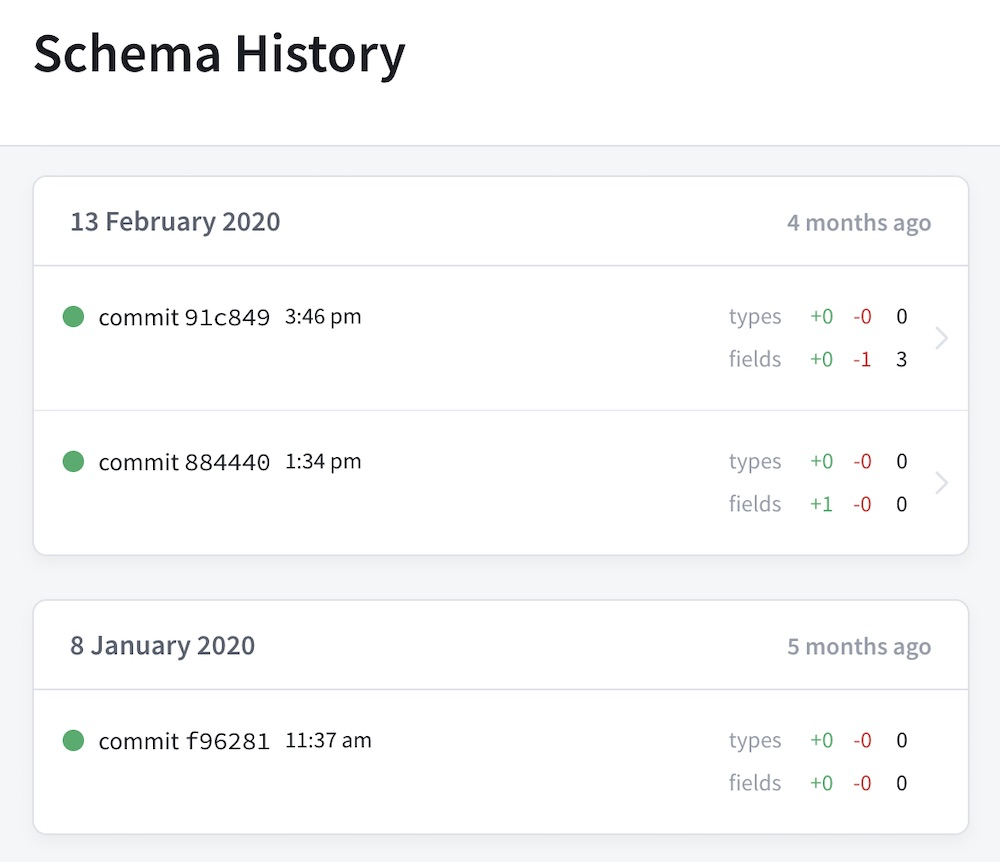

A **graph** in Apollo Studio represents a connected data graph in your organization. Each graph has one or more **variants**, which correspond to the different environments where the graph runs (such as staging and production). Each variant has its own GraphQL schema, which means schemas can differ between environments.

## Creating a graph

To create a graph in [Apollo Studio](https://studio.apollographql.com/), first select the Studio organization that the graph will belong to. Then click **New Graph** in the upper right and proceed through the creation flow:

There are two types of graphs in Studio:

* **Deployed graphs** are shared with other members of your organization. Create a deployed graph for every use case _except_ local development.
* **Development graphs** (**dev graphs** for short) are only visible to you. Use them to help you iterate on your graph in your development environment.

## Registering a schema

You can register your schema to a Studio graph with one of the following methods:

* [Using schema reporting](../schema/schema-reporting/) (recommended)
* [Using the Apollo CLI](../schema/cli-registration/)

## Viewing graph information

After selecting an organization in Studio, click on a particular graph
to view its schema, data, and settings. All of a Studio organization's members can access the data and settings for every graph that belongs to that organization.

> Enterprise accounts can set [member roles](./members/#organization-wide-member-roles) to configure access for individual members of their organization.

### Exploring your schema

Apollo Studio provides a powerful **Explorer** IDE that helps you visualize your graph and run queries against it. It's available from your graph's Explorer tab in Studio.

> [Learn about the Apollo Studio Explorer](../explorer/)

### Tracking schema changes

The History view in Apollo Studio lets you view the timeline of changes made to your graph's schema:

</img>

**Only schema changes that you push to Studio are included in this timeline**, which is one of the most important reasons to [include schema registration in your continuous delivery pipeline](../schema/cli-registration/#registering-with-continuous-delivery).

## Setting graph visibility (Enterprise only)

By default, deployed graphs are visible to all members of your organization. If you have an Enterprise plan, you can set a deployed graph to instead be visible only to members you invite. 

You can configure visibility and invite members from the Access tab of your graph's Settings page.

## Managing variants

To distinguish between instances of the same graph running in different environments (such as staging and production), you can define **variants** for a deployed graph. Each variant has its own schema, along with its own change history, metrics, and operation registry.

> Development graphs do **not** support variants.

### Adding a variant

To add a variant to your graph, you [register a schema](#registering-a-schema) to the graph and include a variation name in the registration. If a variation with the specified name doesn't exist yet, Studio creates it.

### Associating metrics with a variant

You can configure Apollo Server to associate the metrics it sends to Apollo Studio with a particular variant. To do so, set the `APOLLO_GRAPH_VARIANT` environment variable (`ENGINE_SCHEMA_TAG` in `apollo-server` pre-2.13.0) to the appropriate variant before initializing Apollo Server.

> Make sure you associate metrics with the correct variant! Otherwise, metrics from your staging and test environments will be included in reports for your production graph.

### Protected variants (Enterprise only)

If you have an Enterprise plan, you can designate particular variants of a graph as **protected variants**. Members of your organization with the [`Contributor` role](/org/members/#organization-wide-member-roles) _cannot_ push schema updates to a protected variant. Only members with the `Organization Admin` or `Graph Admin` role can do so. `Contributor` members still have read access to protected variants.

Configure protected variants from the Access tab of your graph's Settings page.

## Transferring graph ownership

You can transfer a graph to a different Studio organization you belong to
by visiting the graph's Settings page and changing the **graph owner**.

## Deleting a graph

> **Deleting a graph cannot be undone!**

You can delete a graph from Studio by visiting its Settings page and clicking
**Delete**.
