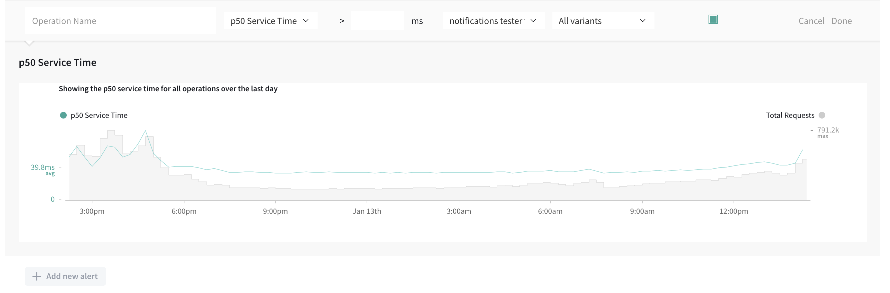

Apollo Studio can send performance alerts to your team's Slack workspace or Pagerduty instnace. This helps you stay up to date on changes to your server's metrics in realtime.

Users can get notifications whenever a metric such as error percentage or request latency exceeds a particular threshold (this feature requires a [paid plan](https://www.apollographql.com/pricing/))

## Performance alerts

> Performance alerts require a [paid plan](https://www.apollographql.com/pricing/). They are currently experimental.

Studio can notify you whenever a particular metric (such as error rate) for a particular GraphQL operation exceeds a defined threshold. This is useful for detecting anomalies, especially following a release.

### Supported metrics

You can configure performance alerts for any of the following metrics:

- **Request rate:**  requests per minute
- **Request duration:** p50/p95/p99 service time
- **Error rate:** errors per minute
- **Error percentage:** the number of requests with errors, divided by total
  requests

Each performance alert you define can apply to either a **specific operation** or **any operation**. If you define an alert that applies to a specific operation, "any operation" alerts for the _same metric_ no longer apply to that operation (i.e., the more specific alert takes precedence).

### Measuring thresholds

Thresholds are measured against a rolling five-minute window. For example, let's say you configure an alert to trigger when an operation's error rate exceeds 5%. If 6 out of 100 executions of that operation result in an error during a five-minute period, the alert will trigger with an error rate of 6%. When the error rate falls back below 5%, your notification will resolve.

## Setup

1. Navigate to the notifications tab under graph settings and scroll to the bottom of the page

   

2. Click the `Add new alert` button which and selecting the various options for the alert.

3. An existing channel can be selected or a new channel can be created by scrolling to the bottom of the channel selector dropdown and selecting `New Channel`. For information on creating new channels look at 