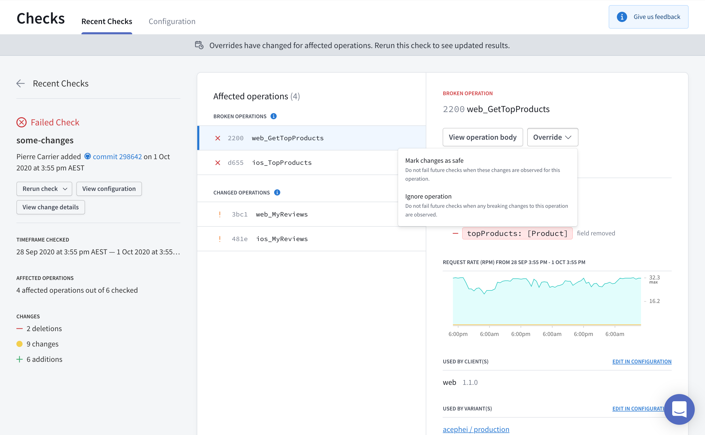
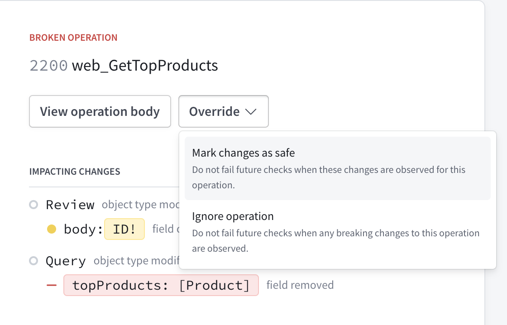
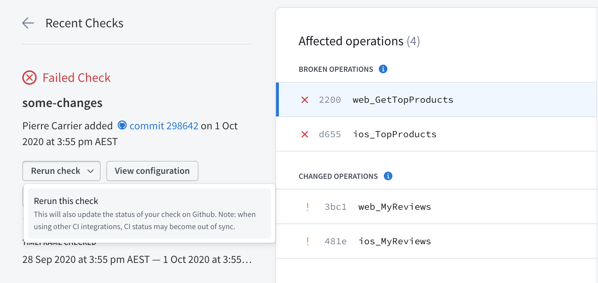

> This article demonstrates performing schema checks using the Apollo CLI instead of the new Rover CLI. If you're just getting started with schema checks, we recommend [using Rover instead](./schema-checks/).

Certain changes to your GraphQL schema (such as removing a field or type) can potentially **break one of your application's clients**. Apollo Studio provides **schema checks** to help you identify breaking changes before you make them, and to help you identify when a potentially dangerous change _won't_ break anything.

Schema checks are a **paid feature** that's available as part of Apollo Studio [Team and Enterprise plans](https://www.apollographql.com/plans/).

## Prerequisites

To enable schema checks for your graph, first do the following:

1. [Set up metrics reporting](/metrics/usage-reporting/) to Apollo Studio from your GraphQL server.
2. Set up schema registration in your [continuous delivery pipeline](./schema/cli-registration/#registering-with-continuous-delivery).
    * (If you use [schema reporting](./schema/schema-reporting/) to register your schema, no additional action is required.)
3. [Install the Apollo CLI](https://www.apollographql.com/docs/devtools/cli/) in your development environment if you haven't yet.

After you complete the above, you can perform a test check by running the following command from your project's root directory:

```bash
# Omit 'npx' if you installed the Apollo CLI globally
$ npx apollo service:check --variant production
```

Try changing something in your schema and see what happens! If everything is set up correctly, the command's output looks similar to the output shown in [The check response](#the-check-response).

## The check process

When you check your schema with the `apollo service:check` command:

1. Apollo Studio generates a diff between your local schema and the active schema for the variant you're checking against (the default variant is `current`).
2. Studio uses this diff to determine whether the changes affect any operations that have been executed against your graph recently (you can [customize this time window](#customizing-checks)).
3. Studio returns the diff, along with a list of the operations that are affected by the changes.
4. The Apollo CLI prints the result of the check and returns a non-zero exit code if at least one breaking change is found.

### The check response

Running `apollo service:check` outputs the diff of all detected schema changes and highlights breaking changes:

```console
$ npx apollo service:check
  ✔ Loading Apollo Project
  ✔ Validated local schema against variant prod on service engine
  ✔ Compared 8 schema changes against 110 operations over the last 24 hours
  ✖ Found 3 breaking changes and 5 compatible changes
    → breaking changes found

FAIL    ARG_REMOVED                `ServiceMutation.checkSchema` arg `gitContext` was removed
FAIL    FIELD_REMOVED              `Schema.fieldCount` was removed
FAIL    FIELD_REMOVED              `Schema.typeCount` was removed

PASS    FIELD_ADDED                `SchemaTag.schemaRepoID` was added
PASS    FIELD_CHANGED_TYPE         `ServiceMutation.uploadPartialSchema` changed type from `UploadPartialSchemaResponse!` to `CompositionResult!`
PASS    FIELD_DEPRECATION_REMOVED  `IntrospectionSchema.fieldCount` is no longer deprecated
PASS    FIELD_DEPRECATION_REMOVED  `IntrospectionSchema.typeCount` is no longer deprecated
PASS    TYPE_REMOVED               `UploadPartialSchemaResponse` removed

View full details at: https://studio.apollographql.com/service/example-1234/check/<DETAILS>
```

Each change to the schema is labeled either `PASS` or `FAIL`.

> **Note:** Because breaking changes are detected by analyzing recent operations, your GraphQL server _must_ be [pushing metrics to Apollo Studio](/metrics/usage-reporting/) for schema checks to work. **If there are no operation metrics to compare against, all potentially dangerous schema changes are labeled `FAIL`.**

The CLI output also includes a Studio URL that provides full details on the changes and their impact on existing clients and operations:





> **Note:** If you've [integrated schema checks with your GitHub PRs](#integrating-with-github), the "Details" link in your GitHub check takes you to this same details page.

### Overriding flagged changes

Occasionally, schema checks might flag a change that you know is safe. For example, you might change an input type's field from nullable to non-null when you are certain that none of your clients ever provides a null value for that field.

In cases like this, you can **override** a flagged change in Apollo Studio from the associated check's details page:



You override flagged changes on an operation-by-operation basis. For each operation with flagged changes, you can override those changes in the following ways:

* **Mark the changes as safe.** In this case, schema checks will _not_ flag these exact changes for the operation in any future execution. This effectively "approves" the changes for the operation.
    * If a future check detects approved changes along with _new_ unsafe changes to the operation, the new unsafe changes _will_ be flagged.
* **Ignore the operation.** In this case, schema checks will completely ignore the operation when checking _all_ changes in any future execution.
  * This option is useful when you know an operation originates _only_ from clients or client versions that you don't actively support.

### Rerunning a check

You can also rerun checks from inside Studio. When you rerun a check, the latest check configuration is applied. The new check uses an updated time window for operations.  In addition, any changes made to excluded / included clients, checked variants, and any operations already marked safe / ignored are incorporated when rerunning.

> **Note:** If you've [integrated schema checks with your GitHub PRs](#integrating-with-github), a rerun of the check also updates the status of the check in Github.



### Checking a federated schema

If your graph uses [Apollo Federation](https://www.apollographql.com/docs/federation/), the schema checks process differs slightly. For details, see [Checking changes to a federated graph](https://www.apollographql.com/docs/federation/managed-federation/advanced-topics/#checking-changes-to-a-federated-graph).

## Using with continuous integration

Schema checks is especially useful when you add it to your continuous integration pipeline (such as Jenkins or CircleCI). By doing so, you can obtain results and display them directly on your team's pull requests.

We recommend defining a separate CI job for each [variant of your schema](./check-configurations#checking-against-multiple-environments) (production, staging, etc.) you want to validate your changes against. The `apollo service:check` command returns a non-zero exit code when it detects a breaking change, meaning the job will fail when the check fails.

### Example configuration

The following config defines a schema check job for a CircleCI pipeline. Your config's syntax varies depending on your CI tool, but the job's steps are the same.

```yaml{30}:title=config.yml
version: 2

jobs:

  # ...other jobs...

  # Define a separate job for each environment you validate against.
  check_against_staging:
    docker:
      - image: circleci/node:12

    steps:
      - checkout

      - run: npm install

      # Start the GraphQL server. If a different command is used to
      # start the server, use it in place of `npm start` here.
      - run:
          name: Starting server
          command: npm start
          background: true

      # Make sure the server has enough time to start up before running
      # commands against it.
      - run: sleep 5

      # This command authenticates using the `APOLLO_KEY` environment
      # variable. Specify your GraphQL endpoint's URL in your Apollo config.
      - run: npx apollo service:check --variant=staging
```

### Integrating with GitHub

If you're using GitHub, you can install the [Apollo Studio GitHub app](https://github.com/apps/apollo-studio). This app enables Apollo Studio to send a webhook back to your GitHub project on each call to `apollo service:check`, providing built-in pass/fail status checks on your pull requests:


### Integrating with other version control services

If you're using GitHub Enterprise, Bitbucket, or another version control service, we recommend setting up your CI tool to post a comment on each pull request with the results of schema checks. By surfacing schema diffs and breaking changes directly in your PR, you can avoid having to search your CI logs to check why a check failed.

The `apollo service:check` supports a `--markdown` flag, which outputs the results of a schema check in markdown format. You can pipe this output directly into a comment to your source control tool, like in [this example of posting a comment with the results of a schema check to GitHub](https://gist.github.com/daniman/e53d0589d18b778878bd8ef32d2e793c).

The output of `apollo service:check --markdown` looks like this:

```md
### Apollo Service Check

🔄 Validated your local schema against `engine@staging`.
🔢 Compared **18 schema changes** against **100 operations** seen over the **last 24 hours**.
❌ Found **7 breaking changes** that would affect **3 operations** across **2 clients**

🔗 [View your service check details](https://studio.apollographql.com/service/engine/checks?...).
```
> For most providers, the `apollo` CLI will automatically deduce the git branch and author information from environment variables. To supply these values manually, we recommend using the `--branch` and `--author` command line arguments.

## Customizing checks

See [Configuring schema checks](./check-configurations/).

## Types of schema changes

Not every change to a schema is a potentially breaking change. Additive changes (such as adding a field to a type) are typically safe and do not affect active clients. Deletions and modifications (such as removing a field or changing a return type), however, can break clients that use affected types and fields.

### Potentially breaking changes

#### Removals

These changes remove a schema element. If a removed element is actively being used by an operation, your graph will return an error to affected clients.

| Name | Description |
|------|-------------|
| `FIELD_REMOVED` | A field used by at least one operation was removed. |
| `TYPE_REMOVED` | A scalar or object used by at least one operation was removed. |
| `ARG_REMOVED` | An argument used by at least one operation was removed from a field. |
| `TYPE_REMOVED_FROM_UNION` | A type was removed from a union used by at least one operation. |
| `INPUT_FIELD_REMOVED` | A field was removed from an input type. That field is referenced by an argument on _another_ field that's used by at least one operation. |
| `VALUE_REMOVED_FROM_ENUM` | A value was removed from an enum used by at least one operation. |
| `TYPE_REMOVED_FROM_INTERFACE` | An object was removed from an interface used by at least one operation. |

#### Addition of required arguments

These changes add a required input to a schema element. If an operation is actively using an element of your graph and doesn't add the new required input argument, the graph will return an error to affected clients.

| Name | Description |
|------|-------------|
| `REQUIRED_ARG_ADDED` |  A non-nullable argument was added to field that's used by at least one operation. |
| `NON_NULL_INPUT_FIELD_ADDED` | A non-nullable field was added to an input object used by at least one operation. |

#### In-place updates

These changes update an existing schema element. If an operation is actively using an element that is updated, the operation might start receiving an error from your graph. It also might receive an unexpected result.

> **Note:** In some cases, in-place updates _are_ compatible with affected clients at runtime (such as a type rename or a conversion from an object to an interface that uses the same fields). However, schema checks still marks these as breaking changes, because validation does not have enough information to ensure that they are safe.

| Name | Description |
|------|-------------|
| `FIELD_CHANGED_TYPE` | An existing field used by at least one operation changed its type. |
| `INPUT_FIELD_CHANGED_TYPE` | An existing field of an input object changed its type. That field is referenced by an argument on _another_ field that's used by at least one operation. |
| `TYPE_CHANGED_KIND` | An existing type used by at least one operation changed its "kind." For example, an object type was changed to a union type. |
| `ARG_CHANGED_TYPE` | An existing argument on a field used by at least one operation changed its type. |

#### Default arguments

These changes update the default value for an argument. If an operation is using an element of your graph and does not specify a value for this argument, the operation might get an unexpected result when the schema is updated if it was relying on the original default value.

| Name | Description |
|------|-------------|
| `ARG_DEFAULT_VALUE_CHANGE` | An existing field used by at least one operation had a default value added or changed. |

### Non-breaking changes

These changes are detected by schema checks, but they are "safe." They never affect the behavior of any existing clients if deployed.

#### Schema additions

| Name | Description |
|------|-------------|
| `FIELD_ADDED` | A field was added to an existing type. |
| `TYPE_ADDED` | A type was added to the schema. |
| `VALUE_ADDED_TO_ENUM` | A value was added to an enum. If clients contain a switch statement on the enum's value and do not include a `default` case, this change might cause unexpected behavior. |
| `TYPE_ADDED_TO_UNION` | A type was added to a union used by at least one operation. |
| `TYPE_ADDED_TO_INTERFACE` | An interface was applied to an object used by at least one operation. |
| `OPTIONAL_ARG_ADDED` | A nullable argument was added to an existing field. |
| `NULLABLE_FIELD_ADDED_TO_INPUT_OBJECT` | A nullable field was added to an existing input object. |

#### Deprecations

| Name | Description |
|------|-------------|
| `FIELD_DEPRECATED` | An existing field was deprecated. |
| `FIELD_DEPRECATION_REMOVED` | A previously deprecated field is no longer deprecated. |
| `FIELD_DEPRECATED_REASON_CHANGE` | The specified reason for a field's deprecation changed. |
| `ENUM_DEPRECATED`| An existing enum was deprecated. |
| `ENUM_DEPRECATION_REMOVED`| A previously deprecated enum is no longer deprecated. |
| `ENUM_DEPRECATED_REASON_CHANGE` | The specified reason for an enum's deprecation changed. |

#### Descriptions

| Name | Description |
|------|-------------|
| `TYPE_DESCRIPTION_CHANGE` | An existing type's description changed. |
| `FIELD_DESCRIPTION_CHANGE` | An existing field's description changed. |
| `ENUM_VALUE_DESCRIPTION_CHANGE` | An existing enum value's description changed. |
| `ARG_DESCRIPTION_CHANGE` | An existing argument's description changed. |
