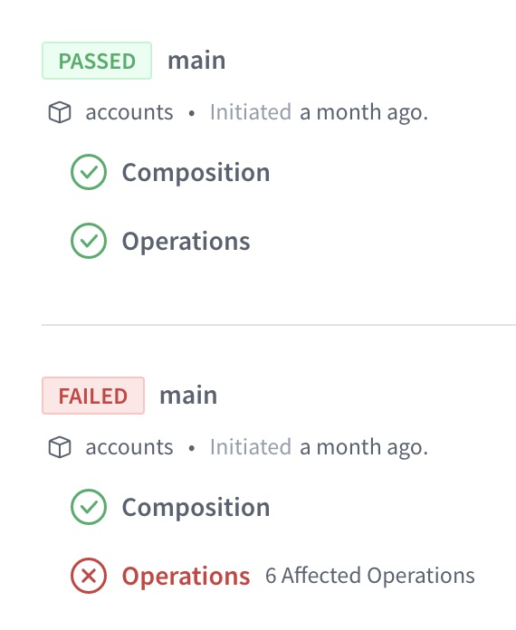
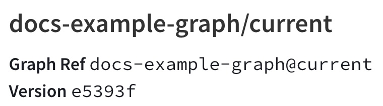
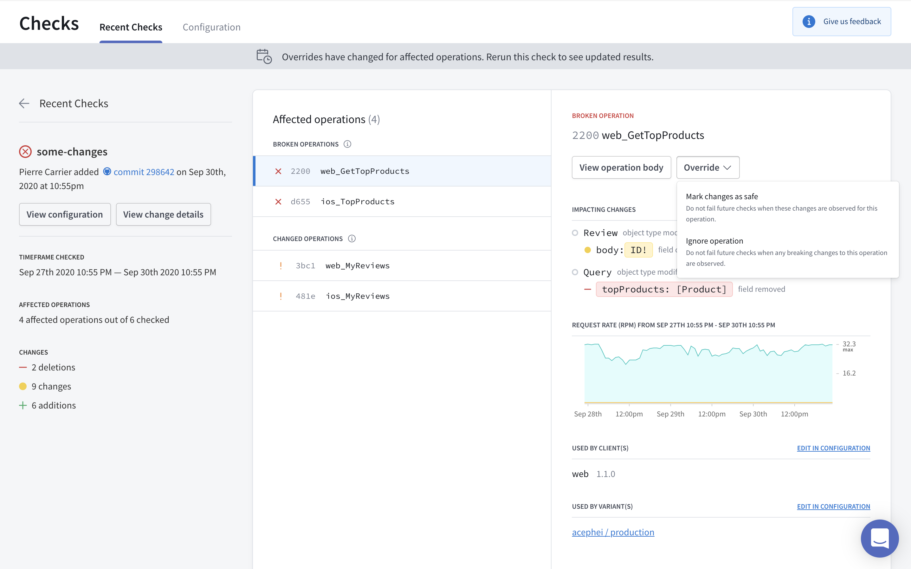
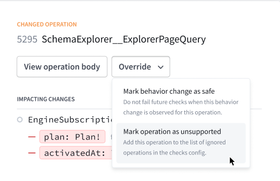
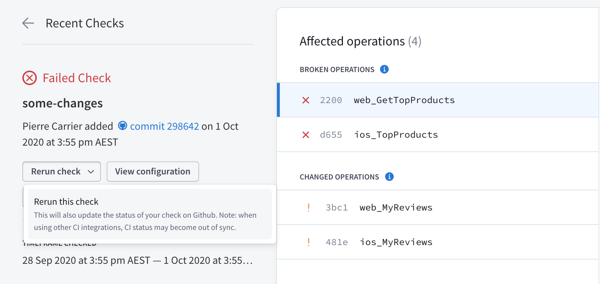
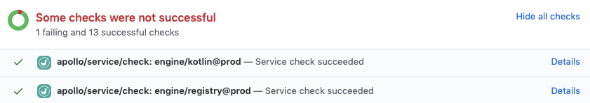

Certain changes to your GraphQL schema (such as removing a field or type) might break one of your application's clients. Apollo Studio provides **schema checks** to help you identify breaking changes before you make them, and to help you identify when a potentially dangerous change _won't_ break anything.

You can review the results of schema checks inside Studio, helping you make informed decisions about evolving your graph:



> Schema checks are a **paid feature** that's available as part of Apollo Studio [Team and Enterprise plans](https://www.apollographql.com/plans/).

## Types of checks

Apollo Studio can perform the following types of schema checks:

* **Operation checks.** Compare your proposed schema changes against historical operations to verify whether the changes will break any of your graph's active clients.

* [**Composition checks.**](#federated-composition-checks) For [federated graphs](https://www.apollographql.com/docs/federation/), verify whether your proposed changes to a subgraph schema will successfully compose with your _other_ registered subgraph schemas.

> Most of this article covers operation checks. For details on composition checks, [see this section](#federated-composition-checks).

## Prerequisites

To enable schema checks for your graph, do the following if you haven't yet:

1. Register your production graph's schema with Apollo.
    * [Federated setup](https://www.apollographql.com/docs/federation/managed-federation/setup)
    * [Non-federated setup](./schema/schema-reporting/)
2. Enable metrics reporting to Apollo Studio from your production graph. Studio uses these metrics to help determine when a type or field can be modified or removed safely.
    * [Federated setup](https://www.apollographql.com/docs/federation/managed-federation/monitoring/#metrics-and-observability)
    * [Non-federated setup](/metrics/usage-reporting/)
3. [Install the Rover CLI](https://www.apollographql.com/docs/rover/getting-started/) in your development environment and [authenticate it with Apollo Studio](https://www.apollographql.com/docs/rover/configuring/#authenticating-with-apollo-studio).

## Running your first check

Let's say you've made local changes to your GraphQL server's schema. After you [complete the prerequisites](#prerequisites), you can run schema checks against those changes with the `rover graph check` command.

> **Important:** If your graph is [federated](https://www.apollographql.com/docs/federation/), use [`rover subgraph`](https://www.apollographql.com/docs/rover/subgraphs/#checking-subgraph-schema-changes) commands instead of `rover graph` commands. These commands require one additional option, the `--name` of the subgraph you're operating on.

The `rover graph check` command looks like this:

```bash
rover graph check docs-example-graph@current --schema ./schema.graphql
```

It requires the following:

* Your registered graph's [graph ref](https://www.apollographql.com/docs/rover/conventions/#graph-refs). This is available from your graph's Schema tab in Studio:

    

* The locally modified version of your schema. In the command above, the schema is provided via a `.graphql` file.

    * If your schema is _not_ in a standalone `.graphql` file, you can run your GraphQL server locally and pipe its schema directly from `rover graph introspect`, like so:

        ```bash
        rover graph introspect http://localhost:4000 | rover graph check my-graph-name@my-variant-name --schema -
        ```

Try changing something in the local version of your schema and see what happens! If everything is set up correctly, the command's output looks similar to the output shown in [The check response](#the-check-response).

## The checks lifecycle

When you run `rover graph check`:

1. Apollo Studio generates a diff between your local schema and the registered schema for the variant you're checking against.
2. Studio uses this diff to determine whether the changes affect any operations that have been executed against your graph within a [customizable time window](./check-configurations/) (by default, this is the last seven days).
3. Studio returns the diff, along with a list of the operations that are affected by the changes.
4. Rover prints the result of the check and returns a non-zero exit code if at least one breaking change is found.

### The check response

Running `rover graph check` outputs the diff of all detected schema changes and highlights breaking changes:

```console
$ rover graph check docs-example-graph@current --schema ./schema.graphql

Validated the proposed subgraph against metrics from docs-example-graph@current
Compared 1 schema changes against 24 operations
┌────────┬────────────────────┬─────────────────────────────────────────────────────────┐
│ Change │        Code        │                       Description                       │
├────────┼────────────────────┼─────────────────────────────────────────────────────────┤
│ PASS   │ FIELD_CHANGED_TYPE │ field `Query.books`: type `[Book]` changed to `[Book!]` │
└────────┴────────────────────┴─────────────────────────────────────────────────────────┘

View full details at https://studio.apollographql.com/service/docs-example-graph/checks/<DETAILS>
```

Each change to the schema is labeled either `PASS` or `FAIL`.

> **Note:** Because breaking changes are detected by analyzing recent operations, your GraphQL server _must_ be [pushing analytics to Apollo Studio](#prerequisites) for schema checks to work. **If there are no operation metrics to compare against, all potentially dangerous schema changes are labeled `FAIL`.**

The output also includes a Studio URL that provides full details on the changes and their impact on existing clients and operations:





> If you've [integrated schema checks with your GitHub PRs](#integrating-with-github), the "Details" link in your GitHub check takes you to this same details page.

### Overriding flagged changes

Occasionally, schema checks might flag a change that you know is safe. For example, you might change an input type's field from nullable to non-null when you are certain that none of your clients ever provides a null value for that field.

In cases like this, you can **override** a flagged change in Apollo Studio from the associated check's details page:



You override flagged changes on an operation-by-operation basis. For each operation with flagged changes, you can override those changes in the following ways:

* **Mark the changes as safe.** In this case, schema checks will _not_ flag these exact changes for the operation in any future execution. This effectively "approves" the changes for the operation.
    * If a future check detects approved changes along with _new_ unsafe changes to the operation, the new unsafe changes _will_ be flagged.
* **Ignore the operation.** In this case, schema checks will completely ignore the operation when checking _all_ changes in any future execution.
  * This option is useful when you know an operation originates _only_ from clients or client versions that you don't actively support.

> Note that there is currently no way to remove an override from an operation, and future changes will not explicitly show the presence of operations that are omitted due to overrides.

### Rerunning checks

You can rerun checks from inside Studio:



When you do, the new check uses the current [check configuration options](./check-configurations/), regardless of the configuration at the time of the original check. Similarly, the new check's time window is based on the current time, _not_ the time when the original check ran.

The new check incorporates any changes made to excluded or included clients, checked variants, and any operations marked as safe or ignored.

> **Note:** If you've [integrated schema checks with your GitHub PRs](#integrating-with-github), a rerun of the check also updates the status of the check in Github.

## Federated composition checks

If you have a [federated graph](https://www.apollographql.com/docs/federation/), you run schema checks with the `rover subgraph check` command (instead of `rover graph check`):

```bash
rover subgraph check docs-example-graph@current --schema ./schema.graphql --name products
```

In addition to the arguments required by `graph check`, `subgraph check` requires the `--name` of the particular subgraph you're performing checks for.

> To obtain your running subgraph's schema via introspection, use `subgraph introspect` instead of `graph introspect`. This preserves federation-specific directives that are required for composition.

When you run `subgraph check`, Apollo Studio performs a **composition check** before it performs operation checks. A composition check verifies that changes you make to a subgraph schema are compatible with your _other_ subgraph schemas, enabling them to compose into a _supergraph_ schema ([learn more](https://www.apollographql.com/docs/federation/quickstart/#federation-concepts)).

> If a composition check fails, Studio does _not_ then perform operation checks for the provided schema.

Results of both check types are available in Studio from your graph's Checks tab:


You can click on a composition check to view its result. If composition succeeded, you can view the composed supergraph schema. Regardless of success, you can view the subgraph schema.

The `rover subgraph check` command returns a nonzero result if a composition check _or_ operation check fails.

## Using in CI

Schema checks are especially useful when you add them to your CI pipeline (such as Jenkins or CircleCI). By doing so, you can obtain check results and display them directly on your team's pull requests.

We recommend defining a separate CI job for each [variant of your schema](./check-configurations#checking-against-multiple-environments) (production, staging, etc.) that you want to validate your changes against. The `rover graph check` command returns a non-zero exit code when it detects a breaking change, meaning the job fails when the check fails.

### Authenticating Rover

The `rover config auth` command is _interactive_, which means you shouldn't use it in CI environments. Instead, you can authenticate Rover with Studio by setting the `APOLLO_KEY` environment variable in CI. For details, see [Configuring Rover](https://www.apollographql.com/docs/rover/configuring).

### Example configuration

The following config defines a schema check job for a CircleCI pipeline. Your config's syntax varies depending on your CI tool, but the job's steps are the same.

```yaml{30}:title=config.yml
version: 2

jobs:

  # ...other jobs...

  # Define a separate job for each environment you validate against.
  check_against_staging:
    docker:
      - image: circleci/node:12

    steps:
      - checkout

      - run: npm install

      # Start the GraphQL server. If a different command is used to
      # start the server, use it in place of `npm start` here.
      - run:
          name: Starting server
          command: npm start
          background: true

      # Make sure the server has enough time to start up before running
      # commands against it.
      - run: sleep 5

      # In CI environments, this command authenticates with the `APOLLO_KEY`
      # environment variable.
      - run: rover graph check docs-example-graph@current --schema ./schema.graphql
```

### Integrating with GitHub

If you're using GitHub, you can install the [Apollo Studio GitHub app](https://github.com/marketplace/apollo-studio#pricing-and-setup). This app enables Apollo Studio to send a webhook back to your GitHub project on each call to `rover graph check`, providing built-in pass/fail status checks on your pull requests:



### Integrating with other version control services

If you're using GitHub Enterprise, Bitbucket, or another version control service, we recommend setting up your CI tool to post a comment on each pull request with the results of schema checks. By surfacing schema diffs and breaking changes directly in your PR, you can avoid searching your CI logs to determine why a check failed.

## Customizing checks

See [Configuring schema checks](./check-configurations/).

## Types of schema changes

Not every change to a schema is a potentially breaking change. Additive changes (such as adding a field to a type) are typically safe and do not affect active clients. Deletions and modifications (such as removing a field or changing a return type), however, can break clients that use affected types and fields.

### Potentially breaking changes

#### Removals

These changes remove a schema element. If a removed element is actively being used by an operation, your graph will return an error to affected clients.

| Name | Description |
|------|-------------|
| `FIELD_REMOVED` | A field used by at least one operation was removed. |
| `TYPE_REMOVED` | A scalar or object used by at least one operation was removed. |
| `ARG_REMOVED` | An argument used by at least one operation was removed from a field. |
| `TYPE_REMOVED_FROM_UNION` | A type was removed from a union used by at least one operation. |
| `INPUT_FIELD_REMOVED` | A field was removed from an input type. That field is referenced by an argument on _another_ field that's used by at least one operation. |
| `VALUE_REMOVED_FROM_ENUM` | A value was removed from an enum used by at least one operation. |
| `TYPE_REMOVED_FROM_INTERFACE` | An object was removed from an interface used by at least one operation. |

#### Addition of required arguments

These changes add a required input to a schema element. If an operation is actively using an element of your graph and doesn't add the new required input argument, the graph will return an error to affected clients.

| Name | Description |
|------|-------------|
| `REQUIRED_ARG_ADDED` |  A non-nullable argument was added to field that's used by at least one operation. |
| `NON_NULL_INPUT_FIELD_ADDED` | A non-nullable field was added to an input object used by at least one operation. |

#### In-place updates

These changes update an existing schema element. If an operation is actively using an element that is updated, the operation might start receiving an error from your graph. It also might receive an unexpected result.

> **Note:** In some cases, in-place updates _are_ compatible with affected clients at runtime (such as a type rename or a conversion from an object to an interface that uses the same fields). However, schema checks still marks these as breaking changes, because validation does not have enough information to ensure that they are safe.

| Name | Description |
|------|-------------|
| `FIELD_CHANGED_TYPE` | An existing field used by at least one operation changed its type. |
| `INPUT_FIELD_CHANGED_TYPE` | An existing field of an input object changed its type. That field is referenced by an argument on _another_ field that's used by at least one operation. |
| `TYPE_CHANGED_KIND` | An existing type used by at least one operation changed its "kind." For example, an object type was changed to a union type. |
| `ARG_CHANGED_TYPE` | An existing argument on a field used by at least one operation changed its type. |

#### Default arguments

These changes update the default value for an argument. If an operation is using an element of your graph and does not specify a value for this argument, the operation might get an unexpected result when the schema is updated if it was relying on the original default value.

| Name | Description |
|------|-------------|
| `ARG_DEFAULT_VALUE_CHANGE` | An existing field used by at least one operation had a default value added or changed. |

### Non-breaking changes

These changes are detected by schema checks, but they are "safe." They never affect the behavior of any existing clients if deployed.

#### Schema additions

| Name | Description |
|------|-------------|
| `FIELD_ADDED` | A field was added to an existing type. |
| `TYPE_ADDED` | A type was added to the schema. |
| `VALUE_ADDED_TO_ENUM` | A value was added to an enum. If clients contain a switch statement on the enum's value and do not include a `default` case, this change might cause unexpected behavior. |
| `TYPE_ADDED_TO_UNION` | A type was added to a union used by at least one operation. |
| `TYPE_ADDED_TO_INTERFACE` | An interface was applied to an object used by at least one operation. |
| `OPTIONAL_ARG_ADDED` | A nullable argument was added to an existing field. |
| `NULLABLE_FIELD_ADDED_TO_INPUT_OBJECT` | A nullable field was added to an existing input object. |

#### Deprecations

| Name | Description |
|------|-------------|
| `FIELD_DEPRECATED` | An existing field was deprecated. |
| `FIELD_DEPRECATION_REMOVED` | A previously deprecated field is no longer deprecated. |
| `FIELD_DEPRECATED_REASON_CHANGE` | The specified reason for a field's deprecation changed. |
| `ENUM_DEPRECATED`| An existing enum was deprecated. |
| `ENUM_DEPRECATION_REMOVED`| A previously deprecated enum is no longer deprecated. |
| `ENUM_DEPRECATED_REASON_CHANGE` | The specified reason for an enum's deprecation changed. |

#### Descriptions

| Name | Description |
|------|-------------|
| `TYPE_DESCRIPTION_CHANGE` | An existing type's description changed. |
| `FIELD_DESCRIPTION_CHANGE` | An existing field's description changed. |
| `ENUM_VALUE_DESCRIPTION_CHANGE` | An existing enum value's description changed. |
| `ARG_DESCRIPTION_CHANGE` | An existing argument's description changed. |
