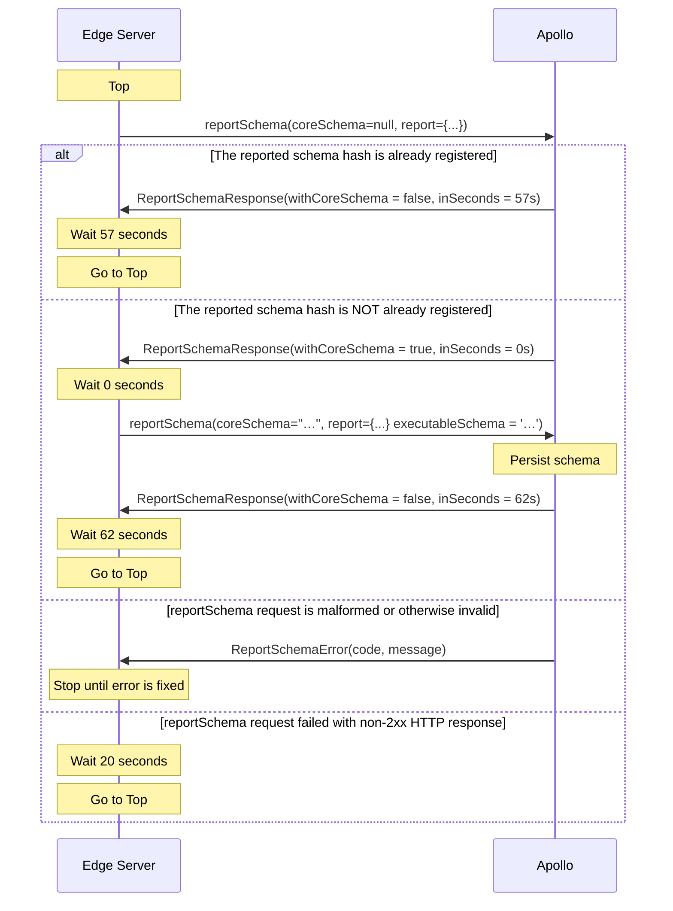

import ObtainGraphApiKey from '../../shared/obtain-graph-api-key.mdx';
import {
  ExpansionPanel,
} from 'gatsby-theme-apollo-docs/src/components/expansion-panel';

This document specifies the protocol that any GraphQL server can implement to enable automatic [schema registration](./schema-reporting/) with the Apollo schema registry.

For reference, Apollo Server uses this protocol in its [schema reporting plugin](https://www.apollographql.com/docs/apollo-server/api/plugin/schema-reporting/) ([see the source](https://github.com/apollographql/apollo-server/tree/main/packages/apollo-server-core/src/plugin/schemaReporting)).

> If you add schema reporting support to a GraphQL server library, please let us know in the [Apollo community forums](https://community.apollographql.com/)!

## The `reportSchema` mutation

A server that reports its schema to Apollo does so periodically via a GraphQL API hosted at the following endpoint:

```
https://schema-reporting.api.apollographql.com/api/graphql
```

Specifically, a server executes the `reportSchema` mutation, which has the following shape:

```graphql
mutation ReportSchemaMutation($coreSchema: String, $report: SchemaReport!) {
  reportSchema(coreSchema: $coreSchema, report: $report) {
    inSeconds
    withCoreSchema
    ... on ReportSchemaError {
      code
      message
    }
  }
}
```

This mutation always requires a `report` input argument, which has the following _minimum_ shape:

```json
{
  "bootID": "abc123",
  "coreSchemaHash": "F908D0B24486E2B2A032ED019A657E7243BCDB7DC5D939AF69820FE7BADFB200",
  "graphRef": "docs-example-graph@production"
}
```

The details of this operation and its inputs are described below.

## Required information

To successfully report a schema to Apollo, your server requires the following information:

### Graph API key

All requests to Apollo's schema reporting endpoint require an `X-API-Key` header:

```yaml
X-API-Key: service:docs-example-graph:abc123
```

The value of this header is a **graph API key**. Developers obtain this API key from Apollo Studio and provide it to their server instance on startup.

> We **strongly** recommend that your server accept the graph API key via an environment variable (e.g., `APOLLO_KEY`). This is because API keys are secret credentials that developers should never commit to version control.

<ObtainGraphApiKey />

### Graph ref

Whenever a server reports its schema, it does so to a particular [graph and variant](https://www.apollographql.com/docs/studio/org/graphs/) in Apollo Studio. Apollo uses strings called **graph refs** to describe particular graph-variant combinations:

```
my-graph-id@my-variant
```

A developer can obtain a variant's graph ref from the variant's Schema page in Apollo Studio.

As with API keys, we recommend that developers provide their graph ref to your server via an environment variable (e.g., `APOLLO_GRAPH_REF`) that's loaded on startup.

### Boot ID

Whenever an instance of your server boots up, it should generate a UUID to identify itself among _other_ instances of the same server. You provide this ID with each `reportSchema` mutation you execute, so that Apollo can distinguish between requests from different instances.

An instance's boot ID should _not_ persist across restarts.

### Schema hash

Every `reportSchema` mutation requires the SHA-256 hash of the schema string you're reporting to Apollo, as a hexadecimal string:

```
F908D0B24486E2B2A032ED019A657E7243BCDB7DC5D939AF69820FE7BADFB200
```

You should always **normalize** your schema before generating this hash, as [explained below](#schema-normalization).

## Protocol sequence

The following sections illustrate the communication sequence between a GraphQL server (hereafter referred to as the **edge server**) and the schema reporting endpoint (**Apollo**) after the server starts up. Each of these sections illustrates the same concepts in different formats.

### Diagram



### Step-by-step description

1. **On startup**, the edge server executes the `reportSchema` mutation, providing a `SchemaReport` object with the server's details as input.
    * See the `SchemaReport` object's [fields](#schemareport-fields), and its [minimum shape](#the-reportschema-mutation).
    * In this initial call, set the `coreSchema` argument of `reportSchema` to `null`.
    * If this or any other `reportSchema` request fails with a non-2xx response, the edge server should retry after 20 seconds.
2. **If the mutation succeeds**, Apollo responds with a `ReportSchemaResponse` object. This response tells the edge server:
    * How many seconds to wait before sending the next `reportSchema` request (`inSeconds`)
    * Whether the next `reportSchema` request should include the `coreSchema` that corresponds to the `coreSchemaHash` provided in the previous request (`withCoreSchema`)

    **If the mutation fails**, Apollo responds with a `ReportSchemaError` object. **In this case, the edge server should stop reporting its schema.** This error should _not_ cause the server to crash.
    * The `message` field of `ReportSchemaError` provides a human-readable message describing the error.
    * Correct the error and deploy a new version of your edge server to resume schema reporting.
3. **Assuming success in step 2**, the edge server waits the specified number of seconds, then executes the `reportSchema` mutation again.
    * This request includes a [normalized `coreSchema` string](#schema-normalization) if and only if `withCoreSchema` was `true` in Apollo's most recent `ReportSchemaResponse`.
4. **Go to step 2.**

### Pseudocode example

```
val schema = normalize("type Query { .. }")
val report = SchemaReport(..)
val withSchema = false

function sendReport() {
  val coreSchema = withSchema ? schema : null
  val response = reportSchema(coreSchema, report)

  if (response.code) {
    throw exception
    return
  }

  withSchema = response.withExecutableSchema

  setTimeout(sendReport, response.inSeconds)
}

sendReport()
```

## `SchemaReport` fields

These are the fields of the `SchemaReport` input type you provide as an argument to the `reportSchema` mutation.

<table class="field-table api-ref">
  <thead>
    <tr>
      <th>Name /<br/>Type</th>
      <th>Description</th>
    </tr>
  </thead>

<tbody>
<tr class="required">
<td>

##### `bootId`

`String!`
</td>
<td>

**Required.** A randomly generated UUID that's unique for each instance of your edge server. Set this value on server startup (a given value should not persist across restarts).

</td>
</tr>

<tr class="required">
<td>

##### `coreSchemaHash`

`String!`
</td>
<td>

**Required.** The hexadecimal string representation of the [normalized schema document's](#schema-normalization) SHA-256 hash.

</td>
</tr>

<tr class="required">
<td>

##### `graphRef`

`String!`
</td>
<td>

**Required.** Indicates which Apollo Studio graph and variant the server is reporting its schema to (e.g., `my-graph-id@my-variant`). See [Graph ref](#graph-ref).

</td>
</tr>

<tr>
<td>

##### `serverId`

`String`
</td>
<td>

An ID that's unique for each instance of your edge server. Unlike `bootId`, this value _should_ persist across an instance's restarts. In a Kubernetes cluster, this might be the **pod name**, whereas the **container** can restart.

</td>
</tr>

<tr>
<td>

##### `userVersion`

`String`
</td>
<td>

An arbitrary string you can set to distinguish data sent by different versions of your edge server. For example, this can be the SHA of the Git commit for your deployed server code. We plan to make this value visible in Apollo Studio.

</td>
</tr>


<tr>
<td>

##### `runtimeVersion`

`String`
</td>
<td>

The runtime that your edge server is running, such as `node 12.03`.

</td>
</tr>

<tr>
<td>

##### `libraryVersion`

`String`
</td>
<td>

The name and version of the server and/or reporting agent your edge server is using, such as `apollo-server-2.8` or `graphql-java-3.1`.

</td>
</tr>

<tr>
<td>

##### `platform`

`String`
</td>
<td>

The infrastructure environment that your edge server is running in (`localhost`, `kubernetes/deployment`, `aws lambda`, `google cloud run`, `google cloud function`, `AWS ECS`, etc.)

</td>
</tr>

</tbody>
</table>

## Schema normalization

Two semantically identical schemas can appear different to the schema registry, such as when those schemas list the same set of object fields in a different order. To avoid this scenario, every edge server should **normalize** its schema before sending it to the registry.

To normalize your schema, do all of the following:

* Apply stable sorting (such as alphabetical) to the order of all type, field, and argument definitions.
* Remove all redundant whitespace.
* Remove all comments (but not docstrings).

Note that runtime dependencies on your schema document might result in poor user experience in tracking your schema changes, or even throttling of service availability.

## Type definitions

The schema reporting protocol uses the following GraphQL types, referred to in [Protocol sequence](#protocol-sequence) above:

```graphql
type Mutation {
  reportSchema(coreSchema: String, report: SchemaReport!): ReportSchemaResult
}

# This type's fields are documented above.
input SchemaReport {
  bootId: String!
  coreSchemaHash: String!
  graphRef: String!
  libraryVersion: String
  platform: String
  runtimeVersion: String
  serverId: String
  userVersion: String
}

interface ReportSchemaResult {
  inSeconds: Int!
  withCoreSchema: Boolean!
}

type ReportSchemaResponse implements ReportSchemaResult {
  inSeconds: Int!
  withCoreSchema: Boolean!
}

type ReportSchemaError implements ReportSchemaResult {
  code: ReportSchemaErrorCode!
  inSeconds: Int!
  message: String!
  withCoreSchema: Boolean!
}

enum ReportSchemaErrorCode {
  BOOT_ID_IS_NOT_VALID_UUID
  BOOT_ID_IS_REQUIRED
  CORE_SCHEMA_HASH_IS_NOT_SCHEMA_SHA256
  CORE_SCHEMA_HASH_IS_REQUIRED
  CORE_SCHEMA_HASH_IS_TOO_LONG
  EXECUTABLE_SCHEMA_ID_IS_NOT_SCHEMA_SHA256
  EXECUTABLE_SCHEMA_ID_IS_REQUIRED
  EXECUTABLE_SCHEMA_ID_IS_TOO_LONG
  GRAPH_REF_INVALID_FORMAT
  GRAPH_REF_IS_REQUIRED
  GRAPH_VARIANT_DOES_NOT_MATCH_REGEX
  GRAPH_VARIANT_IS_REQUIRED
  LIBRARY_VERSION_IS_TOO_LONG
  PLATFORM_IS_TOO_LONG
  RUNTIME_VERSION_IS_TOO_LONG
  SCHEMA_IS_NOT_PARSABLE
  SCHEMA_IS_NOT_VALID
  SERVER_ID_IS_TOO_LONG
  USER_VERSION_IS_TOO_LONG
}
```
