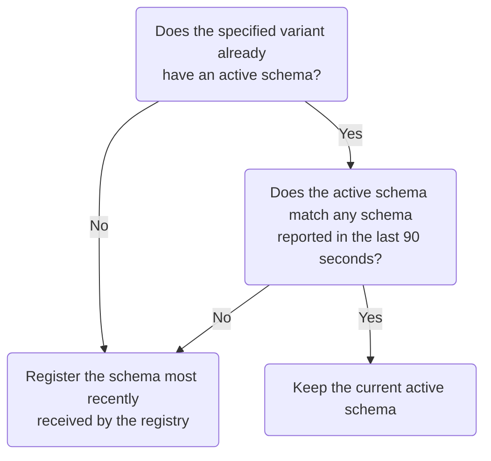

import ObtainGraphApiKey from "../../shared/obtain-graph-api-key";

**Schema reporting** enables your GraphQL server to register its latest schema with Apollo every time it starts up. To use this feature, your server needs to support the [schema reporting protocol](./schema-reporting-protocol/). This protocol is supported by [Apollo Server](#apollo-server-setup), and [other GraphQL servers](#other-graphql-servers) can implement support.

> **Schema reporting does not currently support graphs that use Apollo Federation.** If you have a federated graph, instead see [Setting up managed federation](https://www.apollographql.com/docs/federation/managed-federation/setup/).

## Apollo Server setup

Schema reporting is available in Apollo Server version 2.15 and later. To enable it:

1. Obtain an API key for your graph:

    <ObtainGraphApiKey />

2. Set this API key as the value of the `APOLLO_KEY` environment variable in your server's environment, and also set the `APOLLO_SCHEMA_REPORTING` environment variable to `true`.

    If you're using the [`dotenv`](https://www.npmjs.com/package/dotenv) library, you can add these definitions to the `.env` file in your project's root directory, like so:

    ```bash{1-2}:title=.env
    APOLLO_KEY=YOUR_KEY_HERE
    APOLLO_GRAPH_ID=your-graph-id
    APOLLO_SCHEMA_REPORTING=true
    ```

    > **Important:** If you use a `.env` file, **do not commit it to version control**. Always use `.gitignore` or a similar method to omit files that include secret credentials.
    >
    > You can alternatively provide these values to Apollo Server via the [`apollo` constructor option](https://www.apollographql.com/docs/apollo-server/api/apollo-server/#apollo), but again, **do not add secret credentials to your application source**.

Now every time your server finishes starting up, it waits a random amount of time between zero and ten seconds before automatically registering its schema ([you can customize this time range](#customizing-schema-reporting-behavior-in-apollo-server)).

### Registering to a variant with schema reporting

Your server can register its schema to a particular [variant of your graph](../org/graphs/#managing-variants). Each of your server's environments (development, staging, production, etc.) should register to a different variant.

To do so with Apollo Server, set the `APOLLO_GRAPH_VARIANT` environment variable in each server environment:

```none:title=.env
APOLLO_KEY=YOUR_KEY_HERE
APOLLO_GRAPH_ID=your-graph-id
APOLLO_GRAPH_VARIANT=staging
APOLLO_SCHEMA_REPORTING=true
```

If you don't specify a variant, Apollo Server reports its schema to the default variant (named `current`).

### Providing runtime metadata (recommended)

The schema reporting protocol accepts optional values that help both you and Apollo associate each request with a particular server instance and platform. This in turn helps with diagnosing issues and improving performance.

To provide these values to Apollo Server, set the following environment variables in your server's environment:

| Name | Description  |
|---|---|
| `APOLLO_SERVER_USER_VERSION` | An identifier for the current running version of your server, such as the SHA of its associated Git commit. We plan to display this value in Apollo Studio to help you segment metrics. |
| `APOLLO_SERVER_ID` | An ID that's unique for each running instance of your server. **This value should persist across an instance's restarts.** For example, in a Kubernetes cluster, you can use the server's pod name. |
| `APOLLO_SERVER_PLATFORM` | The infrastructure environment that your server is running in (`localhost`, `kubernetes/deployment`, `aws lambda`, `google cloud run`, `google cloud function`, `AWS ECS`, etc.) |

### Customizing schema reporting behavior in Apollo Server

Apollo Server supports schema reporting via a plugin called `ApolloServerPluginSchemaReporting`. When you set the `APOLLO_SCHEMA_REPORTING` environment variable to `true`, Apollo Server automatically installs this plugin with its default configuration.

If you need to configure the plugin further, you can explicitly install the plugin in your server. For example, you can tweak the amount of time that Apollo Server waits on startup before attempting to register its schema, or you can override the actual schema string that is registered. For details, see the [schema reporting plugin reference](https://www.apollographql.com/docs/apollo-server/api/plugin/schema-reporting/).

## Other GraphQL servers

Any GraphQL server can (and is encouraged to!) support automatic schema registration by implementing the [Schema reporting protocol](./schema-reporting-protocol/).

> Currently, we are not aware of GraphQL server libraries besides Apollo Server that implement the schema reporting protocol. If you add support to an open-source library, please let us know at **support@apollographql.com**!

## Rolling deploys with schema reporting

Whenever you perform a rolling deployment of a schema update, different active instances of your server might temporarily report different schemas to Apollo. If this occurs, Apollo uses the following algorithm to choose which schema to register:



Using this algorithm, your updated schema is registered within a few minutes after your rolling deployment completes.
