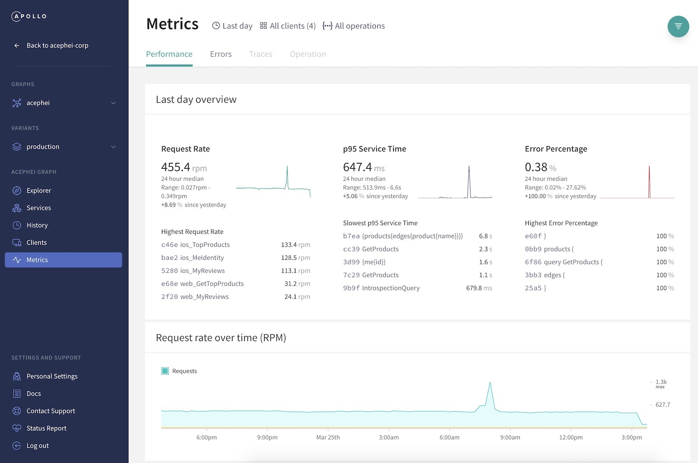

import ObtainGraphApiKey from '../shared/obtain-graph-api-key.mdx';

Apollo Studio can ingest operation **traces** from your GraphQL server to provide performance metrics for your data graph. A trace corresponds to the execution of a single GraphQL operation, including a breakdown of the timing and error information for each field that's resolved as part of the operation.

Trace reporting enables you to visualize:

* Which operations are being executed
* Which clients are executing which operations
* Which parts of the schema are used most
* Which of your resolvers in the server are acting as bottlenecks

## Pushing traces from Apollo Server

Apollo Server has built-in support for pushing traces to Apollo Studio. To set it up, you provide it a **graph API key** from Studio.

<ObtainGraphApiKey />

After you obtain a graph API key, assign it to the `APOLLO_KEY` environment variable (`ENGINE_API_KEY` prior to version 2.13.0 of Apollo Server) in your production server's environment.

> Consult your production environment's documentation to learn how to set its environment variables.

Now the next time you start your production server, it will automatically begin pushing trace data to Studio:



You can also push trace data from environments besides production, such as a staging or beta server. To keep this data separate from your production data, learn how to [create variants of your graph](./org/graphs/#managing-variants).

For advanced configuration options, see [Metrics and logging](https://www.apollographql.com/docs/apollo-server/features/metrics/).


## Third-party support

The following third-party GraphQL servers support Apollo Studio trace reporting:

> These servers and their trace reporting mechanisms are not maintained by Apollo. Apollo does not provide official support for them.

| Server  | Description  |
|---|---|
| [GraphQL Java](https://www.graphql-java.com/) | Provided via the [`apollo-tracing-uploader` instrumentation](https://github.com/braintree/apollo-tracing-uploader-java) |
| [`graphene-tornado`](https://github.com/graphql-python/graphene-tornado) (Python) | Provided via the [`apollo-engine-reporting` extension](https://github.com/graphql-python/graphene-tornado#apollo-engine-reporting) |
| [`async_graphql`](https://github.com/async_graphql/async_graphql) (Rust) | Provided via the [`async-graphql-extension-apollo-tracing` extension](https://github.com/Miaxos/async_graphql_apollo_studio_extension) |


## Adding support to a third-party server (advanced)

You can set up a reporting agent in your GraphQL server to push metrics to Apollo Studio. The agent is responsible for:

* Translating operation details into the correct [trace format](#tracing-format)
* Implementing a default **signature function** to identify each executed operation
* Emitting batches of traces to the Apollo Studio reporting endpoint
* Optionally defining plugins to enable advanced reporting features

Apollo Server defines its agent for performing these tasks in [the usage reporting plugin](https://github.com/apollographql/apollo-server/tree/main/packages/apollo-server-core/src/plugin/usageReporting).

> If you're interested in collaborating with Apollo on creating a dedicated integration for your GraphQL server, please get in touch with us at **support@apollographql.com** or via our [Apollo Spectrum Community](https://spectrum.chat/apollo).

### Tracing format

Apollo Studio's reporting endpoint accepts batches of traces that are encoded in **protocol buffer** format. Each trace corresponds to the execution of a single GraphQL operation, including a breakdown of the timing and error information for each field that's resolved as part of the operation.

The schema for this protocol buffer is defined as the `Report` message in the [TypeScript reference implementation](https://github.com/apollographql/apollo-server/blob/main/packages/apollo-reporting-protobuf/src/reports.proto).

As a starting point, we recommend implementing an extension to the GraphQL execution that creates a report with a single trace, as defined in the `Trace` message of [the protobuf schema](https://github.com/apollographql/apollo-server/blob/main/packages/apollo-reporting-protobuf/src/reports.proto). Then, you can batch multiple traces into a single report. We recommend sending batches approximately every 20 seconds, and limiting each batch to a reasonable size (~4MB).

An example of a `FullTracesReport` message, represented as JSON, is provided [below](#example-fulltracesreport-message).

> Many server runtimes already support emitting tracing information as a [GraphQL extension](https://github.com/apollographql/apollo-tracing). Such extensions are available for [Node](https://www.apollographql.com/docs/apollo-server/api/plugin/usage-reporting/), [Ruby](https://github.com/uniiverse/apollo-tracing-ruby), [Scala](https://github.com/sangria-graphql/sangria-slowlog#apollo-tracing-extension), [Java](https://github.com/graphql-java/graphql-java/pull/577), [Elixir](https://github.com/sikanhe/apollo-tracing-elixir), and [.NET](https://graphql-dotnet.github.io/docs/getting-started/metrics/). If you're working on adding metrics reporting functionality for one of these languages, reading through that tracing instrumentation is a good place to start. For other languages, we recommend consulting the [Apollo Server usage reporting plugin](https://github.com/apollographql/apollo-server/tree/main/packages/apollo-server-core/src/plugin/usageReporting).

### Operation signing

For Apollo Studio to correctly group GraphQL queries, your reporting agent should define a function to generate a  **query signature** for each distinct query. This can be challenging, because two _structurally_ different queries can be _functionally_ equivalent. For instance, all of the following queries request the same information:

```graphql
query AuthorForPost($foo: String!) {
  post(id: $foo) {
    author
  }
}

query AuthorForPost($bar: String!) {
  post(id: $bar) {
    author
  }
}

query AuthorForPost {
  post(id: "my-post-id") {
    author
  }
}

query AuthorForPost {
  post(id: "my-post-id") {
    writer: author
  }
}
```

It's important to decide how to group such queries when tracking metrics. The [TypeScript reference implementation](https://github.com/apollographql/apollo-tooling/blob/master/packages/apollo-graphql/src/operationId.ts) does the following to every query before generating its signature to better group functionally equivalent operations:

* Drop unused fragments and/or operations
* Hide string literals
* Ignore aliases
* Sort the tree deterministically
* Ignore differences in whitespace.

We recommend using the same default signature method for consistency across different server runtimes.

### Sending metrics to the reporting endpoint

After your GraphQL server prepares a batch of traces, it should send them to the Studio reporting endpoint at the following URL:

```
https://usage-reporting.api.apollographql.com/api/ingress/traces
```

Each batch should be sent as an HTTP POST request. The body of the request can be one of the following:

* A binary serialization of a `FullTracesReport` message
* A _gzipped_ binary serialization of a `FullTracesReport` message

To authenticate with Studio, each request must include either:

* An `X-Api-Key` header with a valid API key for your graph
* An `authtoken` cookie with a valid API key for your graph

Only graph-level API keys (starting with the prefix `service:`) are supported.

The request can also optionally include a `Content-Type` header with value `application/protobuf`, but this is not required.

For a reference implementation, see the `sendReport()` function in the [TypeScript reference agent](https://github.com/apollographql/apollo-server/blob/main/packages/apollo-server-core/src/plugin/usageReporting/plugin.ts).

#### Tuning reporting behavior

We recommend implementing retries with backoff when you encounter `5xx` responses or networking errors when communicating with the reporting endpoint. Additionally, implement a shutdown hook to make sure you push all pending reports before your server initiates a healthy shutdown.

### Implementing additional reporting features

The reference TypeScript implementation includes several features that you might want to include in your implementation. All of these features are implemented in the usage reporting plugin itself, and are documented [the plugin's API reference](https://www.apollographql.com/docs/apollo-server/api/plugin/usage-reporting/).

For example, you can restrict which information is sent to Studio, particularly to avoid reporting personal data. Because personal data most commonly appears in variables and headers, the TypeScript agent offers options to `sendVariablesValues` and `sendHeaders`.

### Example `FullTracesReport` message

The `FullTracesReport` message must be provided to the Studio reporting endpoint in protocol buffer format, as described in [Tracing format](#tracing-format). This example is shown in JSON format to illustrate the structure of the message.

```json
  {
    "header": {
      "hostname": "www.example.com",
      "schemaTag": "staging",
      "schemaHash": "alskncka384u1923e8uino1289jncvo019n"
    },
    "tracesPerQuery": {
      "# Foo\nquery Foo { user { email pets { name } } }": {
        "trace": [
          {
            "endTime": "2018-11-25T18:28:36.604Z",
            "startTime": "2018-11-25T18:28:36.104Z",
            "clientName": "c1",
            "clientVersion": "v1",
            "http": {
              "method": "POST"
            },
            "durationNs": "2498055950907169",
            "root": {
              "child": [
                {
                  "response_name": "user",
                  "type": "User",
                  "start_time": "16450765",
                  "end_time": "750079190",
                  "child": [
                    {
                      "response_name": "email",
                      "type": "String",
                      "start_time": "750122948",
                      "end_time": "750145101",
                      "parent_type": "User"
                    }
                  ],
                  "parent_type": "Query"
                }
              ]
            }
          },
          {
            "endTime": "2018-11-25T18:28:37.004Z",
            "startTime": "2018-11-25T18:28:36.404Z",
            "clientName": "c2",
            "clientVersion": "v1",
            "http": {
              "method": "POST"
            },
            "durationNs": "13154220",
            "clientReferenceId": "c2_id",
            "root": {
              "child": [
                {
                  "response_name": "user",
                  "type": "User",
                  "start_time": "16450962",
                  "end_time": "750079190",
                  "child": [
                    {
                      "response_name": "email",
                      "type": "String",
                      "start_time": "720132958",
                      "end_time": "720145167",
                      "parent_type": "User"
                    },
                    {
                      "response_name": "pets",
                      "type": "[Pet]",
                      "start_time": "720132959",
                      "end_time": "720135177",
                      "parent_type": "User",
                      "child": [
                        {
                          "index": 0,
                          "child": [
                            {
                              "response_name": "name",
                              "type": "String",
                              "start_time": "720133006",
                              "end_time": "720133039",
                              "parent_type": "Pet"
                            }
                          ]
                        },
                        {
                          "index": 1,
                          "child": [
                            {
                              "response_name": "name",
                              "type": "String",
                              "start_time": "720133041",
                              "end_time": "720133102",
                              "parent_type": "Pet"
                            }
                          ]
                        }
                      ]
                    }
                  ],
                  "parent_type": "Query"
                }
              ]
            }
          }
        ]
      }
    }
  }
```
