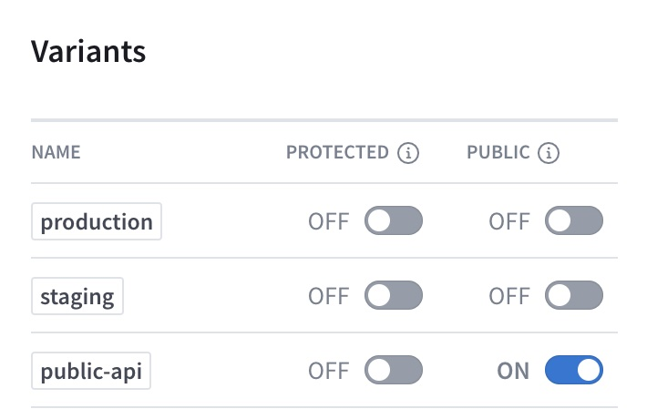
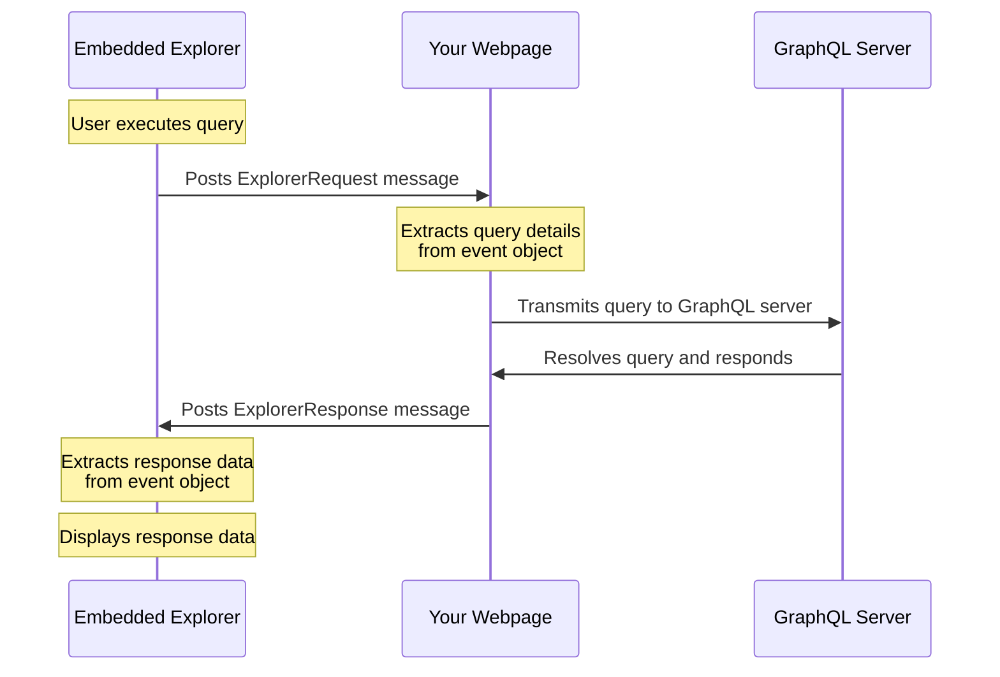

import {
  ExpansionPanel,
} from 'gatsby-theme-apollo-docs/src/components/expansion-panel';
import { MultiCodeBlock } from 'gatsby-theme-apollo-docs';
import { EmbeddableExplorer } from 'gatsby-theme-apollo-docs';

You can enable public access for individual [variants](./org/graphs/#managing-variants) of your graph. If you do, **anyone with that variant's public link** can view the following pages for that variant in Studio:

* Home
* Schema
* Explorer
    * You can also [embed the Explorer](#embedding-the-explorer) on your own webpage.

This enables consumers of your graph to learn about your graph's schema and any special usage information (such as authentication details) that you've documented in [the public variant's README](./org/graphs/#the-readme-page). They can also run properly authenticated operations against your graph with the Explorer.

People outside your organization can't view any _other_ pages for a public variant (Fields, Operations, etc.), and they can never view _any_ pages for private variants. New variants always start as private.

## Making a variant public

> **Note:** Only organization members with the [`Org Admin` or `Graph Admin` role](./org/members/) can toggle a variant's public visibility.

1. Go to your graph's Settings page and open the Access tab.
2. Under the Variants section, toggle the switch for the variant you want to make public:

    

3. Confirm your selection.

You can toggle the switch back to make the variant private again.

After you make a variant public, you can click the variant's **PUBLIC** label at the top of Apollo Studio to get its public link:


## Embedding the Explorer

If you have a [public variant](#making-a-variant-public) of your graph, you can embed the [Apollo Studio Explorer](./explorer/) in a webpage that you can then provide to your graph's consumers. This enables those consumers to test out operations from your own website.

For example, here's an embedded Explorer for an Apollo example graph. Try it out!

<EmbeddableExplorer
  graphRef="Apollo-Fullstack-Demo-o3tsz8@current"
  graphEndpoint="https://apollo-fullstack-tutorial.herokuapp.com/"
  graphSubscriptionEndpoint="wss://apollo-fullstack-tutorial.herokuapp.com/graphql"
  styles={{width: '100%', height:'450px', border: '0px', borderRadius: '4px'}}
/>

> This embedded Explorer collapses its left column by default because the full three-column layout is a little cramped on this page. You can [customize the embedded Explorer's appearance](#options) to suit the page it's on.

### Basic syntax

You embed the Explorer in an `iframe` that points to `https://explorer.embed.apollographql.com`:

```jsx
<iframe src="https://explorer.embed.apollographql.com/?graphRef=my-graph-id@my-variant&postMessageOperations=false" />
```

As shown, the `iframe`'s `src` URL requires the following query parameters:

* `graphRef` - This indicates which [public variant's](#public-access-for-graphs) schema the Explorer should download from Apollo Studio (e.g., `my-graph-id@my-variant`).
* `postMessageOperations` - This indicates whether the `iframe` sends its own network requests to your GraphQL endpoint.
    * You set this according to how you [handle CORS](#handling-cors).

### Handling CORS

Your GraphQL endpoint needs to be able to accept requests from your embedded Explorer. Because the Explorer is embedded in an `iframe`, its requests originate from `https://explorer.embed.apollographql.com`.

There are two supported methods for handling this: [adding a CORS domain](#add-a-cors-domain-recommended) or [routing requests through your webpage](#route-requests-through-your-webpage-advanced).

#### Add a CORS domain (recommended)

We recommend that you update your GraphQL endpoint's CORS configuration (such as with the [`cors` `ApolloServer` option](https://www.apollographql.com/docs/apollo-server/api/apollo-server/#cors)) to accept requests from `https://explorer.embed.apollographql.com`.

> If you use this method, set the `postMessageOperations` query parameter to `false`. Also make sure you've set your public variant's endpoint URL in Apollo Studio.

After you add the Explorer's origin to your endpoint's CORS configuration, you're all set! You can now embed the `iframe` in any webpage and set its dimensions as you like. Also check out [additional supported options](#options).

#### Route requests through your webpage (advanced)

Some endpoints _can't_ receive requests from the Explorer's origin due to firewall rules or organizational policies. In these cases, you can use the the `postMessage` API to route Explorer requests through your embedding webpage's domain.

> If you use this method, set the `postMessageOperations` query parameter to `true`.

If you need to use this advanced method, proceed to the additional setup in [Using `postMessage`](#using-postmessage-advanced).

### Options

When you embed the Explorer, you set options for it by including query parameters in the `src` URL of the `iframe`, like so:

```jsx
<iframe src="https://explorer.embed.apollographql.com/?graphRef=my-graph-id@my-variant&postMessageOperations=false" />
```

The following options are supported:

<table class="field-table api-ref">
  <thead>
    <tr>
      <th>Name /<br/>Type</th>
      <th>Description</th>
    </tr>
  </thead>

<tbody>
<tr class="required">
<td>

##### `graphRef`

`string`

</td>
<td>

**Required.** The graph ref for the [public variant](#public-access-for-graphs) you want to use the embedded Explorer with. Has the format `graph-id@variant-name`.

The Explorer fetches this variant's schema from Apollo Studio to populate its Documentation panel and enable symbol completion.

If you omit this option, the Explorer _does_ still load, but it doesn't know which schema to fetch. This prevents the Explorer from providing critical features like documentation and symbol completion.

</td>
</tr>

<tr class="required">
<td>

##### `postMessageOperations`

`"true" | "false"`

</td>
<td>

**Required.** If `true`, the embedded Explorer uses the `postMessage` API to notify your webpage when a user initiates a GraphQL operation. Your webpage is then responsible for transmitting the operation to your GraphQL server.

If `false`, the embedded Explorer transmits operations directly to your GraphQL server from the origin `https://explorer.embed.apollographql.com`.

See [Handling CORS](#handling-cors).

</td>
</tr>

<tr>
<td>

##### `document`

`string`

</td>
<td>

A URI-encoded operation to populate in the Explorer's editor on load.

If you omit this, the Explorer initially loads an example query from your schema. It then saves the user's last operation in local storage for future page loads.

Example:

```jsx
?document=${window.encodeURIComponent(`
  query ExampleQuery {
    id
  }
`)}
```

</td>
</tr>

<tr>
<td>

##### `variables`

`string`

</td>
<td>

A URI-encoded, serialized object containing initial variable values to populate in the Explorer on load.

If provided, these variables should apply to the initial query you provide for [`document`](#document).

Example:

```jsx
?variables=${window.encodeURIComponent(
  JSON.stringify({
    userID: "abc123"
  })
)}
```

</td>
</tr>

<tr>
<td>

##### `headers`

`string`

</td>
<td>

A URI-encoded, serialized object containing initial HTTP header values to populate in the Explorer on load.

Example:

```jsx
?headers=${window.encodeURIComponent(
  JSON.stringify({
    authorization: "Bearer abc123"
  })
)}
```

</td>
</tr>

<tr>
<td>

##### `searchQuery`

`string`

</td>
<td>

A string to populate in the Explorer's search bar on load. You can use this to direct users to a particular type or field.

Example: `?searchQuery=Query.id`

</td>
</tr>
<tr>
<td>

##### `docsPanelState`

`"open" | "closed"`

</td>
<td>

If `open`, the Explorer's Documentation panel (the left column) is initially expanded. If `closed`, the panel is initially collapsed.

The default value is `open`.

</td>
</tr>

<tr>
<td>

##### `showHeadersAndEnvVars`

`"true" | "false"`

</td>
<td>

If `true`, the embedded Explorer includes the panels for [setting request headers and environment variables](./explorer/#authentication). If `false`, those panels are not present.

The default value is `true`.

</td>
</tr>

<tr>
<td>

##### `theme`

`"dark" | "light"`

</td>
<td>

If `dark`, the Explorer's dark theme is used. If `light`, the light theme is used.

The default value is `dark`.

</td>
</tr>
</tbody>
</table>

### Using `postMessage` (advanced)

Some GraphQL servers can't accept requests from `https://explorer.embed.apollographql.com` due to organizational policies. In these cases, your webpage can use the `postMessage` API to act as an intermediary between the embedded Explorer and your server:



In this case, the embedded Explorer never sends network requests to your GraphQL server. Instead, the Explorer's `iframe` uses the `window.postMessage` method to tell your webpage when the user wants to execute a GraphQL operation. _Your webpage_ is then responsible for sending the operation to your GraphQL server (for example, via `fetch`) and then providing the operation result back to the `iframe` via another `postMessage` call.

Because of this, embedding the Explorer requires additional setup beyond adding an `iframe` to your page.

### `postMessage` examples

* [This repo](https://github.com/apollographql/embeddable-explorer-demo-react) demonstrates a React app that embeds the Explorer and uses `postMessage`.

    * See in particular [`setupEmbedRelay.ts`](https://github.com/apollographql/embeddable-explorer-demo-react/blob/main/src/setupEmbedRelay.ts), which defines view-layer-agnostic logic for communicating between the `iframe`, your own page, and your GraphQL server.

    * You can also run this example on CodeSandbox:

    <a href="https://codesandbox.io/s/github/apollographql/embeddable-explorer-demo-react/tree/main/?fontsize=14&hidenavigation=1&theme=dark">
      
    </a>


* The Explorer embedded in this article uses [this component](https://github.com/apollographql/gatsby-theme-apollo/blob/main/packages/gatsby-theme-apollo-docs/src/components/embeddable-explorer.js) from Apollo's Gatsby documentation theme.

### `postMessage` setup

> Before you proceed, make sure you have a [public variant](#making-a-variant-public) of your graph in Apollo Studio.

This section walks you through the code to set up an embedded Explorer that uses `postMessage`. It borrows code from [this `setupEmbedRelay.ts` example](https://github.com/apollographql/embeddable-explorer-demo-react/blob/main/src/setupEmbedRelay.ts) and removes some optional portions for clarity.

#### 1. Define Explorer constants

Your webpage and the embedded Explorer use the `postMessage` API to send messages to each other. Those messages each have a name that indicates the _type_ of message being posted.

Let's define constants for each of those message types, along with a constant for our `iframe`'s `src` URL:

<MultiCodeBlock>

```ts:title=setupEmbedRelay.ts
// URL for any embedded Explorer iframe
export const EMBEDDABLE_EXPLORER_URL =
  "https://explorer.embed.apollographql.com";

// Message types for queries and mutations
const EXPLORER_QUERY_MUTATION_REQUEST = "ExplorerRequest";
const EXPLORER_QUERY_MUTATION_RESPONSE = "ExplorerResponse";

// Message types for subscriptions (not covered in this setup)
const EXPLORER_SUBSCRIPTION_REQUEST = "ExplorerSubscriptionRequest";
const EXPLORER_SUBSCRIPTION_RESPONSE = "ExplorerSubscriptionResponse";
const SUBSCRIPTION_TERMINATION = "ExplorerSubscriptionTermination";
```

</MultiCodeBlock>

#### 2. Set up communication

Next, let's define a function that sets up communication between a webpage and the embedded Explorer's `iframe`. This function defines a callback that will execute whenever `window.postMessage` is called by the `iframe`.

<MultiCodeBlock>

```ts:title=setupEmbedRelay.ts
export function setUpEmbedRelay() {

  // Callback definition
  const onPostMessageReceived = (
    event: MessageEvent<{
      name?: string;
      operation?: string;
      operationId?: string;
      operationName?: string;
      variables?: Record<string, string>;
      headers?: Record<string, string>;
    }>
  ) => {

    // Obtain the iframe element by any applicable logic for your page.
    // This obtains an element with ID `embedded-explorer`.
    const embeddedExplorerIFrame =
      (document.getElementById("embedded-explorer") as HTMLIFrameElement) ??
      undefined;

    // Check to see if the posted message indicates that the user is
    // executing a query or mutation in the Explorer
    const isQueryOrMutation =
      "name" in event.data &&
      event.data.name === EXPLORER_QUERY_MUTATION_REQUEST;

    // If the user is executing a query or mutation...
    if (
      isQueryOrMutation &&
      event.data.name &&
      event.data.operation &&
      event.data.operationId
    ) {
      // Extract the operation details from the event.data object
      const { operation, operationId, operationName, variables, headers } = event.data;

      // Execute the operation, providing all required details
      // (we'll define executeOperation next)
      executeOperation({
        operation,
        operationName,
        variables,
        headers,
        embeddedExplorerIFrame,
        operationId,
      });
    }
  };

  // Execute our callback whenever window.postMessage is called
  window.addEventListener("message", onPostMessageReceived);
}
```

</MultiCodeBlock>

Now we can import and call `setupEmbedRelay` on any page where we'll embed the Explorer. However, we still need to define the `executeOperation` function that's called by our callback.

#### 3. Define operation execution logic

Our webpages can use the `fetch` API to send operations to our GraphQL server. To do this, we need the URL of our server's GraphQL endpoint. Substitute it in the `executeOperation` function below, where indicated.

<MultiCodeBlock>

```ts:title=setupEmbedRelay.ts
// Helper function that adds content-type: application/json
// to each request's headers if not present
function getHeadersWithContentType(
  headers: Record<string, string> | undefined
) {
  const headersWithContentType = headers ?? {};
  if (
    Object.keys(headersWithContentType).every(
      (key) => key.toLowerCase() !== "content-type"
    )
  ) {
    headersWithContentType["content-type"] = "application/json";
  }
  return headersWithContentType;
}

// Function for executing operations
async function executeOperation({
  operation,
  operationId,
  operationName,
  variables,
  headers,
  embeddedExplorerIFrame,
}: {
  operation: string;
  operationId: string;
  operationName?: string;
  variables?: Record<string, string>;
  headers?: Record<string, string>;
  embeddedExplorerIFrame?: HTMLIFrameElement;
}) {
  const response = await fetch(
    // Substitute your server's URL for this example URL.
    "https://apollo-fullstack-tutorial.herokuapp.com/",
    {
      method: "POST",
      headers: getHeadersWithContentType(headers),
      body: JSON.stringify({
        query: operation,
        variables,
        operationName,
      }),
    }
  );

  // After the operation completes, post a response message to the
  // iframe that includes the response data
  await response.json().then((response) => {
    embeddedExplorerIFrame?.contentWindow?.postMessage(
      {
        // Include the same operation ID in the response message's name
        // so the Explorer knows which operation it's associated with
        name: EXPLORER_QUERY_MUTATION_RESPONSE,
        operationId,
        response,
      },
      EMBEDDABLE_EXPLORER_URL
    );
  });
}
```

</MultiCodeBlock>

Instead of hardcoding your server's URL as shown, you can modify `executeOperation` to take a server URL parameter if you'll be embedding Explorers for multiple graphs.

#### 4. Embed the `iframe`

We're ready to add an embedded Explorer to our page! Below is an example `App.tsx` file that uses our `setupEmbedRelay` function to wire up an embedded Explorer `iframe`.

> This example uses React, but you can use any view layer you like. If you _do_ use React, you should also modify your code to remove your `message` event listener when your component unmounts.

<MultiCodeBlock>

```tsx:title=App.tsx
import React, { useEffect } from 'react';
import { EMBEDDABLE_EXPLORER_URL, setUpEmbedRelay } from './setupEmbedRelay';

export const App = ()=> {

  useEffect(() => {
    setUpEmbedRelay();
  }, [])

  // Provide iframe options via URL query parameters
  const explorerURL = EMBEDDABLE_EXPLORER_URL +
    '?graphRef=Apollo-Fullstack-Demo-o3tsz8@current' +
    '&postMessageOperations=true';

  return (
    <div className="App">
      <h1 className="demo-app-title">Apollo's Embedded Explorer Demo App</h1>
      <iframe id="embedded-explorer" className="embedded-explorer-iframe" title="embedded-explorer" src={explorerURL} />
    </div>
  );
}
```

</MultiCodeBlock>

#### 5. Run the example

You can view and run a complete example that uses code very similar to the above on Codesandbox:

<a href="https://codesandbox.io/s/github/apollographql/embeddable-explorer-demo-react/tree/main/?fontsize=14&hidenavigation=1&theme=dark">
  
</a>

The example includes support for subscriptions, which are omitted from this Setup section for clarity. The subscription-specific logic should be more straightforward after familiarizing yourself with the logic for queries and mutations.

### Message types

If you're using the `postMessage` API with your embedded Explorer, every message posted this way has an `event.data.name` which indicates the type of message.

These are the message types used by the embedded Explorer's `iframe` and your page:

<table class="field-table api-ref">
  <thead>
    <tr>
      <th>Name</th>
      <th>Description</th>
    </tr>
  </thead>

<tbody>
<tr>
<td>

##### `ExplorerRequest`

</td>
<td>

Posted by the `iframe` to notify your page that the user wants to execute a query or mutation.

The following operation details are included in the associated `event.data` object:

* `operation` (string)
* `operationId` (string)
* `operationName` (string)
* `variables` (object)
* `headers` (object)

</td>
</tr>

<tr>
<td>

##### `ExplorerResponse`

</td>
<td>

Posted by your page to notify the `iframe` of a query or mutation result. The message should be the operation's JSON response object.

</td>
</tr>

<tr>
<td>

##### `ExplorerSubscriptionRequest`

</td>
<td>

Posted by the `iframe` to notify your page that the user wants to execute a subscription operation.

The same operation details are included in the `event.data` object that are included in [`ExplorerRequest` messages](#explorerrequest).

</td>
</tr>

<tr>
<td>

##### `ExplorerSubscriptionResponse`

</td>
<td>

Posted by your page to notify the `iframe` of a new subscription result. The message should be the subscription's new JSON response object.

</td>
</tr>

<tr>
<td>

##### `ExplorerSubscriptionTermination`

</td>
<td>

Posted by the `iframe` to notify your page that the user wants to terminate an active subscription operation.

</td>
</tr>

<tr>
<td>

##### `SetOperation`

</td>
<td>

Posted by your page to provide the `iframe` with an operation string to populate in a new tab of the Explorer's editor. You might want to use this to populate a default operation on page load.

</td>
</tr>

<tr>
<td>

##### `ExplorerListeningForState`

</td>
<td>

Posted by the `iframe` to notify your page when the Explorer is ready for you to post a `SetOperation` message.

If you post a `SetOperation` message before the Explorer is ready, the Explorer does not populate its editor with the operation you provide.

</td>
</tr>
</tbody>
</table>
